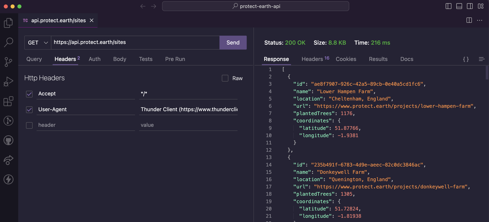
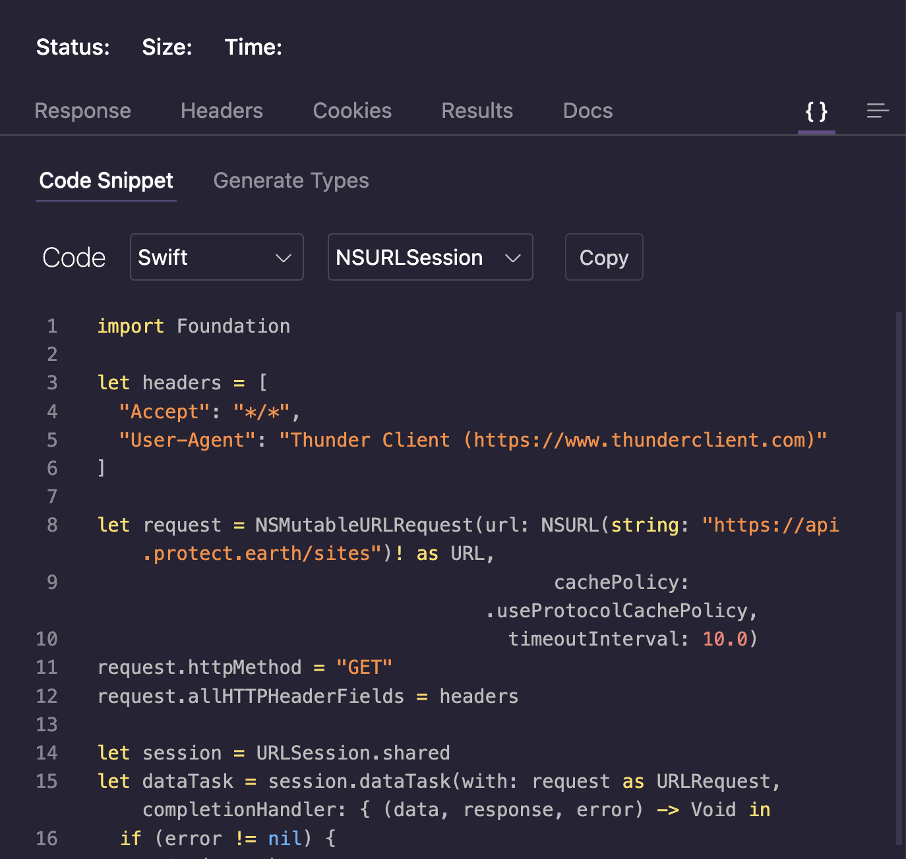

= Transportation Layers

To send anything to or fetch anything from an API, we're going to need a
"transport layer" to do it. Transport layers are conceptually about sending
things about over the network, and there's a bunch of different levels with a
bunch of different protocols that all sit on top of each other. Whole books are
written about transportation, network protocols, and all the fun that goes with
it, but we're going to skim past some of the stuff that's not relevant. 

http://https://wikipedia.org/wiki/Transmission_Control_Protocol[Transmission
Control Protocol (TCP)] and
http://https://en.wikipedia.org/wiki/User_Datagram_Protocol[User
Datagram Protocol (UDP)] provide two means of sending things around. TCP
ensures a packet of data was received, and UDP is a fire and forget
approach that's a little quicker due to its blasé approach.

One implementation of TCP is TCP/IP, also known as the
http://https://en.wikipedia.org/wiki/Internet_protocol_suite[Internet
Protocol Suite]. This is a whole bunch of protocols that facilitate the
modern Internet as we know it, so yay for that.

TCP/IP facilitates the
http://https://en.wikipedia.org/wiki/Hypertext_Transfer_Protocol[Hypertext
Transportation Protocol (HTTP)], and _that_ is what we care about. HTTP
is an absolutely fantastic resource for API interaction, as it covers so
many fantastic features, that would be just awful to implement from
scratch.

Ever growing and improving, there have been several versions over the years.
They're all huge improvements, that reflect the evolving requirements of the
web, and the needs of those creating and using software that uses it. 

HTTP/1 was pretty standard and expected early-web stuff: a static HTML page to
load of a few links to Word documents or something, HTTP/1.1 added a bunch of
amazing things to make multiple connections work far quicker (all that
CSS/JS/AJAX/etc), and HTTP/2 changes pretty much everything, turning
conventional wisdom on its head, and gives us powerful functionality like
multiplexing that allows HTTP clients to make more requests and receive more
responses at the same time.

Learning about HTTP and utilizing its features to make fantastic
applications can be tough. HTTP is like snowboarding: you can learn the
basics in a very short amount of time, get cocky, and go smashing off at
high speed, until you inevitably break three ribs... 

I've been using HTTP for over twenty years and new features are always popping
up. These are some of the learnings the book will be covering, as HTTP gets a
lot of very undue flak for being "bulky" or "slow", which mostly come down to
decades of using it poorly and refusing to reconsider entrenched beliefs that
were based on previous versions of HTTP.

This is not just a book about HTTP however. There are a few other protocols that
are commonly used for building more "real-time" APIs:

- http://https://wikipedia.org/wiki/WebSocket[WebSockets]
- http://https://wikipedia.org/wiki/Advanced_Message_Queuing_Protocol[Advanced
Message Queuing Protocol (AMQP)]
- https://mqtt.org/[Message Queuing Telemetry Transport (MQTT)]

Event-driven technologies like this are sometimes paired with an HTTP API to
provide more interactive experiences than the request/response approach can
handle, or they're run by themselves to have primarily event-driven
architectures, with HTTP demoted to providing secondary services like
summarizing status of a system.

There are some other types of API you may be working with, HTTP APIs are the majority of what you'll see
80-90% of the time, With WebSockets or AMQP popping up now and then. As such, a
hefty chunk of the book will be covering HTTP APIs.

== HTTP Basics

To avoid getting all academic and theoretical, learning by doing might
be the way to go with understanding HTTP.

Making your first HTTP query is fairly easy, you just need a HTTP client. Most
programming languages have one built in, but before we get into all of that, we
can just use the command line. If you have the `curl` command available you can
use that, otherwise a quick `brew install curl` (macOS) or `apt-get install
curl` (Linux) will install it for you.

[source,bash]
----
$ curl -X GET http://example.com
<!doctype html>
<html>
<head>
    <title>Example Domain</title>
    <meta charset="utf-8" />
    ...
----

Right there, we made a request using the GET method (in the complicated world of
curl `-x` stands for "method"), to the URL `http://example.com`, and we got a
HTML response. If this was some JSON, and if we were doing it in a programming
language, we would be off to a reasonable start!

Most programming languages come with a HTTP client by default, but often
they are hard to work with and have an interface uglier than a bulldog
chewing a wasp. For example, the backend language PHP has a curl
extension, which is quite time consuming to do anything with, and
therefore most folks use http://docs.guzzlephp.org/[Guzzle] (which
actually wraps curl).

A popular HTTP client for JavaScript is
http://https://github.com/axios/axios[Axios], which provides
promise-based HTTP interactions.

.JavaScript library Axios, which helps separate successes and failures based on HTTP conventions.
[source,javascript]
--
axios.get('https://api.example.org/companies/12345')
  .then(function (response) {
    console.log(response);
  })
  .catch(function (error) {
    console.log(error);
  });
--

Quite simply, we are trying to GET the information for whichever company
has the identifier 12345. If it works, the `then()` is called, otherwise
`catch()` is called.

Asking this question of the API is known as the "HTTP Request", and the
success or fail will be determined by the APIs answer, the "HTTP
Response".

The HTTP client is responsible for providing a useful interface between
your programming language, and whatever low-level networking library is
in place to make the actual requests. At the network level, HTTP is a
plain-text protocol that has a request message and response message. A
request has method like `GET`, `POST`, `PUT`, `PATCH`, `DELETE`, `OPTIONS` (and a
few more), which indicate the sort of request you are making. There's
then a host, and a URI, and you need to specify which HTTP version
you're talking about.

The Axios example would produce a HTTP request like this:

----
GET /companies/12345 HTTP/1.1
Host: api.example.org
----

The response may well be something successful, and we might get JSON
back to play with:

----
HTTP/1.1 200 OK
Date: Mon, 18 Dec 2018 12:30:00 GMT
Content-Type: application/json
Connection: Closed

{"id":12345,"name":"Patagonia","description":"Expensive outdoor clothing saving the world through taking a decent moral stance"}
----

It could also be a total failure:

----
HTTP/1.1 401 Unauthorized
Date: Mon, 18 Dec 2018 12:30:00 GMT
Content-Type: application/json
Connection: Closed

{"error":"Get out of here!"}
----

Notice here the 401 Unauthorized message on the first line. Thanks to
the conventions of certain status codes being an error, the Axios example knows whether to call the `then()` function or the `catch()` function, clearly splitting the success and failures paths.

Not all HTTP clients are that well set up by default, so you might need to programmatically check the "status code" in the HTTP
response to see if the request was successful or not.

.JavaScript library fetch() example, showing how to check response as a success or an error.
[source,js]
----
const url = 'https://api.example.org/companies/12345';
fetch(url)
  .then((response) => {
    if (response.ok) {
      return response.json();
    }
    throw new Error('Something went wrong');
  })
  .then((responseJson) => {
    console.log(error);
  })
  .catch((error) => {
    console.log(error);
  });
----

== HTTP Methods

We have made a `GET` request, because they are nice an easy. There are
plenty more methods out there, which all have their own specific meaning
and uses. Some APIs will use more than others, but it's important to
learn what is what.

* `GET` - Fetching things, shouldn't cause anything to change on the API
other than maybe some metrics.
* `POST` - Most commonly used for "creating" resources, but
can be done for anything which changes state, like triggering actions. 
* `PUT` - Often used by APIs for "updating" resources, but is more semantically an "upsert" or "create or update". This is used for "idempotent" requests, meaning making the request multiple times doesn't change state thing multiple times.
* `PATCH` - Update just a few properties instead of everything, to avoid two clients race-condition clobbering data sent from the other.
* `DELETE` - Does what it says on the tin.
* `HEAD` - Like a `GET`, but only return the headers, which can be used for quickly checking something exists without wasting time downloading the whole response.

There are a few others like `TRACE` and `OPTIONS` which we can ignore for now.

If the API you are talking to calls itself a "REST API", it's likely to
use all of those methods. If it calls itself "RPC", it might only use
`GET` and `POST`. If it's GraphQL, interactions will probably all happen over `POST`.

.A table showing what sort of HTTP methods are used for different types of APIs.
[%autowidth]
|===
| Paradigm | GET | POST | PUT | PATCH | DELETE | HEAD

| REST API | ✅ | ✅ | ✅ | ✅ | ✅ | ✅
| RPC API | ✅ | ✅ | ❌ | ❌ | ❌ | ❌
| GraphQL API | ✅ | ℹ️ | ❌ | ❌ | ❌ | ❌
|===

Confused? I know. We'll get there.

== HTTP Status Codes

A status code is a number with a special meaning defined in RFC 9110. The status codes are broken down into various types of success or failure. 

In ye olden days when AJAX was first creeping into web development, it was common for people to ignore most of the HTTP specification and just focus on the body, returning something like:

[source,json]
----
{ "success": true }
// or 
{ "success": "success" }
// or 
{ "isFailure": true }
----

This is incredibly difficult to reason about at a generic level, so you have to train all of your network logic to know that `isFailure: false` is... good?

These days it's far more common for API developers to utilize HTTP properly, and send you an appropriate status code so you can figure out what to do next based.

Status codes are grouped into a few different categories:, with the
first number being a wide category, then the rest of the digits pointing to a more specific scenario.

=== ✅ 200-299 = Success

Whatever your application tried to do was successful, up to the point
that the response was sent. A 200 OK means you got your answer, a 201
Created means the thing was created, but keep in mind that a 202
Accepted does not say anything about the actual result, it only
indicates that a request was accepted and is being processed
asynchronously. It could still go wrong, but at the time of responding
it was all looking good so far.

=== ➡️ 300-399 = Redirects

These are all about sending the calling application somewhere else for
the actual resource. The best known of these are the `303 See Other` and
the `301 Moved Permanently`, which are used a lot on the web to redirect
a browser to another URL. Some folks use a `Location` header to point to
the content, so if you see a 3xx check for that.

=== 🙊 400-499 = Client Errors

With these status codes, APIs indicate that the client has done
something invalid and needs to fix the request before resending it.

=== 🔥 500-599 = Server Errors

With these status codes, the API is indicating that something went wrong
in their side. For example, a database connection failed, or another
service was down. Typically, a client application can retry the request.
The server can even specify when the client should retry, using a
`Retry-After` HTTP header.

=== Common Errors

Arguments between developers will continue for the rest of time over the
exact appropriate code to use in any given situation, but these are the
most important status codes to look out for in an API:

* 400 - Bad Request (should really be for invalid syntax, but some .folks
use for validation)
* 401 - Unauthorized (no current user and there should be).
* 403 - The current user is forbidden from accessing this data.
* 404 - That URL is not a valid route, or the item resource does not.
exist
* 405 - Method Not Allowed (e.g.: you tried to `POST` on something .that should have been a `GET`.)
* 405 - Not Acceptable (e.g.: You tried to send a Content-Type of .JSON for something that doesn't expect JSON)
* 409 - Conflict (Maybe somebody else just changed some of this .data, or
status cannot change from e.g: "published" to "draft")
* 410 - Data has been deleted, deactivated, suspended, etc..
* 415 - The request had a `Content-Type` which the server does not .know
how to handle
* 429 - Rate Limited, which means take a breather, sleep a bit, try.
again
* 500 - Something unexpected happened, and it is the APIs fault.
* 503 - API is not here right now, please try again later.

You might spot others popping up from time to time, so check on
http://http.cat/[http.cats] (or
http://www.iana.org/assignments/http-status-codes/http-status-codes.xhtml[iana.org]
for a more formal list) when you see one that's not familiar.

== HTTP Headers

Headers have been mentioned a few times, and they're another great
feature for HTTP.

HTTP headers are meta-data about the request or response, and control
all sorts of things, like the Content-Type (JSON, XML, or something else), or
cache controls (if the response is cacheable and for how long), etc.

For example, some APIs accept "form data", as well as JSON. It's
important to understand which is being sent by default, and which the
API wants.

Sending form data might look like this:

[source,javascript]
----
const instance = axios.create({
  baseURL: 'https://api.example.com/',
  headers: {'Content-Type': 'application/x-www-form-urlencoded'}
});

const formData = new URLSearchParams({someParam: 'Some value'}).toString();

instance.post('/hello', formData);
----

Sending the same data as JSON might look a little more like this:

[source,javascript]
----
const instance = axios.create({
  baseURL: 'https://api.example.com/',
  headers: {'Content-Type': 'application/json'}
});

const jsonData = JSON.stringify({someParam: 'Some value'});
instance.post('/hello', jsonData);
----

Notice the only real difference here is that we have changed the
Content-Type, and changed how we generate the string. HTTP APIs are very
flexible in this way.

Some APIs will let you request data in a format relevant to your needs: CSV,
YAML, or other more complex binary formats. If there is a choice of data formats for a response, you can
pick one, by putting the http://wikipedia.org/wiki/Media_type[media type] in the `Accept` header.

[source,javascript]
----
var instance = axios.create({
  baseURL: 'https://api.example.com/',
  headers: {'Accept': 'application/csv'}
});
instance.get('/reports/123');
----

Requesting a media type that the API does not support then you will probably
give you a https://www.rfc-editor.org/rfc/rfc9110#name-406-not-acceptable[406
Not Acceptable] client error. In which case you'll need to update your code to
use another data format.

Headers can do a whole lot more than just switch content types, but we
will look at more headers in relevant content as we go.

=== Making HTTP Requests with a GUI

We have tried using `curl` in the command line, and talked through some JavaScript examples, but if you want to play around with HTTP requests a lot more you'll can progress next to using a GUI (Graphical User Interface), then we'll use that to make sample code in our favourite programming language.

There are plenty of HTTP GUI applications out there, but the three
biggest are:

- https://www.postman.com/product/rest-client/[Postman] - Complete API development environment.
- https://insomnia.rest/products/insomnia[Insomnia] - API client for GraphQL, REST, and gRPC.
- https://paw.cloud/[Paw] (macOS) - Fast and feature rich native macOS application.
- https://nightingale.rest/[Nightingale] (Windows) - A modern, resource-efficient REST API client for Windows.
- https://www.thunderclient.com/[Thunder Client] - A lightweight REST API Client Extension for VS Code.

Kicking the tyres of an API with a GUI HTTP client like this is a great way to make sure things work as you expect, allowing you to build up complex requests and even chained interactions, without having to try to write a bunch of JSON or awkward command-line arguments. 

.Paw HTTP client on macOS making a GET request.
image::images/paw.png[Paw HTTP client]

Paw is a lot of fun, but I like using Thunder Client as it keeps me right there in VS Code when I'm working. Here is Thunder Client hitting the Protect Earth API.

.Thunder Client extension for VS Code, calling the Protect Earth API

Once you've got the API interacting in the way you want, most of these GUI's will help you generate some "sample code" in the programming language of your choice. You can grab that, and pop it into your application (or an interactive console that speaks your programming language) to get even closer to making your first successful interaction in code.

.Thunder Client extension generating Swift HTTP code automatically

Without knowing any Swift I can grab this code, and my application will make a successful request. 

Making a "GET THE THING" requests like this is overly simplistic and brittle, but this should help get you making API requests quickly, and we can spend the rest of the book making interactions as reliable as possible.

See the headers, response codes, and data being returned. Twilio is a
fantastic API and has a great
https://postmancollections.com/collection/twilio-api-1513510826119x720495719814266900[collection],
so maybe start there.

////
TODO

- Talk about HTTP/3 and what relevant changes it has, can you use it already in any languages, tools, etc.

- illustrations / images / coloring might make the HTTP Status codes breakouts easier to remember. A big, smiley green box around 2xx, for example, vs. a red-angry client for 4xx and a broken server for 5xx, etc

////
