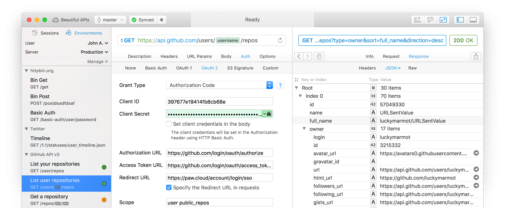

= Transportation Layers

To send anything to or fetch anything from an API, we're going to need a
"transport layer" to do it. Transport layers are conceptually about
sending things about over the network, and there's a bunch of different
levels with a bunch of different protocols that all sit on top of each
other. Whole books are written about transportation, network protocols,
and all the fun that goes with it, but we're going to skim past some of
the stuff that's not relevant. If you don't care about inside the
sausage, just skip this chapter.

http://https://wikipedia.org/wiki/Transmission_Control_Protocol[Transmission
Control Protocol (TCP)] and
http://https://en.wikipedia.org/wiki/User_Datagram_Protocol[User
Datagram Protocol (UDP)] provide two means of sending things around. TCP
ensures a packet of data was received, and UDP is a fire and forget
approach that's a little quicker due to its blasé approach.

One implementation of TCP is TCP/IP, also known as the
http://https://en.wikipedia.org/wiki/Internet_protocol_suite[Internet
Protocol Suite]. This is a whole bunch of protocols that facilitate the
modern Internet as we know it, so yay for that.

TCP/IP facilitates the
http://https://en.wikipedia.org/wiki/Hypertext_Transfer_Protocol[Hypertext
Transportation Protocol (HTTP)], and _that_ is what we care about. HTTP
is an absolutely fantastic resource for API interaction, as it covers so
many fantastic features, that would be just awful to implement from
scratch.

Ever growing and improving, there have been three versions over the
years. They're all huge improvements, that reflect the evolving
requirements of the web, and the needs of those building software for
it. HTTP/1 was pretty standard and expected early-web stuff: a static
HTML page to load of a few links to Word documents or something,
HTTP/1.1 added a bunch of amazing things to make multiple connections
work far quicker (all that CSS/JS/AJAX/etc), and HTTP/2 changes pretty
much everything, turns conventional wisdom on its head, and gives us
powerful functionality like multiplexing, amongst many other things.

Learning about HTTP and utilizing its features to make fantastic
applications can be tough. HTTP is like snowboarding: you can learn the
basics in a very short amount of time, get cocky, and go smashing off at
high speed, until you inevitably break three ribs... At 12 years old,
HTTP seemed rather clear, and I thought I had a grasp on how it worked.
Almost two decades later I'm still learning about features, headers, and
options, that were either added back then, or by more recent RFCs.

These are some of the learnings the book will be covering, as HTTP gets
a lot of very undue flak for being "bulky" or "slow", which mostly come
down to us using it incredibly poorly.

This is not just a book about HTTP however. There are a few other
protocols that are commonly used for building more "real-time" APIs:
http://https://wikipedia.org/wiki/WebSocket[WebSockets] which sit on top
of a single TCP connection, and
http://https://wikipedia.org/wiki/Advanced_Message_Queuing_Protocol[Advanced
Message Queuing Protocol (AMQP)]. Often these two technologies will be
paired with an HTTP API, providing event-driven interactions for an API
that is otherwise mostly just sitting there waiting for you to ask it
(or tell) it stuff.

Whilst there are technically others, depending on the sort of work you
are doing, HTTP APIs are probably going to be what you bump into 80-90%
of the time, with WebSockets or AMQP popping up now and then. As such, a
hefty chunk of the book will be covering HTTP APIs.

== HTTP Basics

To avoid getting all academic and theoretical, learning by doing might
be the way to go with understanding HTTP.

Making your first HTTP query is easy, you just need a HTTP client. Most
programming languages have one built in, but before we get into all of
that, we can just use the command line. If you have curl available you
can do this, otherwise a quick `brew install curl` will help.

[source,bash]
----
$ curl -X GET http://example.com
<!doctype html>
<html>
<head>
    <title>Example Domain</title>
    <meta charset="utf-8" />
    ...
----

Right there, we made a request using the GET method (of course -x means
"method"), to the URL `http://example.com`, and we got a HTML response. If
this was some JSON, and if we were doing it in a programming language,
we would be off to a reasonable start!

Most programming languages come with a HTTP client by default, but often
they are hard to work with and have an interface uglier than a bulldog
chewing a wasp. For example, the backend language PHP has a curl
extension, which is quite time consuming to do anything with, and
therefore most folks use http://docs.guzzlephp.org/[Guzzle] (which
actually wraps curl).

A popular HTTP client for JavaScript is
http://https://github.com/axios/axios[Axios], which provides
promise-based HTTP interactions. Their README example shows the most
basic of API interactions, and it looks a bit like this:

----
axios.get('https://api.example.org/companies/12345')
  .then(function (response) {
    console.log(response);
  })
  .catch(function (error) {
    console.log(error);
  });
----

Quite simply, we are trying to GET the information for whichever company
has the identifier 12345. If it works, the then() is called, otherwise
catch() is called.

_Identifiers (IDs) are used to reference companies in a unique way.
Human readable names might not work as two companies in difference
industries might trade under the same name, so an ID helps keep them
unique._

Asking this question of the API is known as the "HTTP Request", and the
success or fail will be determined by the APIs answer, the "HTTP
Response".

The HTTP client is responsible for providing a useful interface between
your programming language, and whatever low-level networking library is
in place to make the actual requests. At the network level, HTTP is a
plain-text protocol that has a request message and response message. A
request has method like GET, POST, PUT, PATCH, DELETE, OPTIONS (and a
few more), which indicate the sort of request you are making. There's
then a host, and a URI, and you need to specify which HTTP version
you're talking about.

The Axios example above would produce a HTTP request like this:

----
GET /companies/12345 HTTP/1.1
Host: api.example.org
----

The response may well be something successful, and we might get JSON
back to play with:

----
HTTP/1.1 200 OK
Date: Mon, 18 Dec 2018 12:30:00 GMT
Content-Type: application/json
Connection: Closed

{"id":12345,"name":"Patagonia","description":"Expensive outdoor clothing saving the world through taking a decent moral stance"}
----

It could also be a total failure:

----
HTTP/1.1 401 Unauthorized
Date: Mon, 18 Dec 2018 12:30:00 GMT
Content-Type: application/json
Connection: Closed

{"error":"Get off my land!"}
----

Notice here the 401 Unauthorized message on the first line. Thanks to
the conventions set up, any HTTP client is going to know that's an
error, and Axios will trigger the catch() block for you. Not all HTTP
clients are that well set up by default, and some ask their users to pay
a bit more attention to detail. Instead of being spoon fed the success
or fail, you'll need to programatically be aware of the "status code" in
the HTTP response.

== HTTP Methods

We have made a GET request, because they are nice an easy. There are
plenty more methods out there, which all have their own specific meaning
and uses. Some APIs will use more than others, but it's important to
learn what is what.

* GET - Fetching things, shouldn't cause anything to change on the API
other than maybe some metrics
* POST - Most commonly used for "creating" things in a collection, but
many APIs will use this for anything that changes state
* PUT - An idempotent method that overrides whatever was there with
whatever you send. Maybe nothing was there before, meaning PUT actually
facilitates create _and_ replace
* PATCH - Update just a few fields instead of everything, to avoid two
clients race-condition clobbering data sent from the other
* DELETE - Guess
* HEAD - Like a GET, but only return the headers

We'll ignore the others for now.

If the API you are talking to calls itself a "REST API", it's likely to
use all of those methods. If it calls itself "RPC", it might only use
GET and POST. If it's GraphQL, it's all going to happen over POST.

Confused? I know. More on all of that later.

== HTTP Status Codes

A status code is a category of success or failure, with specific codes
being provided for a range of situations, that are essentially metadata
supplementing the body returned from the API. Back in the early 2000s
when AJAX was first a thing, it was far too common for people to ignore
everything other than the body, and return some XML or JSON saying:

----
{ "success": true }
----

These days it's far more common to utilize HTTP properly, and give the
response a status code as defined in the RFC have a number from `200` to
`507` -- with plenty of gaps in between -- and each has a message and a
definition. Most server-side languages, frameworks, etc., default to
`200 OK`.

Status codes are grouped into a few different categories:, with the
first number being an identifier of the category of thing that happened.

=== 2xx is all about success

Whatever your application tried to do was successful, up to the point
that the response was sent. A 200 OK means you got your answer, a 201
Created means the thing was created, but keep in mind that a 202
Accepted does not say anything about the actual result, it only
indicates that a request was accepted and is being processed
asynchronously. It could still go wrong, but at the time of responding
it was all looking good so far.

=== 3xx is all about redirection

These are all about sending the calling application somewhere else for
the actual resource. The best known of these are the `303 See Other` and
the `301 Moved Permanently`, which are used a lot on the web to redirect
a browser to another URL. Some folks use a `Location` header to point to
the content, so if you see a 3xx check for that.

=== 4xx is all about client errors

With these status codes, APIs indicate that the client has done
something invalid and needs to fix the request before resending it.

=== 5xx is all about service errors

With these status codes, the API is indicating that something went wrong
in their side. For example, a database connection failed, or another
service was down. Typically, a client application can retry the request.
The server can even specify when the client should retry, using a
`Retry-After` HTTP header.

=== Common Status Codes

Arguments between developers will continue for the rest of time over the
exact appropriate code to use in any given situation, but these are the
most important status codes to look out for in an API:

* 200 - Generic everything is OK
* 201 - Created something OK
* 202 - Accepted but is being processed async (for a video means
encoding, for an image means resizing, etc.)
* 400 - Bad Request (should really be for invalid syntax, but some folks
use for validation)
* 401 - Unauthorized (no current user and there should be)
* 403 - The current user is forbidden from accessing this data
* 404 - That URL is not a valid route, or the item resource does not
exist
* 405 - Method Not Allowed (your framework will probably do this for
you)
* 409 - Conflict (Maybe somebody else just changed some of this data, or
status cannot change from e.g: "published" to "draft")
* 410 - Data has been deleted, deactivated, suspended, etc.
* 415 - The request had a `Content-Type` which the server does not know
how to handle
* 429 - Rate Limited, which means take a breather, sleep a bit, try
again
* 500 - Something unexpected happened, and it is the APIs fault
* 503 - API is not here right now, please try again later

You might spot others popping up from time to time, so check on
http://http.cat/[http.cats] (or
http://www.iana.org/assignments/http-status-codes/http-status-codes.xhtml[iana.org]
for a more formal list) when you see one that's not familiar.

== HTTP Headers

Headers have been mentioned a few times, and they're another great
feature for HTTP.

HTTP headers are meta-data about the request or response, and control
all sorts of things, like the Content Type (is this JSON or XML), or
cache controls (how long should this data be cached for), etc.

For example, some APIs accept "form data", as well as JSON. It's
important to understand which is being sent by default, and which the
API wants.

Sending form data might look like this:

....
var querystring = require('querystring');
var instance = axios.create({
  baseURL: 'https://api.example.com/',
  headers: {'Content-Type': 'application/x-www-form-urlencoded'}
});
instance.post('/hello', querystring.stringify({someParam: 'Some value'));
....

Sending the same data as JSON might look a little more like this:

....
var instance = axios.create({
  baseURL: 'https://api.example.com/',
  headers: {'Content-Type': 'application/json'}
});
instance.post('/hello', JSON.stringify({someParam: 'Some value'));
....

Notice the only real difference here is that we have changed the
Content-Type, and changed how we generate the string. HTTP APIs are very
flexible in this way.

Some APIs will let you request data in a format relevant to your needs:
CSV, YAML, or other more complex binary formats, which we'll get into
later. You simply need to supply the
http://wikipedia.org/wiki/Media_type[media type], and if the API has it
you'll get it back.

....
var instance = axios.create({
  baseURL: 'https://api.example.com/',
  headers: {'Accept': 'application/csv'}
});
instance.get('/reports/123');
....

If you try requesting a media type that the API has not defined, you
will probably end up with a
http://tools.ietf.org/html/rfc7231#section-6.5.6[406 Not Acceptable]
response.

Headers can do a whole lot more than just switch content types, but we
will look at relevant headers in relevant content as we go.

=== Playing around with HTTP

Mucking about with a HTTP client in a console, like `node -i` or `ruby
console` will get you quite a long way, and you can get a feel for how
your programing language HTTP client of choice is going to work. It can
be a little fiddly working that way to get started though, and when
often you will find that a HTTP client with a GUI will be more helpful.

There are plenty of HTTP GUI applications out there, but the three
biggest are:

* http://www.getpostman.com/[Postman]
* http://paw.cloud/[Paw]
* http://insomnia.rest/[Insomnia]

These GUIs are very impressive, and can help you build complex requests
without having to try to write a bunch of JSON by hand every time. Often
attempting to integrate with a new API via one of these tools first is a
good way to make sure things work as you expect, then it can be
integrated in code.

Screenshot of Paw from paw.rest

Paw is probably the most feature complete, but Postman has been around
the longest, and as such has a huge community of
http://postmancollections.com/[shared collections]. Download Postman,
grab one of those collections, and play around with it.

See the headers, response codes, and data being returned. Twilio is a
fantastic API and has a great
https://postmancollections.com/collection/twilio-api-1513510826119x720495719814266900[collection],
so maybe start there.