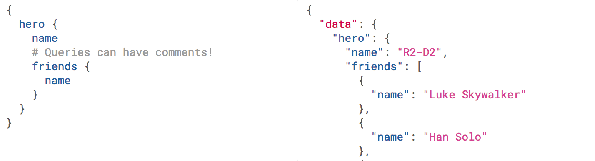
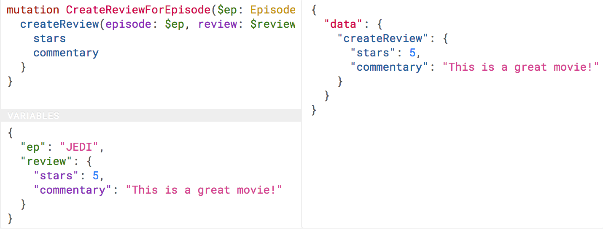

= RPC, REST and Query Languages

When interacting with an API there are some fundamental things you need to know
about how the API works, and one of the main things is: what sort of API is it? 

Assuming its a request/response API it's probably going to be an RPC API (like
gRPC), a REST API, or a query language API (like GraphQL). Before getting too
much further, understanding the differences between these APIs is going to be
vital, because it will massively effect how your application will interact with
the API.

== Paradigms, Implementations, & Specifications

If paradigms are general approaches, those approaches need to have some sort of
manifestation to exist. These are implementations. Implementations are something
you can actually download, install, and use to build an API. 

The process of turning a mere concept like an API paradigm into actual code
means making a lot of decisions, and with enough developers involved over the
years a lot of different decisions are going to be made. This means there are a
fair few different Specifications floating around that try to tie down how
various implementations should work.

If an API an its clients are all using tools that are speaking following the
same specification then everything should work out ok. 

For example:, you have probably heard of some of these terms being used in
conjunction with APIs you're working with.

- SOAP is a specification, following the RPC paradigm, with implementations like https://www.genivia.com/dev.html[gSOAP]
- gRPC is an implementation, following the RPC paradigm, which has no standard or specification by any working group, but the authors (Google) did https://github.com/grpc/grpc/blob/master/doc/PROTOCOL-HTTP2.md[document the protocol].
- REST is a paradigm only, has never been turned into a specification (but is the basis of many like OData like JSON:API), and has no official implementations.
- GraphQL is a specification, following the query language paradigm for fetching data and the RPC paradigm for sending data, and implementation - although many third-party implementations also exist.

Yeah, the world of APIs can be ridiculously confusing. Welcome!

You might not need to know all of this just to talk to these APIs, but it certainly helps to have a certain level of confidence in how this is all _meant_ to work when having discussions with API developers (who can be pretty opinionated! 😇)

== Remote Procedure Call (RPC)

RPC is the most simple form of API interaction. It is about
executing a block of code on another server, and when implemented in
HTTP or event-based protocols it can become a Web API. 

There is a method and some arguments, and that is pretty much it. 

Think of it like calling a function in JavaScript, taking a method name and
arguments.

For example:

....
POST /sayHello HTTP/1.1
HOST: api.example.com
Content-Type: application/json

{"name": "Racey McRacerson"}
....

In JavaScript, we would do the same by defining a function, and later
we'd call it elsewhere:

....
/* Signature */
function sayHello(name) {
  // ...
}
/* Usage */
sayHello("Racey McRacerson");
....

The idea is the same. An API is built by defining public methods; then,
the methods are called with arguments. RPC is just a bunch of functions,
but in the context of an HTTP API, that entails putting the method in
the URL and the arguments in the query string or body.

When used for "CRUD" (Create, Read, Update, Delete), RPC is just a case of
sending up and down data as a bunch of properties, which is fine. One downside
is that the client is entirely in charge of pretty much everything. The client
must know which methods (endpoints) to hit in what order, to construct its own
workflow out of otherwise incredibly naive and non-descriptive endpoints.

RPC is merely a concept, but that concept has a lot of specifications,
all of which have concrete implementations:

* https://en.wikipedia.org/wiki/XML-RPC[XML-RPC]
* https://en.wikipedia.org/wiki/JSON-RPC[JSON-RPC]
* https://en.wikipedia.org/wiki/SOAP[Simple Object Access Protocol
(SOAP)]

XML-RPC and JSON-RPC are not used all that much other than by a minority
of entrenched fanatics, but SOAP is still kicking around for a lot of
financial services and corporate systems like
https://developer.salesforce.com/docs/atlas.en-us.api.meta/api/sforce_api_quickstart_intro.htm[Salesforce].
XML-RPC was problematic, because ensuring data types of XML payloads is
tough. In XML a lot of things are just strings, making it hard to differentiate between integers, floats, and numeric strings. There's no difference between `false` and `'false'`, so care needs to be taken. JSON helps with differentiating some of these data types with primitive types covering strings, numerics, and booleans, but still has trouble differentiating between integer and float.

One solution to these type problems is layering metadata on top. This became
part of the basis for SOAP, which used
https://en.wikipedia.org/wiki/XML_schema[XML Schema] and a
https://en.wikipedia.org/wiki/Web_Services_Description_Language[Web Services
Description Language (WSDL)] to explain various types and validation rules for different properties.

This idea of "descriptions" (metadata explaining data) will come up again in the future, because being specific about what data is all about could not be more important for client-server relationships.

At the most basic level, descriptions are essentially what most science teachers
drill into you from a young age: "label your units!" It's the sort of thing that
stops people paying $100 for something that should have been $1 but was just
marked as "price: 100" and that was actually cents... At larger scales it's
helpful to know if the "distance" field is metric or imperial, to avoid bad
maths crashing your billion dollar satellite into Mars.

A modern RPC implementation is https://grpc.io/[gRPC], which can easily be
considered modern (and mostly better) SOAP. It uses a data format called
https://developers.google.com/protocol-buffers/[Protocol Buffers] (or Protobuff
for short), which requires a schema as well as the data instance, much like the
WSDL in SOAP. GRPC focuses on making single interactions as quick as possible,
thanks to the way it leverages HTTP/2 (and now HTTP/3), and the fact that
Protobuff packs down smaller than JSON. Fear not, JSON is available as an
option too.

== Representational State Transfer (REST)

REST is a network paradigm described by Roy Fielding in
https://www.ics.uci.edu/~fielding/pubs/dissertation/top.htm[a
dissertation] in 2000, which is not the easiest read and doesn't have the
flashiest website. Despite all that its been considered the standard for APIs
years. REST is all about a client-server relationship,
where server-side data are made available through representations of data, often broken down into "resources" and "collections" of resources. 

Representations are most commonly defined in JSON (and decreasingly XML), but
could be "form data", CSV, or even images. 

Representations are then potentially modifiable with actions and relationships
being made discoverable via a concept known as hypermedia controls (HATEOAS).

Hypermedia controls is fundamental to REST, but is massively misunderstood by
the people making the APIs, and often by the people using the APIs too.
Basically hypermedia controls are a way of defining and sharing "next available
actions", which could be fetch this related data, or might be some sort of action to progress through a workflow like paying an invoice. 

Sticking with the idea of an Invoice resource, there might be a Pay link, which guides the client in how to create a Payment Attempt. If the pay link is there, that means the invoice is in a payable state (not in draft, and not already paid for). The client knows this not by having to infer some state from some random field, but because the pay link is there for them to follow.

[source,json]
--
{
  "data": {
    "type": "invoice",
    "id": "093b941d",
    "attributes": {
      "created_at": "2017-06-15 12:31:01Z",
      "sent_at": "2017-06-15 12:34:29Z",
      "paid_at": "2017-06-16 09:05:00Z",
      "status": "published"
    }
  },
  "links": {
    "pay": "https://api.example.com/invoices/093b941d/payment_attempts"
  }
}
--

This is quite different to RPC. Imagine the two approaches were
answering the phones for a doctors office:

> *Client:* Hi, I would like to speak to Dr Watson, are they there? If so,
what time can I see them?
>
> *RPC:* No. \*click*
>
> \*Client calls back*
>
> *Client:* I checked his calendar, and it looks like he is off for the
day. I would like to visit another doctor, and it looks like Dr Jones is
available at 3pm, can I see them then?
>
> *RPC:* Yes.
> 
> \*Client goes to find out what office Dr Jones is likely to be in then.*

The burden of knowing what to do is entirely on the client. It needs to
know all the data, come to the appropriate conclusion itself, then has
to figure out what to do next. REST however presents you with the next
available options:

> *Client:* Hi, I would like to speak to Dr Watson, is he there? 
>
> *REST:* Doctor Watson is not currently in the office, he'll be back tomorrow,
but you have a few options. If it's not urgent you could leave a message and
I'll get it to him tomorrow, or I can book you with another doctor, would you
like to hear who is available today? 
> 
> *Client:* Yes, please let me know who is there! 
> 
> *REST:* Doctors Smith and Jones, here are links to their profiles.
> 
> *Client:* Ok, Doctor Jones looks like my sort of Doctor, I would like to see them, let's make that appointment.
> 
> *REST:* Appointment created, here's a link to the appointment details.

REST provided all of the relevant information with the response, and the
client was able to pick through the options to resolve the situation. Of
course REST would needed to know to look for `"status: unavailable"` and
follow the `other_doctors` link to
`/available_doctors?available_at=2017-01-01 03:00:00
GMT`, but that is far less of a burden on the client than forcing it to
check the calendar itself, ensure it's getting timezones right when
checking for availability for that time, etc.

=== Key Principles of REST

Putting Hypermedia Controls aside for a second, there are a few other
key principles that a REST API is meant to follow:

* Requests are stateless: not persisting sessions between requests without some sort of API key / authentication token
* Responses should declare cacheablility: helps the API scale simply and consistently
* REST focuses on uniformity: if the API is using HTTP it should utilize the generic interface that the transportation layer proxies. Simply that means REST APIs operating 
over HTTP should use generic HTTP features whenever possible, instead of inventing special conventions.

These constraints exist to help REST APIs last for decades, which is almost
impossible to do without these concepts. This might not always be important, as
startups don't always last for decades, so the "move quickly and break things"
mindset wins, and that may or may not work out for the API developers, and may
or may not work out for the API clients.

REST also does not require the use of a schema or description format, which many
API developers were frustrated about with SOAP. For a long time nobody was
building REST APIs with schema, but since 2020 it's become far more common
thanks to http://json-schema.org/[JSON Schema]. This description format was
inspired by XML Schema, but more in concept than reality as the functionality
diverged. This optional layer is something we will talk about a lot, as it can
provide some incredibly functionality like client-side validation that was
defined by the backend, to save repeating validation logic in places which can
diverge.

=== REST & RESTish

Unfortunately, REST became a marketing buzzword for most of 2006-2014.
It became a metric of quality that developers would aspire to, fail to
understand, then label as REST anyway. 

Many systems implemented most of what REST is about, but stopped short of
leveraging all of the benefits. These APIs are jokingly called RESTish by people
aware of the difference.

Instead of an RPC-style `GET /getWidgets` you do a vaguely REST `GET /widgets`,
and that's about the extent of the difference. The running joke is that these
APIs are SEO optimized RPC APIs, because they are just an RPC API with HTTP
methods.

A RESTish API might not have any conventional cacheability provided, so you will
have to think about how to do reliable caching on your end. 

A RESTish API will definitely not bother defining links to discover next available actions, which is missing the most useful part of a REST API for API clients.

=== REST is a State Machine

I like to think of REST as a state machine operating over a network, and this can help to conceptualize the benefits for the client-server relationship. 

At first REST can feel like a lot of extra faffing about for client developers.
Surely they can manage their own workflows better so they don't need hypermedia
controls and HTTP caching provided for them, and RPC would be easier?

That is missing the point. Not all API interactions need to be about executing
arbitrary remote code as fast possible. REST can still be performant, but it's
more focused on helping clients navigate through workflows, where resources in
different states can lead to different forks in the workflows. Trying to do this
with RPC-thinking can be very brittle when its hardcoded into a wide array of
different clients, and any server-side changes can require simultaneous
deployments of all the clients or lots of awkward versioning shenanigans.

Centralizing state into the server has benefits for systems with multiple
different clients who offer similar workflows. Instead of distributing all the
logic, checking data fields, showing lists of "Actions", etc. around various
clients - who might come to different conclusions - a REST API should keep it
all in one place.

=== REST Specifications

REST has no specification, and that has leads to some of this confusion that got
us stuck with RESTish APIs for so long. REST doesn't have any concrete
implementations either. 

That said, there are two large popular specifications which provide a whole lot
of standardization for REST APIs that chose to use them:

* http://jsonapi.org/[JSON-API]
* https://www.hydra-cg.com/[Hydra]
* http://www.odata.org/[OData]

If the API advertises itself as using these then you are off to a good start.
These are more than just standardized shapes for the JSON, they guide
pagination, metadata, manipulating relationships between existing items, etc.

You can use a HTTP client in your programming language that's aware of these
standards to save yourself some work. This gives you some of the benefits of an
SDK even if the standards-based client isn't aware of the particular API you're
interacting with.

Otherwise you're stuck hitting the API directly with a plain-old HTTP client, but
you should be ok with a little bit of elbow grease. This might mean converting data in funny shapes into something thats more pleasant to work with in your codebase, or figuring out complex code for following pagination yourself.

== GraphQL

Listing GraphQL as a direct comparison to these other two concepts is a little
odd, as GraphQL is essentially a query language for fetching data, and RPC for
everything else. GraphQL takes a lot from the REST/HTTP community, ignores some
bits it wasn't interested in, and built new conventions on top.

Initially this was a bit of a nightmare as none of the generic HTTP tooling
would understand those conventions. The rate of growth in the GraphQL ecosystem since its public launch in 2014 has meant lots of great GraphQL-aware tooling has popped up. Over time some of the generic HTTP tools added special GraphQL awareness, so these days it's not quite as much of a stark difference trying to interact with GraphQL and other REST/RESTish APIs. 

For example, HTTP Clients like Postman and Insomnia all have special GraphQL modes.

=== Query Language and Mutations

GraphQL is basically RPC with a default procedure providing a query language,
which is conceptually a little like SQL (Structured Query Language) used for database interactions. 

A GraphQL request involves asking for resources and the specific properties
you're interested in receiving.

.GraphQL Example request using Star Wars as a domain. It asks for a hero resource, with the name of the hero, and a list of their friends names.

It has Mutations for creates, updates, deletes, etc. and again they are
exactly RPC.

.A GraphQL example of a Mutation, reviewing an Return of the Jedi, saying "It's a great movie!"

GraphQL has many fantastic features and benefits, which are all bundled in one
package. If you are trying to learn how to make calls to a GraphQL API, the
http://graphql.org/learn/[Learn GraphQL] documentation will help, and their site
has a bunch of other resources.

Seeing as GraphQL was built by Facebook, who had previously built a
RESTish API, they're familiar with various REST/HTTP API concepts. Many
of those existing concepts were used as inspiration for GraphQL
functionality, or carbon copied straight into GraphQL. Sadly a few of
the most powerful REST concepts were completely ignored.

Endpoints are gone by default, resources and collections cannot declare their
own cacheability, the concept of leveraging the uniform interface is
replaced with lots of implementation-specific conventions that will vary from
API to API. All of this has various pros and cons, like being able to use GraphQL outside of HTTP - i.e. AMQP or any other transportation protocol.

The main selling point of GraphQL is that it defaults to providing the
very smallest response from an API, as you are requesting only the
specific bits of data that you want, which minimizes the Content
Download portion of the HTTP request. It also reduces the number of HTTP
requests necessary to retrieve data for multiple resources, known as the
"HTTP N+1 Problem" that has been a problem for API developers through
the lifetime of HTTP/1.1, but thankfully was solved quite nicely in
HTTP/2 and further improved with HTTP/3.

Sadly despite being a rather nice package, GraphQL through Mutations
force the responsibility onto clients to know everything. The only
difference between RPC and GraphQL is the ability to request which
fields you get on a successful mutation.

> *Client:* Hi, I would like to see Dr Watson, and if they are free, what
time can I see them, and what location?
> 
> *GraphQL:* No. \*click*
> 
> \*Client calls back*
> 
> *Client:* I checked their calendar, and it looks like they are off for the
day. I would like to visit another doctor, and it looks like Dr Jones is
available at 3pm. If they are still free can I see them then, and what location?
> 
> *GraphQL:* Yes. 3pm at the Soho Office.

That is a handy feature as it saves a tiny bit of network bandwidth, but
again the client was forced to figure out its own workflow instead of
being presented with potential next actions. It has reduced the follow-up questions required to complete the workflow because you can ask for related data to be combined into the response.

This sort of thing makes GraphQL very nice for fetching custom reports,
gathering statistics, etc., and fine enough for CRUD, but pretty complicated for following more complicated workflows. This limits the type of clients that will benefit from interacting with a GraphQL API. Thankfully many companies offer both, and there are various ways to convert GraphQL to REST and vice versa which we will discuss later.

== How does Paradigm effect an API Client?

Banging on about different types of API paradigms and specifications might sound like it would be better off in a book directed at API developers, but clients can benefit from understanding the differences as API clients will fundamentally differ.

Let's talk about some of the differences and similarities to make all this
clear, so we can smash on through the rest of the book as experts with a shared
understanding of this stuff.

=== Light/Heavy Clients

In couples dancing there is usually one person leading, and another person
following. The leader will be in charge of signaling which moves should be made
next, and the follower responds to their hints. 

In REST the idea is that the server leads. 

In all forms of RPC (including GraphQL and RESTish), the client leads.

We already spoke about REST centralizing state, which is the concept of removing
the guesswork and decision making on things that the server is authoritative on. This means clients can following the various links to solve problems, being trained to know what a payment link means, what an archive link means, and whenever they pop up the client knows what to do.

The client application in a REST API becomes a thin UI, which handles user
interactions, forms, validations, rendering, animations, but very little
business logic needs to be hardcoded in. Nobody needs to write "If this product has enough stock left, and the `status != "archived"`, and the user is in a country that sells the item, then show the buy button", because the REST API will offer you a "buy" link if the user can buy it, and now show it if they can't.

Light clients are only possible when an API has been designed to support the
workflow in mind. This is most common when a very specific API is being designed
to support a Web and Mobile version of the same business workflows.

Often an API has not been designed to serve specific use-cases. For decades APIs
were built to be as generic as possible, because if its generic then anyone can
do anything, but as more APIs started popping up it made more sense to have some
generic "data APIs" and some more workflow orientated. 

Whether an API is intentionally generic, or its just foolishly vomiting out the
database out over the wire, you'll find yourself needing to make a Heavy Client
to sift through all the data. There will be a lot of deciphering to get the job
done. 

=== Inferring State from Arbitrary Fields

At a previous job, one API developer team suggested that clients should check
responses for `location_uuid == null` to infer the "membership type" was a
special "Anywhere member" (a member who can access any coworking spaces.) 

One day they changed the logic, suggesting clients check for `location_uuid ==
"some-special-uuid"` instead of looking for `null`. This was not communicated to
the developers in charge of various systems, as nobody remembered which of the
50+ systems were making the outdated checks. 

One outcome of that was to confuse the permissions API, which started denying
things it should not have been denying. Who even knows what else broke and what
else was fixed by various teams working on various systems. Applications need to
be investigated, fixed, and updated.

Inferring meaning from arbitrary fields can lead to production issues,
angry users, and wasted developer time debugging bizarre things. 

The preferred approach for a RPC, RESTish or GraphQL API would be to have the
current state centralized on the server. This would be done with a simple field
like `"type"` which could have a few options like `"anywhere"`, `"other"`, and
the API can figure out when to display that. 

If the API you are working with asks you to infer state of some random fields,
politely let them know that you don't want their laziness to break your client
application. Request they provide their data in a useful generic fashion, so
past/present/future clients don't need to guess everything.

=== Various Places "Available Actions" Can Live

Working out the current state is bad enough, but working out what to do
"next" from arbitrary properties can be really tough. 

At that same job, a piece of functionality was required on companies user management pages, that would let the "primary member" promote somebody else to be a primary member. Business logic complicated this even further by requiring users could not be "primary members" of more than
one company at the time.

The API didn't help API clients with this at all, so both the JavaScript and iOS clients did it the hard way.

Both clients defined helper functions in their applications, which involved lazy-loading all the users and all their seats (seats join users to companies) and checked this was the right seat for the right company, then made sure the company was active.

[source,javascript]
--
IsNotPrimaryOfAnotherCompany(user, company_uuid) {
  return _(user.data.result.seats).select(s => {
    return s.company.uuid != company_uuid &&
    s.status == "active" &&
    s.kind == "Licensee" &&
    s.company.status == "active";
  }).isEmpty();
},
--

[quote,Zack Kitzmiller]
It might not be pretty, but at least it's slow.

That's quite a faff for both the JavaScript and iOS developers, and when we get the Android app done that'll be a faff for them too. 

When the iOS native codebase forgot to add that `s.status ==
"active"` condition, the two devices were showing different actions, which was confusing for users who had both the mobile and the web application and were seeing different options available. 

We then fixed it on iOS, and a few months later another rule was added to the
JavaScript code, causing another unexpected difference that regression tests did
not catch.

Really we should have just demanded the API Developers add a `is_promotable:
true` property, which would contain all of the logic internally. The API is far
better at handling this; it'll do it more performantly, and it will be able to
change its the logic internal whilst still communicating the same meaning. 

If the API you're using doesn't define next available actions for you, instead of littering these around the whole codebase, try and make some sort of state machine layer between the interface and the data layer, so that you can turn the raw data of the API into something the interface logic doesn't need to know about. 

// TODO example of the above code in some sort of reactish state machine code example

== Summary

Regardless of the type of API being offered to you, you can build a brilliant experience so long as you know what the expectations are for how that API works. 

Whether that comes from a brilliantly designed API that lines up with client teams needs and expectations, or whether that comes from excellent documentation or a brilliant SDK, it doesn't much matter what type of API is being used at a fundamental level. 

Maybe you're building a light client, maybe you're building a heavy client, but focus on moving business logic that relates to API data as high up the stack as you can: definitely not in user interface, maybe the controllers, ideally somewhere as high up in the application as possible.

If you're lucky enough to be in discussion with the API developer teams during
the design process, try and get them to listen to your needs. If they are
building an API thats handling workflows, discuss with them that centralizing
state can save multiple clients trying to copy business logic rules, which
reduces the chance of different clients inferring things wildly differently.
Tell them to get hypermedia controls in to make a decent REST API to reduce how
many different clients are guessing differently.

Letting the server take control of such things can be a little scary, and it
also depends on the relationship the client has with the API, the team
developing it, and the intent of the client application. If the API is a
third-party, letting them lead could cause some unexpected results. If the API
was designed without the knowledge of the clients requirements, the API might
not do a very good job of leading.

And if you just need to grab some data and do a thing, well, who cares. Let's grab that data, mush it about, and ship it... well, that's the "happy path" at least

Whatever sort of API you are using, it probably wants to know who you are, or at least know what your application is. Let's learn about authentication so you can start working with actual APIs, then armed with enough information to become dangerous we can try to disarm some of the footguns before they go off.
