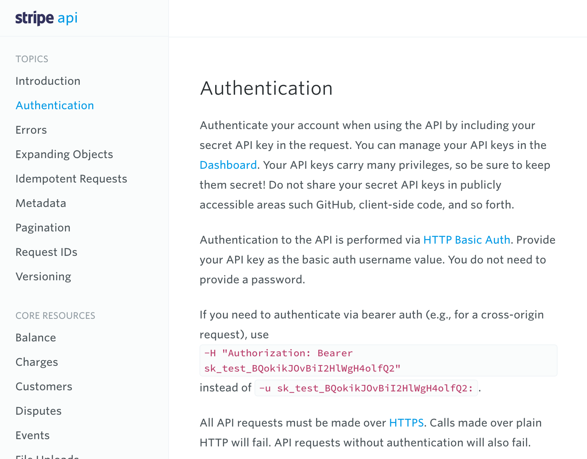

= Authentication

Some read-only APIs might let you grab data without needing any sort of credentials set up, but at some point you're almost certainly going to need to figure out Authentication, Authorization, API Keys, API Credentials, Access Tokens, Bearer tokens, JWTs... or a whole sack full of terminology that all basically comes down to letting people or machines do various tasks that you wouldn't want the wrong people doing.

== Basic Concept

Generally the idea is to require API clients to provide some sort of unique
information, similar in concept to a username and a password, but hopefully not literally a username and password because that is fraught with security concerns.

The API wants to know that the request is:

1. coming from a user or application that actually exists
2. has been allowed to make that request
3. has not had its access revoked

An API might also want to tie you to a specific payment plan, or want to at least have your email so they can pester you about buying things or warn you about changes.

The unique information given to the API client is usually referred to as
"credentials" or "tokens", and it can be a little different depending on whether the API client is interacting with the API on behalf of itself, or on behalf of a user in the API.

== User or Application

Say you're building a Mastodon client. The Mastodon application will need general credentials in order to fetch the public posts, find the current trends, do all the public stuff you're seeing before the end user logs in.

To log the end user in, your Mastodon client will need to say "Hey Mastodon Server, it's me, Legit App, you can tell because you gave me those secret API credentials! This person wants to log in, is that alright with you?"

Then the Mastodon server will say "Yeah those credentials check out, alright... here are some more credentials for that specific users' session."

Now you can do things as your application, or on behalf of that end user specifically.

== Authentication vs. Authorization

These two terms get thrown around interchangeably sometimes but mean very different things, and I always forget so let's write it down.

[quote,onelogin.com]
--
Authentication and authorization are two vital information security processes that administrators use to protect systems and information. Authentication verifies the identity of a user or service, and authorization determines their access rights.

Authentication and authorization are similar in that they are two parts of the underlying process that provides access. Consequently, the two terms are often confused in information security as they share the same "auth" abbreviation. Authentication and authorization are also similar in the way they both leverage identity. For example, one verifies an identity before granting access, while the other uses this verified identity to control access.
--

Does this matter to you? Possibly.

Some APIs will only want to know that you are allowed to be working with the API, then the whole API is open to you. 

Some APIs will want to know if you are meant to be doing the specific thing you are trying to do.

Some APIS will accidentally forget to check if you're meant to be looking at certain information and you can steal loads of data thats meant to be tied to some other company just by changing details.

.Graphic from apisecurity.io highlighting one of the largest security threats in badly made APIs.


Oops! You probably don't want to be using an API where this is possible, so it's worth trying to have a quick hack before you start building it. More API security concerns can be found via the https://owasp.org/www-project-api-security/[OWASP API Security Project].

Anyway, even when its not a security issue, it can be confusing to see these two different concepts munged into the `Authorization` HTTP header when we're only trying to do basic authentication... 

Ahh well. Computers are weird. Let's get into it! 

== Getting Your API Keys / Access Tokens

Depending on the type of API you're working on, the credentials could be given to you in a bunch of different ways.

*Internal APIs:* If the API was made a few desks over and its application credentials, then you'll probably get told an API Token, or have it direct messaged to you.

*External APIs:* You'll probably have to sign up for some sort of Developer Portal, make an account, and possibly create an App to get your credentials.

If there is API documentation there will usually be a section called Authentication, and that should tell you whether you need API keys, access tokens, or what, and will help you find them.

.Screenshot from https://stripe.com/docs/api/curl#authentication[Stripe's Authentication documentation].


Stripe do a great job of directing people to the Dashboard to find API keys, it's explained right after the Introduction! Like many APIs, pop over to the Dashboard, then look for a "Developers" link. 

Once there look for something like "Get API Key".

.Stripe's Developer Portal, showing an API key being made.


Copy this somewhere secret, maybe into a password manager for now, so you can
use it whenever you like, but it's not easy to find by the criminals.

== Using API Keys

If you're lucky enough to have a good SDK for the API then this might be incredibly easy. Just grab that code, bung it into some sort of environmental variable manager, and effectively you're just doing this.

.Stripe's JavaScript SDK showing an API key being passed in. Hardcoded... naughty!
[,javascript]
----
include::code/ch04-authentication/01-stripe-sdk.js[]
----

.Keep your API keys out of source control! 
[sidebar]
--
Better to pass that in through something like dotenv, which is a cracking environment variable manager available in most languages.

[source,javascript]
----
import Stripe from 'stripe';
import * as dotenv from 'dotenv';

dotenv.config();

const stripeApiKey = process.env.STRIPE_API_KEY;
----

You can usually make a `.env.development` to store "muck around" tokens, then your production deployment/build probably has a way to pop in production Environment Variables.

Don't ignore this step, as there's all sorts of unknown horrors that can befall you if you commit API keys to source control, like Git Copilot happily auto-completing tokens into other peoples code and letting them do crimes.

image::images/ch04-authentication/github-copilot-crimes.png[Reddit post titled "GitHub copilot just leaked someones api key..." with the code embedded with a hardcoded api key right there.]
--

When SDKs are not an option it isn't too much different to 

.How would that authenticated Stripe SDK example look in a plain old HTTP client?
[,javascript]
----
include::code/ch04-authentication/02-bearer-token.js[]
----

Here we have simple passed in the `Authorization` HTTP header, with a "Bearer" token, which is the keyword `Bearer` with a space and the token popped in behind it. This is one of the more common ways to do auth for HTTP, but there are plenty more to keep you guessing.

== Authorization Methods

Here are a few of the authentication methods you're likely to come up against working with various HTTP APIs (if the SDK hasn't abstracted it away for you.)

=== Authorization Header

The Authorization header is part of a https://developer.mozilla.org/en-US/docs/Web/HTTP/Headers/Authorization[general HTTP authentication framework] which can be used with several https://developer.mozilla.org/en-US/docs/Web/HTTP/Authentication#authentication_schemes[authentication schemes].

- Basic
- Bearer
- Digest

These all work in a similar way to the example above, you pass in `Authorization` as a header in every request, then the server will respond with a 401 if it's no good.

*HTTP Basic* is password based, so have generally been used less and less. Basic is especially bad as somebody sniffing network traffic can see the password. It's not plaintext, but base64 encoded, and that can be decoded with no effort.

.HTTP basic credentials grabbed from the browser that look encrypted, but...


If anyone was to grab that traffic (man in the middle, snooping on a public network) then they could base64 decode it:

```
$ echo YWRtaW46cGFzc3dvcmQxMjM= | base64 -d
admin:password123
```

Decoding it shows the password, which can allow for privilege escalation if an attacker can now logs in as the user. They could change account details to lock the original user out. They might even be able to access other systems if the password is reused.

If an API is using HTTP Basic then see if the password is an actual password, or if its an access token being used as a password. If its a user account password then you might not want to use this API. If it's a token then that's just fine, as tokens cannot be used to login, only to make authenticated requests, so most of those other problems go away.

HTTP Digest is a bit safer going over the wire as it is taking password checkums, which is fairly similar to how most login forms work anyway. 

```
Digest: sha-256=X48E9qOokqqrvdts8nOJRJN3OWDUoyWxBf7kbu9DBPE=
```

Digest checksums are a bit tricky to construct, but essentially you mush a lot of different things together and checksum it up:

- Compute A1 as MD5("username:realm:password").
- Compute A2 as MD5("requestMethod:requestURI").
- Compute the final hash, known as “response”, as MD5("A1:nonce:A2").

This can also get sketchy depending on how that API client is getting that password. It's ok if the API client is asking the user to log in, then sends that HTTP digest authenticated token off then ok for a single request, or a few requests together. It's ok if the API client uses that digest approach to talk to an authentication server to get credentials on behalf of the user. It's not ok if the API client is storing that password in plain text so it can repeat those requests. Y'all going to get hacked and get in trouble.

*HTTP Bearer* tokens are far more common, and that token is either the API Key like we discussed earlier, or some sort of other credential tied to the user specifically. Some will last forever, some might expire and need refreshing, and some might get revoked if you're doing something cheeky.

=== JWTs (JSON Web Tokens)

A JWT (JSON Web Token) is a compact, URL-safe way to represent claims to be
transferred between two parties, which in our example is client and server. It's
a type of authentication and authorization token that is commonly used in web
applications and APIs.

A JWT is made up of three parts: a header, a payload, and a signature. The
header contains information about the algorithm used to sign the token, while
the payload contains the actual data or claims that are being made about the
user or request. The signature is used to verify the integrity of the JWT,
ensuring that it has not been tampered with or modified.

When a user logs in to a web application or API, they are issued a JWT, which is
then used to authenticate subsequent requests. The JWT is typically included in
the request headers or as a query parameter, and the server can verify its
authenticity by decoding the token and verifying its signature.

JWTs are useful for single sign-on (SSO) scenarios, where a user can log in to
multiple applications using a single set of credentials. They are also commonly
used in microservices architectures, where each service can use the JWT to
verify the identity of the user or request.

.Simple example of a JWT being created with a shared secret to talk to a hypothetical API.
[,javascript]
----
include::code/ch04-authentication/03-jwt.js[]
----

In this example, we use the jwt library to sign the JWT token with a secret key, which can be used to verify the token on the server side. We then set up the API request headers with the JWT token, using the Bearer scheme, and the Content-Type header to indicate that we are sending JSON data.

We then make a request to the API using the fetch API, passing in the URL and headers. We parse the response JSON data and log the information about the golden retriever breed to the console.

=== Query String

Some APIs will ask you to send API keys or access tokens via the URL.

.A request to fetch a list of products from a Shopify store which includes the access token in the query string.
```
GET /admin/api/2021-01/products.json?access_token={access_token}
```

Passing access tokens through query strings is generally frowned up for most
APIs, as it can lead to tokens being leaked, but there are plenty of ways to
reduce this impact. 

1. Don't log or expose this key in any way inside your application.

2. Don't let the access token make its way to the browser, as people will see it
in their history or network tab, and malicious actors could grab that.

Shopify allow access tokens in the URL to authenticate requests to their API
from their various integrations. This is made less dangerous by Shopify allowing
developers to limit the "scope" of their app's access by specifying which parts
of the Shopify store the app can access. This helps ensure that the app only has
access to the data it needs, and reduces the risk of data breaches. 

== Auth in HTTP is usually "Stateless"

What confuses many folks when faced with HTTP Authentication, is that
most of the time the authentication happens on every single HTTP
request.

That is right: Every. Single. Request.

This sounds bizarre at first, as we are so often used to the concept of
"Users logs in, then they have a session and can do logged in stuff
until they log out or the session expires" being the one paradigm for
how users login. That paradigm certainly exists for some APIs, but its
rare, and for plenty of good reasons.

To cut a long story short, servers are happier when they do not need to
remember who a specific user is. For example, if the API actually has
multiple application servers all running behind load balancers, a client
could hit a different server with each request they make. If cookies
were used, then the user would be logged out every time the load
balancer routed them to a different application server, unless it went
to the trouble of maintaining "sticky sessions" to keep the user hitting
the same server. That is all well and good until that application server
is replaced by another instance on deployment... should users really be
logged out due to a deployment?

For this, and many other reasons (like not having to worry about
logouts), HTTP Authentication tokens are passed on every single request
made.

// TODO Wedge in OAuth 2,2.1
