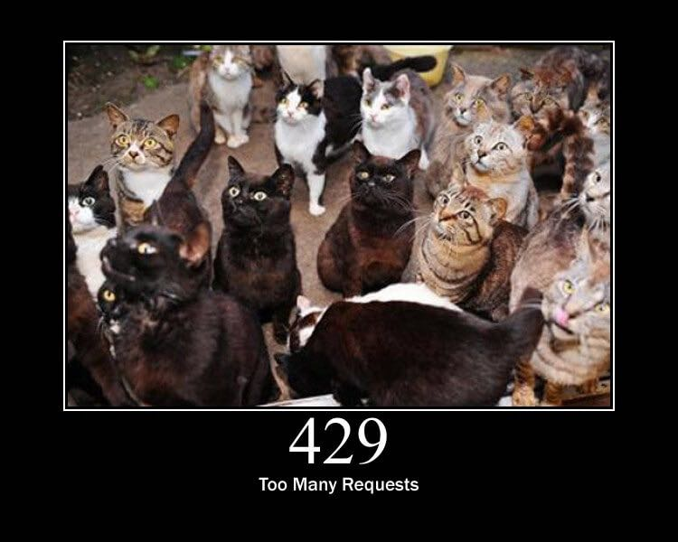

= Common Pitfalls

Getting the happy path coded up is super easy. Usually the happy path is
something like "I expect a quick response, with valid JSON, in the
format my code expects it" often feels about as naive as thinking "I can
just ride my bike to work in NYC without two taxi drivers, a truck, a
whole family of tourists, cops on horses, a dog walker, and a raccoon,
all trying to kill me."

== Connection Failures

Connection failures can happen for all sorts of reasons:

* Mobile user gets on the subway
* Laptop user switches WiFi networks, and the new one has a captive portal login
* API rate limiting has decided your client is too chatty
* API deployment caused temporary instability
* AWS is down again
* Cockroaches made a nest in the API servers

Going over the wire is fraught with danger, and it gets worse the
farther a request and response have to travel. A common theme "in this
book will be: avoid making network calls when possible, expect failure,
and make sure your user interface degrades to vary levels, so failures
are clear. No white screens of death!

One quick tip: make sure your HTTP client throws exceptions whenever
possible, which makes failures a lot more clear. Some applications
presume the call will work then fall over on JSON parsing, or some other
business logic later down the line which expects an object, but the
object contains some error message and the required keys are missing.
This all makes debugging very complicated as the backtrack will send you
off on some wild goose chase looking at some unrelated source code.

Failed to connect? Try it again, and if it fails a few times maybe show
something to the user explaining that their Internet is down.

It's important to make sure that no single part of any client
application _requires_ a connection to leave that state. Often I have
seen client applications submit a form, hide the form they just
submitted, fail to make the connection, and as they were expecting a
positive or negative JSON response in a specific structure, in order to
dictate showing the form again or progressing, they end up with a blank
screen.

Timeouts are also a concern, but more on those later.

== Rate Limiting

Another common situation to run into is rate limiting: the API telling
you to calm down a bit, and slow down how many requests are being made
in a certain timeframe. The most basic rate limiting strategy is often
"clients can only send X requests per second."

Many APIs implement rate limiting to ensure relative stability when
unexpected things happen. If for some reason one client causes a spike
in traffic, the API has to continue running smoothly for other users
instead of crashing. A misbehaving (or malicious script) could be
hogging resources, or the API systems could be struggling and they need
to cut down the rate limit for "lower priority" traffic. Sometimes it is
just because the company providing the API has grown beyond their
wildest dreams, and want to charge money for increasing the rate limit
for high capacity users.

Often the rate limit will be associated to an API key or access token, so it can
be tied to a specific account. Our friends over at Nordic APIs very nicely
explain some other rate limiting strategies:

[quote,Kristopher Sandoval,https://nordicapis.com/stemming-the-flood-how-to-rate-limit-an-api/]
____
Server rate limits are a good choice as well. By setting rates on
specific servers, developers can make sure that common use servers, such
as those used to log in, can handle a lot more requests than specialized
or seldom used servers, such as data conversion devices.

Finally, the API developer can implement regional data limits, which
limit calls by region. This is especially useful when implementing
behavior-based limiting; for instance, a developer would expect the
number of requests during midnight in North America to be lower than the
baseline daytime rate, and any behavior contrary to this without a good
reason would suggest questionable activity. By limiting the region for a
period of time, this can be prevented.
____

All fair reasons, but for the client it can be a little pesky.

=== Throttling Your API Calls

There are a lot of ways to go about throttling your API calls, and it
very much depends on where the calls are being made from. One of the
hardest things to limit are API calls to a third party being made
directly to the client. For example, if your iOS/web/etc clients are
making Google Map API calls directly from the application, there is very
little you can do to throttle that. You're just gonna have to pay for
the appropriate usage tier for how many users you have.

Other setups can be a little easier. If the rate limited API is being
spoken to via some sort of backend process, and you control how many of
those processes there are, you can limit often that function is called
in the backend code.

For example, if you are hitting an API that allows only 20 requests per
second, you could have 1 process that allows 20 requests per second to
pass through. If this process is handling things synchronously that
might not quite work out, and you might need to have something like 4
processes handling 5 requests per second each, but you get the idea.

If this process was being implemented in NodeJS, you could use
https://www.npmjs.com/package/bottleneck[Bottleneck].

....
const Bottleneck = require("bottleneck");
 
// Never more than 5 requests running at a time.
// Wait at least 1000ms between each request.
const limiter = new Bottleneck({
  maxConcurrent: 5,
  minTime: 1000
});

const fetchPokemon = id => {
  return pokedex.getPokemon(id);
};

limiter.schedule(fetchPokemon, id).then(result => {
  /* ... */
})
....

Ruby users who are already using tools like Sidekiq can add plugins like
https://github.com/sensortower/sidekiq-throttled[Sidekiq::Throttled], or
pay for Sidekiq Enterprise, to get
https://github.com/mperham/sidekiq/wiki/Ent-Rate-Limiting[rate limiting
functionality]. Worth every penny in my books.

Every language will have some sort of throttling, job queue limiting,
etc. tooling, but you will need to go a step further. Doing your best to
avoid hitting rate limits is a good start, but nothing is perfect, and
the API might lower its limits for some reason.

// TODO This may be a good place to explain the Debounce and throttle methods
// that lodash provides, since they often get comingled/confused

=== Am I Being Rate Limited?

The appropriate HTTP status code for rate limiting has been argued over
about as much as tabs vs spaces, but there is a clear winner now;
https://tools.ietf.org/html/rfc6585[RFC 6585] defines it as 429, so APIs
should be using 429.

Twitter's API existed for a few years before this standard, and they
chose "420 - Enhance Your Calm". They've dropped this and moved over to
429, but some others copied them at the time, and might not have updated
since. You cannot rule out bumping into a copycat API, still using that
outdated unofficial status.

Google also got a little "creative" with their status code utilization. For a
long time were using 403 for their rate limiting, but I have no idea if they are
still doing that. Bitbucket are still using 403 in their Server REST API.

[quote,REST Resources Provided By: Bitbucket Server,https://docs.atlassian.com/bitbucket-server/rest/5.12.3/bitbucket-rest.html]
____
Actions are usually "forbidden" if they involve breaching the licensed user limit of the server, or degrading the authenticated user's permission level. See the individual resource documentation for more details.
____

GitHub v3 API has a 403 rate limit too:

....
HTTP/1.1 403 Forbidden
X-RateLimit-Limit: 60
X-RateLimit-Remaining: 0
X-RateLimit-Reset: 1377013266
{
   "message": "API rate limit exceeded for xxx.xxx.xxx.xxx. (But here's the good news: Authenticated requests get a higher rate limit. Check out the documentation for more details.)",
   "documentation_url": "https://developer.github.com/v3/#rate-limiting"
}
....

Getting a 429 (or a 420) is a clear indication that a rate limit has
been hit, and a 403 combined with an error code, or maybe some HTTP
headers can also be a thing to check for. Either way, when you're sure
it's a rate limit error, you can move onto the next step: figuring out
how long to wait before trying again.

=== Proprietary Headers

Github here are using some proprietary headers, all beginning with
`X-RateLimit-`. These are not at all standard (you can tell by the
`X-`), and could be very different from whatever API you are working
with.

Successful requests with Github here will show how many requests are
remaining, so maybe keep an eye on those and try to avoid making
requests if the remaining amount on the last response was 0.

....
curl -i https://api.github.com/users/octocat
HTTP/1.1 200 OK
X-RateLimit-Limit: 60
X-RateLimit-Remaining: 56
X-RateLimit-Reset: 1372700873
....

You can use a shared key (maybe in Redis or similar) to track that, and
have it expire on the reset provided in
http://en.wikipedia.org/wiki/Unix_time[UTC time] in `X-RateLimit-Reset`.

=== Retry-After

According to the RFCs for HTTP/1.1 (the obsoleted and irrelevant RFC
2616, and the replacement RFC 9110), the header
https://www.rfc-editor.org/rfc/rfc9110#field.retry-after[Retry-After] is only
for 503 server errors, and maybe redirects. Luckily
https://tools.ietf.org/html/rfc6585[RFC 6584] (the same one which added
HTTP status code 429) says it's totally cool for APIs to use
`Retry-After` there.

So, instead of potentially infinite proprietary alternatives, you should
start to see something like this:

....
HTTP/1.1 429 Too Many Requests
Retry-After: 3600
Content-Type: application/json

{
   "message": "API rate limit exceeded for xxx.xxx.xxx.xxx.",
   "documentation_url": "https://developer.example.com/#rate-limiting"
}
....

An alternative value for Retry-After is an HTTP date:

....
Retry-After: Wed, 21 Oct 2015 07:28:00 GMT
....

Same idea, it just tells the client to wait until then before bothering
the API further.

By checking for these errors, you can catch then retry (or re-queue)
requests that have failed, or if thats not an option try sleeping for a
bit to calm workers down.

_*Warning:* Make sure your sleep does not block your background
processes from processing other jobs. This can happen in languages where
sleep sleeps the whole process, and that process is running multiple
types job on the same thread. Don't back up your whole system with an
overzealous sleep!_

Faraday, a ruby gem I work with often, is
https://github.com/lostisland/faraday/pull/773[now aware of
Retry-After]. It uses the value to help calculate the interval between
retry requests. This can be useful for anyone considering implementing
rate limiting detection code, even if you aren't a Ruby fan.

== Error Codes and Error Messages

Error codes are usually strings or integers that act as a unique index
to a corresponding human-readable error message with more information
about what is going wrong. That sounds a lot like HTTP status codes, but
these errors are about application specific things that may or may not
have anything to do with HTTP specific responses.

Some folks will try to use HTTP status codes exclusively and skip using
error codes because they do not like the idea of making their own error
codes or having to document them, but this is not a scalable approach.
There will be some situations where the same endpoint could easily
return the same status code for more than one different condition. For
example, a 403 could be because the authenticated user is not allowed to
send a message to this specific user, or it could mean the users has
been banned entirely.

HTTP status codes are there to merely hint at the category of error.
When an API needs to return application specific information, it can do
that with a simple bit of JSON in the response.

For example, an issue with the access token will always result in the
user not being recognized. An uninterested client would simply say "User
could not get in" while a more interested client would probably prefer
to offer suggestions via messages in their own webapp/iPhone app
interface.

....
{
  "error": {
    "type": "OAuthException",
    "message": "Session has expired at unix time 1385243766.
The current unix time is 1385848532."
  }
}
....

Humans can understand that nicely enough, but this example from an old
version of the Facebook Graph API is not good enough. Their "type" is
vague, making it rather hard for computers to understand the problem.
They have added error codes since then, which removes the hell which is
substring matching a bit of text to find out the specifics of what is
going on.

Twitter does a great job of having their
https://developer.twitter.com/en/docs/basics/response-codes.html[error
responses and codes documented]. It's a good thing they use error codes
on top of HTTP status codes, because they loooooooove to use 403. In the
Twitter API, a 403 response could mean:

* The access token being used belongs to a suspended user.
* The OAuth credentials cannot be validated. Check that the token is
still valid
* Thrown when a user cannot follow another user due to some kind of
limit
* Thrown when a Tweet cannot be viewed by the authenticating user,
usually due to the Tweet's author having protected their Tweets
* This was a duplicated follow request and a previous request was not
yet acknowleged

This is a snipped list because I got tired of copying and pasting.
Twitter are misusing 403 for most of those examples past the first, but
they've never much cared about good API design.

Anyway, if you check their documentation, they have a code next to each
of those specific error instances, which means you can figure out
exactly which situation you are in when a 403 pops up.

*Programatically Detecting Errors*

You can use error codes to make an application respond intelligently to
failure of something as basic as a posted Twitter

status.

....
try:
    api.PostUpdates(body['text'])
except twitter.TwitterError, exc:
    skip_codes = [
        # Page does not exist
        34,
        # You cannot send messages to users who are not following you
        150,
        # Sent too many
        # TODO Make this requeue with a dekal somehow
        151
    ]
    error_code = exc.__getitem__(0)[0]['code']
    # If the error code is one of those listed before, let's just end here
    if error_code in skip_codes:
        message.reject()
    else:
        # Rate limit exceeded? Might be worth taking a nap before we requeue
        if error_code == 88:
            time.sleep(10)
        message.requeue()
....

Compare this sort of logic with the Facebook example from when they
lacked error codes:

....
except facebook.GraphAPIError, e:
    phrases = ['expired', 'session has been invalidated']
    for phrase in phrases:
        # If the token has expired then lets knock it out so we don't try again
        if e.message.find(phrase) > 0:
            log.info("Deactivating Token %s", user['token_id'])
            self._deactivate_token(user['token_id'])
    log.error("-- Unknown Facebook Error", exec_info=True)
....

Looking out for codes is considerably more reliable than checking for
bits of text in a message, but if you have no choice then do what you
have to do.
