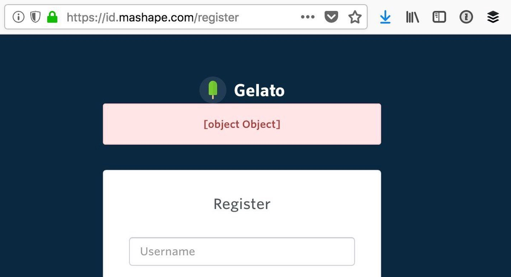

= Error Codes and Error Messages

Error codes are usually strings or integers that act as a unique index
to a corresponding human-readable error message with more information
about what is going wrong. 

That sounds a lot like HTTP status codes, but these errors are about application
specific problems. HTTP status codes are part of the picture, they can define a
category of issue, but they are never going to explain the whole story.

Here are two examples from a carpooling application I worked on, which had a
"simulated savings" endpoint, to let folks know how much they might save picking
up a passenger on their driving commute:

This error let the client know the coordinates were too close together, meaning
it is not even worth driving let alone trying to pick anyone else up.

```
HTTP/1.1 400 Bad Request

{
  "errors" : [{
    "code"   : 20002,
    "title"  : "There are no savings for this user."
  }]
}
```

This carpool driver is trying to create a trip from Colombia to Paris, which would get a bit wet.

```
HTTP/1.1 400 Bad Request

{
  "errors" : [{
    "code"   : 20010,
    "title"  : "Invalid geopoints for possible trip."
  }]
}
```


Notice here that for both errors, the status code was 400. It is very common for a single HTTP status code to have multiple possible outcomes, and that's where error messages and error codes come in.

Error messages for humans.

Error codes for computers.

Another example, a 403 could be because the authenticated user is not allowed to
send a message to this specific user, or it could mean the users has
been banned entirely.

HTTP status codes are there to merely hint at the category of error.
When an API needs to return application specific information, it can do
that with a simple bit of JSON in the response.

== Different Error Formats

You will come across a lot of different error formats, of varying qualities and usefulness.

At first a lot of API developers ignore most of that and just make an error be a single string.

[source,json]
--
{
  "error": "A thing went really wrong"
}
--

Then somebody points out it would be nice to have application codes, and new versions of the API (or some different APIs built in the same architecture) start using a slightly modified format.

[source,json]
--
{
  "error": {
    "code": "100110",
    "message": "A thing went really wrong"
  }
}
--

Guess what happens when a client is expecting the first example of a single
string, but ends up getting that second example of an object?



When an error is an object but the client shoves it into a string, JavaScript will turn that into `"[object Object]"` and the end-user gets to see something hilarious/confusing as hell.

Beware, errors may change, and for some reason some API developers don't consider that to be a breaking change?

I remember writing a bunch of code that would check for various properties, if
error is a string, if error is an object, if error is an object containing `foo`,
if error is an object containing `bar`..

Here's another common problem with error formats.

.JSON error from an old version of the Facebook Graph API which only had type and message.
[source,json]
--
{
  "error": {
    "type": "OAuthException",
    "message": "Session has expired at unix time 1385243766.
The current unix time is 1385848532."
  }
}
--

Humans can understand that easily enough, but it's a message aimed at API client developers not your clients end-users. It needs to be translated from nerd to people, and it doesn't give you anything to base localization translations either.

The `type` is vague, making it rather hard for computers to understand the problem, but you can at least say "User was logged out, please try and log in." 

Annoyingly another `OAuthException` might be "You do not have permissions to access this Page" so saying "User was logged out..." to the end-user is confusing. It could also just mean you need to refresh the token, so... ugh. Guess I'll be matching on substrings then! 

[source,python]
--
except facebook.GraphAPIError, e:
  phrases = ['expired', 'session has been invalidated']
  for phrase in phrases:
    # If the token has expired then lets knock it out so we don't try again
    if e.message.find(phrase) > 0:
      log.info("Deactivating Token %s", user['token_id'])
      self._deactivate_token(user['token_id'])
  log.error("-- Unknown Facebook Error", exec_info=True)
--

Facebook have long since added error codes to their error messages. They even have subcodes! 🧐

[source,json]
--
{
  "error": {
    "message": "Message describing the error",
    "type": "OAuthException",
    "code": 190,
    "error_subcode": 460,
    "error_user_title": "A title",
    "error_user_msg": "A message",
    "fbtrace_id": "EJplcsCHuLu"
  }
}
--

To give you an idea of the sort of data you might find in an error object, here is how Facebook document their error formats: 

- `message`: A human-readable description of the error.
- `code`: An error code. Common values are listed below, along with common recovery tactics.
- `error_subcode`: Additional information about the error. Common values are listed below.
- `error_user_msg`: The message to display to the user. The language of the message is based on the locale of the API request.
- `error_user_title`: The title of the dialog, if shown. The language of the message is based on the locale of the API request.
- `fbtrace_id`: Internal support identifier. When reporting a bug related to a Graph API call, include the fbtrace_id to help us find log data for debugging.

Still, you might be running into APIs that are just a message. Try to centralize the substring matching and keep an eye out for changes to error messages. Have an "unknown error" case in the switch that will report new errors back to the developers somehow, so you can see if changes are causing problems.

== Good API Errors

A good quality API error will have at the very least:

A human readable short summary.

[source,json]
--
{
  "error": {
    "title": "Cannot checkout with an empty shopping cart"
  }
}
--

A human readable message with more detail to explain why this happened and hopefully suggest what to actually do about it.

[source,json]
--
{
  "error": {
    "message": "It looks like you have tried to checkout but your basket is empty. Please add some items to your basket and try again."
  }
}
--

An application-specific error code relating to the problem.

[source,json]
--
{
  "error": {
    "code": "#ERR_CART_EMPTY"
  }
}
--

Links to a documentation page or knowledge base where API client developers - or maybe even end-users of the client - can figure out what to do next.

[source,json]
--
{
  "error": {
    ...
    "href": "http://example.org/docs/api/errors#ERR_CART_EMPTY"
  }
}
--

== Standard Error Formats

There are a million unique snowflake error objects out there, but as with everything in API land standards are here to help. 

Of course not just one standard, there are two for REST/RESTish APIs, and everything else has entirely different approaches.

=== Problem Details (RFC 7807))

https://tools.ietf.org/html/rfc7807[Problem Details for HTTP APIs (RFC 7807)] is a brilliant standard from Mark Nottingham, Erik Wilde, released through the IETF.

[source]
--
HTTP/1.1 403 Forbidden
Content-Type: application/problem+json
Content-Language: en

{
  "type": "https://example.com/probs/out-of-credit",
  "title": "You do not have enough credit.",
  "detail": "Your current balance is 30, but that costs 50.",
  "instance": "/account/12345/msgs/abc",
  "balance": 30, <1>
  "accounts": ["/account/12345", "/account/67890"] <2>
}
--

<1> Extra attribute with the current balance, so you can use that as a variable in custom constructed error messages if you like.

<2> Another extra attribute to link to the accounts that are associated with the users account, to show more information if you want it.

This example from the RFC shows the user was forbidden from taking that action, because the balance did not have enough credit. 403 would not have conveyed that (it could have meant the user was banned, or all sorts of things) but there is text, and there is a type, which is just an error code in the form of a URL.

[quote,Internet Engineering Task Force (IETF),https://www.rfc-editor.org/rfc/rfc7807]
--
A problem details object can have the following members:

- `type` (string) — A URI reference [RFC3986] that identifies the problem type. This specification encourages that, when dereferenced, it provide human-readable documentation for the problem type (e.g., using HTML [W3C.REC-html5–20141028]). When this member is not present, its value is assumed to be abou:blank".
- `title` (string) — A short, human-readable summary of the problem type. It SHOULD NOT change from occurrence to occurrence of the problem, except for purposes of localization (e.g., using proactive content negotiation; see [RFC7231], Section 3.4).
- `status` (number) — The HTTP status code ([RFC7231], Section 6) generated by the origin server for this occurrence of the problem.
- `detail` (string) — A human-readable explanation specific to this occurrence of the problem.
- `instance` (string) — A URI reference that identifies the specific occurrence of the problem. It may or may not yield further information if dereferenced.
--

The type is a URI instead of an arbitrary code, so you might see `https://example.com/probs/out-of-credit` and that's going to be unique to some other error like `ERR_NO_CREDIT` would be, but it's also unique to this specific API which might help differentiate another error from another API you're talking to. 

That URI may or may not resolve, so try using it as a URL and see if it loads up. If it does then its likely to have more documentation on how to fix your problem.

=== JSON:API

Another popular data format for REST/RESTish APIs is JSON:API. Most of the spec focuses on the data and relationships, but it also defines what error structures should look like.

[source]
--
HTTP/1.1 400 Bad Request
Content-Type: application/vnd.api+json

{
  "errors": [
    {
      "status": "403",
      "code":   "ERR_DAY_OFF",
      "source": { "pointer": "/data/attributes/secretPowers" },
      "detail": "Editing secret powers is not authorized on Sundays."
    },
    {
      "status": "422",
      "code":   "ERR_CRANK_LIMIT",
      "source": { "pointer": "/data/attributes/volume" },
      "detail": "Volume does not, in fact, go to 11."
    }
  ]
}

--

This one is a little different, because you can have multiple errors! This is absolutely brilliant for validation errors, but if you get a mixture of client and server errors you might have to pick which is more important. Let the codes inform that decision.

Once you know what format errors should be coming back in, you can try to optimistically look for errors in that format when something goes wrong (HTTP Status Code 400-599 is returned).

== Beware

Sometimes APIs will randomly return errors on 200, which is meant to be a success. GraphQL is designed to work this way so it shouldn't e a surprise, but if you're working with a REST/RESTish API that'll catch you by surprise. If the data you're seeing is not the data you were looking for, then check to see if its an error hiding in a success response.

Just because some of the errors respond with a proper error status code, doesn't mean all API errors will always have one. Those errors could be coming from another tool in the chain, or might have just been written badly and nobody noticed. Code defensively.

These errors are mostly "something has gone wrong, this is how you should fix it", and that's great, being told about problems is handy, but what about all the weird things that happen when going over the wire?

// TODO 
// == code samples solving common problems
// == Localization
