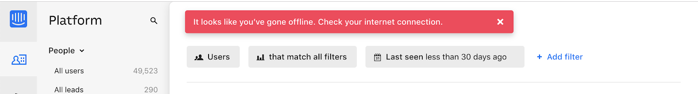
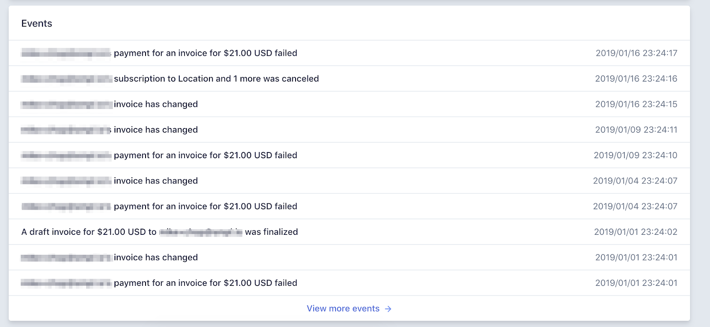

= User Experience Pitfalls

Connecting to and using the APIs that enable your application are only
part of the story.  Creating and managing a design that is both
intuitive and useful for the people using your application is critical
to building successful software.  Paradoxically,
https://en.wikipedia.org/wiki/Aesthetic_usability_effect[science has
shown] that if your users _perceive_ your product to be aesthetically
pleasing, they will feel like they're using more intuitive (and thus
more valuable) software.  Whether you consider yourself a full-stack
developer, a front-end developer, or a database engineer, it's to your
benefit to take advantage of this by understanding where your work fits
into the bigger picture of User Experience design on your team.  

Once you've figured out how to consume a given API, spend some time
considering all of the ways in which things might go wrong. Within
reason, do your best to utilise user experience patterns which help
users feel empowered when everything is working correctly, and
well-informed when API calls fail.

== Progressive Data Presentation

The vast majority of the time, your API will probably be working
perfectly well, but not providing data to your application quickly
enough to be perceived as instant by your users. When a page in your
application appears empty for even a fraction of a second, it can make
your app seem like it is unresponsive, or not working correctly, or just
sluggish.  This is easy to forget when you're developing your app on a
beefy workstation - particularly if your dev environment includes your
API, database, and app. You may be seeing imperceptible loading times of
<200ms, but that won't be representative of your app's typical consumer.
They could be in the middle of nowhere, traveling, underground, or
throttled for some suspect reason (looking at you, _AT&T!)._

Perceived loading time is particularly sensitive in the case of people
loading your app on mobile devices - whether through a browser or from a
native app downloaded from their respective app store. These are people
who can experience download speeds that vary wildly from moment to
moment - and honestly, this is something that can be really easy to lose
sight of.

You - _you_ - the developer/designer/maker of this thing, are building
your app in an environment you have some control over. Your home office
or your couch are likely connected to a predictably performant broadband
network. If you work in a traditional office or a coworking space,
high-speed broadband is generally a safe bet, too. Hell, even if you're
throwing back $7 lattes while designing and building your app at your
local specialty coffee shop, I'd bet your connection is pretty damn
good. In _any_ of these cases, if your connection degrades or goes down,
you've very likely got a plan B that your users may not have.

What I want you to do here is close your eyes and imagine yourself using
your app from somewhere else, with a less ideal connection. Maybe you're
on a train riding from Brussels to Paris, with a spotty wifi connection
that comes and goes as you fly through the countryside. Maybe you're in
a quiet cafe in Vietnam, sipping an iced coffee in the sweltering heat,
connected to a network that makes everything just a bit of a struggle.
 What if you're on a mobile phone in the middle of Pune India, on a
crowded 3G Network, or in Midtown NYC where the signal is inexplicably
awful? It can _really_ suck, right? This is something you should
regularly do - even if you don't expect the majority of your users to be
in this kind of situation.  You can also use a simulator to slow your
network, like the Chrome devtools
https://developers.google.com/web/tools/chrome-devtools/device-mode/#network[network
throttling utility].

.Chrome DevTools can simulate different bandwidth options on your site.  It's an eye-opening experience.

This, of course, begs the question: what can we do to make the page
loading experience better for our users? A good place to start is to
think about experiences you've had with sites and apps that behave badly
when it comes to loading data on a page.

You've undoubtedly come across a website whose content loads in
unpredictable chunks - with content appearing and unfolding haphazardly
on the page right in front of your eyes, pushing content you were trying
to read down without warning. This is a step better than the "Web 1.0"
days where you'd need to wait for _everything_ to load before displaying
any content, but only because there's a chance you may be able to get to
what you're looking for slightly more quickly. It's tricky business
trying to guess what's going on in an app while content is popping into
existence left and right, changing the layout of the page as it arrives
back from its journey through the API.

Think of it this way: you know that one website you use, where you go to
click on the link to [_the thing you want to do],_ but just as you go to
click on it, something on the page loads just above where you're about
to click, causing the page to reflow so that you click the _[Sign Out]_
button instead of that one simple thing you wanted to do?

.User tries to click the Pay Bill button while a component is still loading...

.When the component loads that pushes the button down and the user can end up clicking self-destruct.

AHHHH!

There's a few great, proven patterns we can use to avoid that kind of
rage-inducing experience. While you're waiting on data to come back from
an API, render content placeholders on screen.

.Facebook does a great job of this - while timeline content is loading, animated data placeholders are displayed in a way that makes the application feel alive.

=== Progressive data loading

Users are able to anticipate where new content will load on screen. Gradients
which represent usernames and post content are subtly animated, which prevents
users from thinking something has gone wrong. If you're viewing facebook from a
device with a decent connection to the web, this can all happen _incredibly_
quickly, but the end result is an interface which feels like it is responding to
your request for more content (by scrolling down the page).

If a particular request is taking a long time to complete, inform you users that
you're still loading a response. If your user closes your app or page due to
slow loading, you both lose. This can be as simple as changing a loading status
from "Loading..." to "Still waiting..." after a few moments.

.Netflix loads each show individually, maintaining their position in the grid on-screen while others load.  You'll never accidentally tap the wrong show!

.The BBC's website loads images last, but holds their position in the layout until images are loaded.

Lucky for you, some of these effects are fairly easy to accomplish on
your own.  What's even better is that with a quick search of your
favorite open-source repositories, you may find community-supported
libraries, packages, and plugins that support this sort of behavior.
 Some examples include
https://www.npmjs.com/package/react-placeholder[react-placeholder]
(React), and
https://www.npmjs.com/package/@netbasal/ngx-content-loader[ngx-content-loader]
(Angular).

== Everything is a Hierarchy

Let's be clear: while it is easy to discuss, this is _not_ an inherently
straightforward task for a product team (even a one-person team) to
execute on. In my experience, I've found it can be beneficial to start
by dissecting your interface into its hierarchical data components. Put
simply, this means you should break down a given screen into an _ordered
list_ of information on the page. As with many design-related
activities, this is firmly rooted in science.

Spend enough time around seasoned designers, and you'll eventually hear
someone prattle on about
https://en.wikipedia.org/wiki/Maslow's_hierarchy_of_needs[Maslow's
Hierarchy of Needs]. If up until this moment you've been lucky enough
to have never encountered Maslow, I can save you some time: from a UX
perspective, the hierarchy tells us that first we should deliver what
the user _needs_ before we give them what they [think they] want. (In
reality, Maslow tell us quite a bit more than that, but for the sake of
this example, this should be a suitable oversimplification). 

So let's come back to the example of dealing with a user on a
particularly slow connection. Looking at any page or interface as a
hierarchy of data being presented to the user becomes advantageous for
us if we have some idea of what actions a user might be looking to
accomplish on a page.

=== First: The sublime, a Logical Hierarchy

In practice, this isn't difficult to get started on. For a given
interface, make a list of all of the _types of information_ on the
screen. From that list, ask yourself: _Which bit of information here is_
*_most_* _important?_ Do the same thing for all remaining bits of data.
Just like that, you've got a _logical hierarchy_ of the data on your
page. From a User Experience perspective, that's really step 1. If
you're working with a reasonably well-designed bit of interface, this
hierarchy should be reflected in the design of the page. It's very
likely that the single most important thing on a given screen should be
the biggest/boldest thing, and located somewhere near the very top of
the content area of the page.

.For example, if you are showing a feed of articles, and next to that feed of data are some suggestions for things to read next, and a list of trending articles, then feed is probably the primary data, the suggestions might be secondary, and the service which shares trending articles might be down, so that could be tertiary.

.Load the most pertinent content first and progress from there based on how important it is to your reader

=== Then: Which data is most expensive?

Once you've got your _logical hierarchy_ sorted, it's time to take a
realistic look at the types of data that are contained in each layer of
the hierarchy. Some basic analysis of data types should help you figure
out which bits of interface are most expensive to load (in english:
loading images and video take the longest). There's no hard and fast
rule for how this should affect the prioritized ordering of data being
loaded on your page. In some situations, you may the main feature image
or video to load first, if that's what the person viewing your interface
is most interested in. In other cases, images and video serve more to
add context and richness to a design - in these cases, it may be safe to
delay loading these until more critical information in your hierarchy is
available.

=== Next: Bring in the harsh realities of development

At this point, you'll have an idea of the order in which data _should_
be loaded -- ideally. You will inevitably find that this isn't
technically feasible in all cases. Your APIs may not provide information
granularly enough for you to request just-the-bits-you-want, and that's
_okay!_

These days there is a big push for flexibility in requests. A lot of
APIs offer you the ability to grab a lot of data all at once, but they
should also let you load just the bits you want. This used to be slow in
a HTTP/1 world, with browsers limiting you to 6 connections to a domain
at any time. Now that you can use HTTP/2, that limit is configurable,
and defaults to about 100 in most browsers, so crack on and make more
connections.

In particular, with GraphQL, this gives you the opportunity to pare your
query down to _exactly the data_ you need for a given view. This give
you the opportunity to consume an API in exactly the ways that you need,
making for extremely efficient data requests.

Combining this with the process we discussed for loading information
progressively, you can craft separate queries for each tier of
information you need to display on a given view. This will help ensure
that when a given query comes back, it will contain only the data needed
to hydrate a particular subset of your interface.

If you're building your application with a modern framework like Angular
or React, you can suddenly build a custom query for each type or
collection of components loaded onscreen, which can be tweaked as design
or business requirements change.

For third-party APIs, you'll have to work with what is available to you.
For APIs delivered by your team or organization, this gives you an
opportunity to have a discussion about data delivery strategy. Often
times, when testing early versions of a product, there's no sense in
creating APIs _or_ interfaces that work this way. Once your team has
proven the value of what you're building, you can revisit the page load
experience to make things feel smoother and more intuitive.

== Connectivity

There are many different ways in which your users might lose
connectivity while using your app. If we anticipate what these may be,
given the context of a particular app, we can build interfaces which
convey what's gone wrong, and give opportunities or suggestions to
remedy the situation.

=== Completely offline

What happens when your app loses its connection to the internet? When
you detect a loss of connectivity, have a strategy on-hand for
presenting that to your users.

.Intercom provides a helpful notification when users are offline, without disabling every action on the page. 

You may also be able to cache actions while your users are offline. You've
probably experienced this before with your mail client of choice. Gmail,
Outlook, Thunderbird, and whatever else you might prefer will let you draft new
emails (and replies to existing emails) while offline. You can even send them,
which puts the email into your outbox, to be sent as soon as your connection
comes back from the dead.

For both web and mobile applications, the strategy for enabling offline
actions is fairly similar - first, make sure the user knows they're
offline. Beyond that, if there are actions that they may reasonably be
able to perform without loading more information from the web - let
them! This generally includes actions where your user is annotating some
content (tagging financial records with metadata, marking an action as
completed), or drafting new content (like writing an email, or drafting
a blog post).

Behind the scenes, those actions will get cached to local storage on the
device using any of a number of techniques, depending on your
implementation. Once your app detects that connectivity has returned,
the user's actions are sent off to your API in the order they were
executed while offline. Once confirmation comes back from the server
that the job is done, data is reloaded on the client-side, and they
should be up to speed!

In web app parlance, this type of behavior is often called a Progressive
Web App (or PWA). Depending on your implementation details, there are
loads of different ways to accomplish the PWA dream. For example,
Amazon provides a service called https://aws.amazon.com/appsync/[AWS
AppSync] for GraphQL, and Google's Firebase has several action caching
strategies built into their framework
(https://firebase.google.com/docs/database/android/offline-capabilities[Web],
https://firebase.google.com/docs/database/ios/offline-capabilities[IOS],
and
https://firebase.google.com/docs/database/android/offline-capabilities[Android]).
 Ruby on Rails has a library called
https://rossta.net/blog/service-worker-on-rails.html[serviceworker-rails],
and ASP.net has an open source library extension called
https://github.com/madskristensen/WebEssentials.AspNetCore.ServiceWorker[WebEssentials.AspNetCore.ServiceWorker]
- all ready for you to dive in and make your users' lives better.

For actions which you're unable to cache locally while your users are
offline, disable anything on screen that users won't be able to use.
This might not mean you should disable the _entire_ screen. For example,
it is often a good idea to keep Log Out actions available, so that users
on public or shared devices can exit your app locally. On a web app,
this generally means clearing local storage and cookies of any cached
information you've stored - none of which requires a connection to the
internet.

=== Temporarily offline

Imagine that your site is being viewed from a mobile phone. Your user
enters an elevator or a tunnel, and connectivity drops temporarily right
in the middle of an API call. Can you recover?

There are considerations to be made in recovering gracefully. If the
user started an interaction in offline mode and suddenly regains their
connection, it's generally not a great idea to assume that the
connection is then steadfast and reliable. In other words, do not
suddenly assume that internet is fantastic and there to stay.

This is a common failure of applications with amazing offline support.
As soon as they detect a connection, they attempt to flush all local
changes to their cloud services. If everything goes well, and the
connection is indeed back for good, _great!_ But - as is often the case,
if the connection then goes down while these local changes are being
sent up to the API, everything that was waiting to be sent to the API in
the local cache is lost.

This happens for example in Asana (a todo list application) for iOS,
which is often recommended entirely because of the service's advertised
offline syncing. Imagine this: You write up a bunch of todo items when
underground or without an internet connection. Your offline changes stay
on your phone, waiting for the moment you regain service, so they can
sync back up to Asana's servers. This all works perfectly when you have
a great connection, _but_ if that sync attempt gets a 500 it throws a
bunch of alert boxes and errors, then eventually just forgets about the
todo items, along with the user who wrote them. _Sorry I didn't get you
a birthday present, mum!_

=== Some services or endpoints are offline

What happens if the API you're trying to access is down for maintenance?
Most modern applications take advantage of _many_ external services. If
an API or service is not critical to the functionality of your
application, the show must go on! Don't disable everything because your
connection to the Google Analytics API is down.

This can be done with frontend circuit breakers, or just generally
checking if services are down. Naturally, some judgement is needed to
decide how to handle missing services.  Completely non-critical services
should fail silently, and those which fall somewhere between there and
being mission critical should be disabled intelligently.

In some cases, that should be exactly what it sounds like - let your
users know something is missing or offline temporarily, and disable any
interface elements that might lead to that offline service breaking
things.  In other cases, after letting users know that something is
temporarily offline, it might be better to get it out of their way - and
to hide it until that service comes back online.

While booking a parking space recently, Spothero.com's mapping
service went down.  Instead of giving me a frustratingly useless map
interface, it let me know the service was down, and hid the view option
until the map service came back.  Brilliant!

In some cases, you may be able to provide a good fallback: if your video
hosting CDN is down, and you have the luxury of a backup CDN, switch to
the fallback!  Similarly, if you can tell that the google maps embed on
your page is breaking, it might make sense to fall back to
OpenStreetMap, or another similar service. If you're loading images on
your interface, having a fallback image or SVG loaded via CSS will
always look better than the browser or mobile OS's broken image
placeholder.  

=== API retries

It can be easy to forget that there are times when API requests might
fail the first time they're sent. Many front-end frameworks allow
developers to
https://github.com/greatjapa/node-fetch-retry[automatically]
https://www.rubydoc.info/gems/faraday/Faraday/Request/Retry[retry]
failed requests. This is great when connections drop momentarily, but
requires some restraint: be mindful that each retry attempt takes a
finite amount of time. If these attempts prevent users from accessing a
part of your interface, excessive retry attempts will make your app feel
unresponsive and broken. In order to combat this feeling, give your
users the ability to cancel retry attempts, and display a message or
status on your interface that clearly shows that a retry attempt is
being made.

You should have an application-wide strategy for retrying failed API
calls.  If you detect that an API fails, it may be okay to retry that
call 2 or 3 times before alerting the user that something is wrong.  In
these cases, it's also a good idea to keep track of the amount of time
between sending the initial request and alerting users - in cases where
API calls are taking multiple seconds to fail, it will be better to show
a failure notice as soon as you detect the first failure.  This takes
some intuition, and may also require some fine-tuning on a per-scenario
basis.

While retrying, it's also a good idea to add an exponential backoff to
your API calls.  In essence, this means you might wait 100ms after the
first API call fails (to give the server a chance to get its act
together), and 200ms after the second, then 400ms, etc.  At scale, this
will prevent you from accidentally DDoSing your API services when
there's a brief failure of an API.

It's also a great idea to communicate to your users when calls are
taking longer than expected, too.  Letting them know in plain english
that you're waiting for a response from the server gives you a chance to
let users know that your app hasn't frozen or crashed.  This is also an
opportunity to send a link to a system status page, so users can see
whether the problem they're having is local to them or not.

* Slack: https://status.slack.com/[https://status.slack.com]
* Amazon AWS:
https://status.aws.amazon.com/[https://status.aws.amazon.com]
* Strava: https://status.strava.com/[https://status.strava.com]

=== The tricky inverse - limiting / debouncing / buffering requests

When firing off API requests, you should take care to make sure that
your interface won't allow users to send the _same_ request again while
waiting for a response. This can be accomplished in a few different ways
- for actions that create or destroy data (like "New invoice" or "Delete
this user"), make sure to _disable_ the action buttons and menu items
that can trigger that behavior, until it is complete. Complete can mean
either a success or a failure, so remember not to keep that button
disabled if something failed.

For less destructive actions (like refreshing a list, for example),
using something like a https://www.npmjs.com/package/debounce[debounce]
function to limit the number of API calls users are able to send is
advisable. A well-crafted API will reject rapidfire responses with a
rate limiter of some sort, explained elsewhere in the book. Your
interfaces can interpret such responses and dynamically enable/disable
bits of interface accordingly, while providing meaningful messages for
your users.

You may also have the luxury of using or building APIs that provide
something like https://stripe.com/blog/idempotency[Stripe's Idempotency
Key].  This allows you to annotate your request with a unique key, so
that even if your request is sent to an API multiple times, it will only
ever be executed once.

.Stripe's Idempotentcy strategy helps stop API consumers from accidentally creating the same credit card charge more than once.

== Dealing with errors

Errors provide important feedback to users when something goes wrong. As
the developer, your job is to make sure the errors you're sending along
to your users make sense to _them_. This can be particularly
challenging, since as you become more familiar with the software you're
building, you will lose sight of how non-experts view your solution.

Your error messages should be informative and concise - giving some
indication of what's gone wrong, and how the problem might be remedied.
Something like

"It looks like you're not connected to the internet."

will always be better than

"ERROR 0xf172c: Unable to connect"

Adding an error code and more failure details behind a "More
Information" expanding box is a good common ground, as it means users
who are a bit more technically inclined can report the error code to
helpdesk staff. Adding a "Contact Support" which prefills an
email/contact form with the error code and other information is another
good option, or do both.  

Helpdesk staff and support engineers are the second important class of
people who benefit from information about errors that have occurred on
your application. These are people who are equipped to deal with the
technical details of a particular problem. When logging errors for
support staff, provide as much detail as possible so that they can find,
remedy, and fix any problems they may be tasked with supporting.

.Giving your support team as much information as possible can make your helpdesk experience feel like magic.

You can also use bug tracking services like
https://logrocket.com/[LogRocket] or https://sentry.io/[Sentry] to
silently send more contextual information to your support team in the
background, to better enable their support efforts.  These services can
also be tied to systemwide reporting, so that _as soon as_ an error is
seen, your team is alerted to the problem.  In its simplest form, this
may mean sending an email to a share inbox with a bug report, or to an
https://api.slack.com/incoming-webhooks[Incoming Webhook] on Slack which
posts to a shared channel.  Seeing how frequently users are encountering
a given error can help your engineering team prioritize bug fixes over
new feature development.  Being able to fix a bug before your users get
disenfranchised with your product will always be easy to sell to the
powers-that-be in your organization, particularly if you have data to
back up your story.

.An example error report sent to a slack channel via Incoming Webhook. Seeing errors happening in real time will help your team feel empathy for how (infuriatingly) often your users encounter a given bug.

== Undo Functionality

If you're doing something semi-permanent, make sure you give users the
ability to undo or cancel actions whenever possible.

.Toast notification from Gmail serves as an action confirmation and an undo opportunity for a few moments before your email goes out into the world.

Undo can be accomplished both proactively and reactively.  Proactive
undo scenarios are extremely common; most often, this comes in the form
of a modal dialog asking "are you sure you want to do this?"

Reactive undo scenarios are a bit trickier with web-based applications,
since edits and actions are often sent up to the cloud somewhere via API
call, rather than being stored locally, where it's easy to keep track of
a list of recent actions in memory.  

If you're using "events" logic, which might well be how you are handling
offline syncing, then this "undo" could be a case of removing the event
from a queue.  If you add delays to your queue (for certain events that
are hugely destructive or scary like sending email) then adding a 30
second delay to the queue before the event is handled makes this undo
work.

Another approach is to keep track of the relevant actions a user has
taken by way of a queue structure in your database.  Think of this as a
table listing instructions for your application to take on behalf of a
user. This can be useful in several ways - work completed on
asynchronous actions can be tracked to completion, and annotated with
error messages as necessary.  You can also store the information needed
to undo that action here. Finally, this can be presented back to your
users as a historical log of their activity on your service.

.Stripe provides an Events log to customers using their service, which can be extremely helpful in tracking down failed and missing payments.

