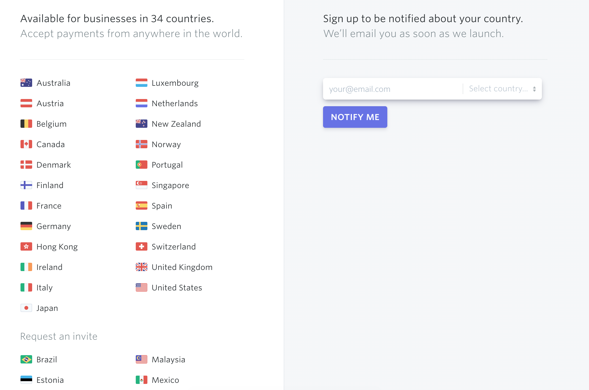

## drop in an introduction on form generation

- maybe go back and do this last

= Form Generation

Imagine you're building a shiny new web app which requires users to register an account with a profile that includes their mailing address.  You're using https://stripe.com[Stripe] for payments, and because of that, you're forced to limit registrations to the https://stripe.com/global[countries supported by Stripe].  Looking at their list on launch day, you see that they support _34 Countries_:

.Stripe's list of supported countries on day 1 of your product launch


Taking note of that list, you build out your HTML form with a `<select>` box that has an entry for each country:

[source,html]
----
<select>
  <option value="australia">Australia</option>  
  <option value="austria">Austria</option>
  <option value="belgium">Belgium</option>
  <option value="canada">Canada</option>
  <!-- etc -->
</select>
----

Having done that, you let the product out into the world.  Maybe you make a mental note to check back on Stripe's list of supported countries in 6 months - or you do one better and log a ticket in your project tracking system so that it doesn't get forgotten forever.  Even with the best of intentions, if Stripe updates their supported country list down the line, you may miss it for some length of time.  At best, that represents a lost opportunity to gain paying customers in a new geography. But what happens if Stripe _removes_ a country from their list? Suddenly you've got a potentially very broken experience on your hands.  Crap.

In a better world, this is exactly where form generation would start to save your butt. After some googling, you find that Stripe actually has https://stripe.com/docs/api/country_specs/object[an API endpoint] which you can use to grab a list of countries which they support.  It contains all of the metadata you'll need to make decisions about which countries to include in your dropdown list!  Suddenly you've got a solution on your hands which is much more maintainable:

----
// note: this is a simplified example, done with react, for illustration purposes

const countries = await fetch('https://api.stripe.com/v1/country_specs');

const countrySelect = (
  <select>
    {countries.forEach(country => <option key={country.id} value={country.id}>{country.displayName}</option>)}
  </select>
);

// render a select box with a list of countries
return countrySelect;
----

This approach can also save you loads of time when it comes to standardizing your UI.  There's a principle in software development called DRY (Don't Repeat Yourself), which can serve as an easy litmus for front-end developers.  Though the work may not have been incredibly complex, there's quite a bit of repeated code in the first example above. It's easy enough to add another country to that list by creating a new `<option />` tag with a few attributes on it, but once the story gets a little more complex, the work gets lots heavier.

What if your team decided that it was bad form to use the country name as the value of each checkbox, and instead that the value for each needs to be its ISO standard abbreviation? Now you've got to go back and edit each and every country to update its value.  The same goes for relatively common HTML-ish tasks, like adding an `id="blah"` attribute to each element.  

Imagine now that requirements have changed, and that your users now need to indicate _all_ of the markets in which they intend to do business.  Now your `<select>` doesn't make sense, and all of those `<option>` entries need to be turned into something like `<input type="check" />`.  That's a lot of work, and the amount of work grows linearly with each country added to the list.  Not good.

In all of these cases, you'll have to go back and update _each and every_ line of code manually.  Even if you're particularly savvy with your IDE, or are great at find/replace or perl scripting or regex or whatever it may be, you're opening yourself up to an error-prone and change-intensive process, which could be saved if you better encapsulated your interface with components or partials or includes, or whatever your implementation of choice makes available to you.

----
// country list implemented as a select dropdonw
const CountryEntry = ({ country }) => (
  <option value={country.id}>{country.displayName}</option>
);

const CountryList = ({ countries }) => (
  <select>
    {countries.forEach(country => (
      <CountryEntry
        key={country.id}
        country={country}
      />
    )}
  </select>
);
----

----
// country list implemented as checkboxes
const CountryEntry = ({ country }) => (
  <input
    type="checkbox"
    value={country.id}
  >
    {country.displayName}
  </input>
);

const CountryList = ({ countries }) => (
  {countries.forEach(country => (
    <CountryEntry type="checkbox"
      key={country.id}
      country={country}
    />
  )}
);
----

== JSON Schema

In the chapter on Validation, we discussed how JSON Schema can be used to keep form validation in tune with your API's validation rules. From a usability standpoint, using JSON Schema for validation alone can represent a massive leap in progress compared to old-world application development.  As JSON Schema can _also_ be used to generate your app's input forms. 

Using JSON Schema to generate forms takes a bit of work up front, but saves you loads of manual work and error-prone repetition when things change.  Essentially, for each data type which your application uses, your software will have a _set interface element_ which will be _dynamically generated_ to prompt for, validate, accept, and edit the type of data which it represents.

If that sounds great - it's because it absolutely is.  Imagine being able to add a field to a form just by telling the form that the field exists!  What's more, there's loads of great libraries which already exist to help front end developers with this.  As with anything else, you'd do well to search GitHub, NPM, PyPI, RubyGems, CocoaPods, Swift Package manager, and so on for well-maintained and widly used libraries in your implementation of choice.  

(For the examples below, we'll use the https://react-jsonschema-form.readthedocs.io/en/latest/[`react-jsonschema-form`] library to illustrate how this might work for you).

Using JSON Schema form generation tools typically looks something like this: an input form is generated (at least inj part) by feeding JSON Schema data into the form generator.  It provides hooks of some sort for your application to catch when the user requests a CRUD action from the form, providing some feedback for clientside validation alongh the way:

```
import React from 'react';
import Form from 'react-jsonschema-form';

const sampleSchema = {
  title: "Business Settings",
  type: "object",
  required: ["title"],
  properties: {
    title: {type: "string", title: "Title", default: "A new task"},
    done: {type: "boolean", title: "Done?", default: false}
  }
};
```

=== TODO TODO TODO finish this code sample
- pull schema contract from _somewhere else_ to illustrate how this actually works

This, as you can imagine, can save loads of effort when building forms in your applications. Most of the well-supported form libraries are flexible enough to work with anything you might throw at them.  Many are also extensible, allowing you to generate form controls from the UI library that you or your team are using for a given project.

**EXAMPLE: generating forms from a given UI Library**
- show how to generate components from several UI Libraries

=== Validation

=== **think about merging this with chapter 08 on validation**

Along with the shape of data required for your forms, JSON Schema provides for input and form validation, too.  For a given field, you can proid

- explain how type checking works in JSON Schema
- give a few examples of checking input validation:
  - asynchronously
  - on form submission
  - waititng for response from API

=== Resliance to API changes

- this all is super duper awesome because when the API upstream from your project changes, you don't need to lose sweat as long as you're checking for updated JSON Schema definitions.
- how/when to cache this
- how to prepare for API updates
- example: how to read docs for important API changes (maybe talk about semver a bit?)
- APIs can change, this can help, we'll talk more about that in a later chapter

=== Advising designers and front-end developers on how to use JSON Schema

- talk a bit about Atomic Design as it applies to form generation
- storybook storybook storybook:
  - 3rd party integrations - look for JSON Schema in docs for external APIs where you can generate interface for [their service].  If all else fails, talk to API developers about what you need!
- Set dev teams off on designing and building out form controls that are consistent with design guidelines before getting too deep on any specific form
- Give a few examples on how to display form validation errors: inline with fields given enough context, on top of a form if it isn't too large, near submit/cancel as a summary with invalid fields highlighted

- other examples: https://json-schema.org/implementations.html#web-ui-generation

Give some great exmaples of brand guidelines / front-end guidelines on what a date/text/toggle field looks like, point to changelogs to track updates

=== Heavily customized UI Elements

- there are some cases where you need to override the default: a type may say "array of strings", but really be asking for a selection of 1/many country names, or something like that

=== When _not_ to do this
- sometimes json schema just doesn't fit.  talk about how to detect and deal with that, and how to recognize scenarios where this makes sense
- 