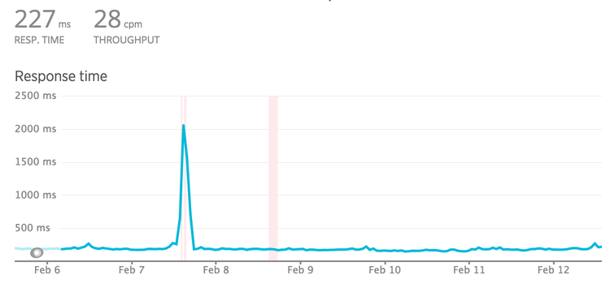
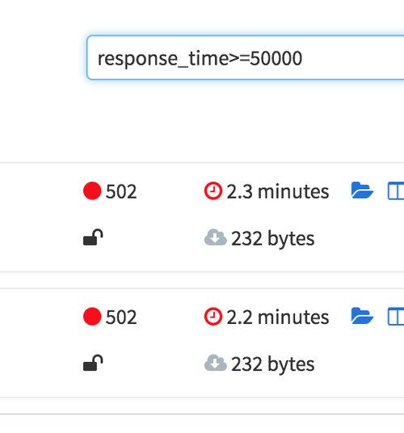
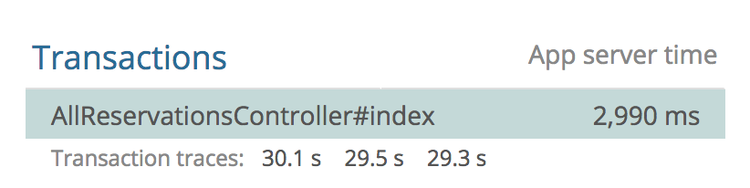
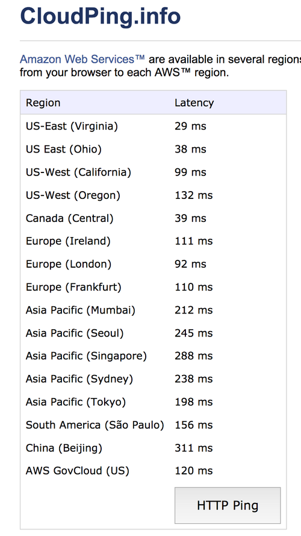
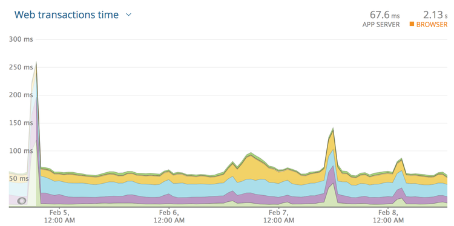
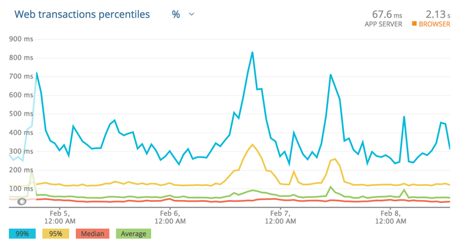

= Timeouts, Retries, and Circuit Breakers

Whenever possible it is best to make calls to other APIs asynchronously.
Doing something in the background and letting the user know it is done
usually beats making the user wait for the slow thing to happen in real
time. This might mean they see a blank page, or have no idea of progress
for seconds, minutes, etc.

Sometimes things cannot be done asynchronously. This could be making a
request to an authentication system, to find out if the username and
password, token, etc. are valid. It could also be an API following a
design pattern known as the
https://en.wikipedia.org/wiki/Broker_pattern[Broker Pattern]. This
pattern is useful when you're trying to build a new interface to
disguise complexity in the background, maybe temporarily while you help
two systems converge.

I have seen the proper pattern used at work after acquiring another
company, we made a new "membership system" and that API would talk to
the two different user/membership systems behind the scenes, converting
those systems payloads into one unified interface for consumers. It was
not the most performant, but it let clients move over to the new system
while we worked on unifying the systems in the background. Eventually
when we were able to completely merge the systems (getting both sources
of data into the new membership system), we kept the response contracts
exactly the same, making it no longer a broker (and therefore a bunch
quicker!)

In an ideal world each service knows enough information to satisfy its
clients requests, but often there are unfortunate requirements (like the
one above) for data to be fetched, or actions to be confirmed, on the
fly. All of these things take time, and many developers make a mistake
in assuming that it will always be quick.

Frontend applications (desktop, web, iOS, Android, etc.) talk to
services, and services talk to other services. This chain of calls can
stack up, as service A calls service B, unaware that system is calling
service C and D... So long as A, B, C and D are functioning normally,
the frontend application can hope to get a response from service A
within a "reasonable time", but if B, C or D are having a bad time, it
can cause a domino effect that takes out a large chunk of your
architecture, and the ripple effects result in a slow experience for the
end users.

Slow applications can cost you a lot of money. A
https://blog.kissmetrics.com/loading-time/?wide=1[Kissmetrics survey]
suggests that for every additional second a page takes to load, 7% fewer
conversions will occur, so its important to keep as much of the user
experience functioning as well as possible, for as long as possible,
even when upstream dependencies are having a rough time.

== Other People's Problems

You own service A, and are making calls to service B. What happens when
service B has a bad day, and instead of responding within the usual
~350ms, it starts to take 10 seconds? Do you want to wait 10 seconds for
that response? 

What about if service B is fine, but C is taking 20s and D is taking
25s? Are you happy to wait 45 seconds for the response from B?

What about two minutes?! 😱

When a server is under load, it can do some pretty wild stuff, and not
all servers know to give up. Even fewer client applications know when to
give up waiting for the server, and those that do will take a while to
do it.

For example, if service B is on https://www.heroku.com/[Heroku], we can
be confident the request is not going to last for more than 30 seconds.
Heroku's router has a policy: applications get 30 seconds to send the
first byte, and if that doesn't happen then the request gets dropped. 

Quite often in monitoring systems like NewRelic or CA APM, you will see
things like this:

This controller has an average response time of 2.9s, but the slow ones
are floating right around that 30s mark. The Heroku Chop saves the
caller from being stuck there indefinitely, but this behavior is not
widespread. Other web servers with different policies could hang for
longer, or forever.

For this reason, never presume any service is going to respond as fast
as it usually does.  Even if that team's developers are super confident.
Even if it autoscales. Even if it's built in Scala. If you don't set
timeouts, other people's problems become your problems. 

So, how can we prevent slow requests from making our clients hang
indefinitely?

A client can simply say "If it ain't done in 2 seconds, I'm done. I got
other stuff to do." This concept is known as a "timeout".

== Set Timeouts in the HTTP Client

HTTP clients usually do not set a timeout by default, but accept
configuration to control various aspects of timeout settings.

For Ruby users, the HTTP client
https://github.com/lostisland/faraday/[Faraday] might look like this:

....
conn = Faraday.new('http://example.com');  

conn.get do |req|  
  req.url '/search'  
  req.options.timeout = 5           # open/read timeout in seconds  
  req.options.open_timeout = 2      # connection open timeout in seconds  
end
....

For PHP,
http://docs.guzzlephp.org/en/stable/request-options.html?highlight=timeout#timeout[Guzzle] does
this:

....
$client->request('GET', '/delay/5', ['timeout' => 5]);
....

There are two types of timeout that a lot of HTTP clients use: 

. Open (Connection) Timeout
. Read Timeout

An *open timeout* asks: how long do you want to wait around to see if
this server is actually accepting requests. That can mean many things
but often means a server is too busy to take a request (there are no
available workers processing the traffic). It also depends in part on
expected network latency. If you are making an HTTP call to another
service in the same data center, the latency is going to be a few
milliseconds, but going to another continent takes time. 

The *read timeout* is how long you want to spend reading data from the
server once the connection is open. It's common for this to be set
higher, as waiting for a server to generate an answer (run queries,
fetch data, serialize it, etc.) should take longer than opening the
connection.

When you see the term "timeout" on its own (not an open timeout or a
read timeout) that usually means the total timeout.
https://github.com/lostisland/faraday/[Faraday] takes `timeout = 5` and
`open_timeout = 2` to mean "I demand the server marks the connection as
open within 2 seconds, then regardless of how long that took, it only
has 5 seconds to finish responding."

For JavaScript users using `fetch()` you're stuck wrapping fetch and
making your own deadline option...

....
const oldfetch = fetch;
fetch = function(input, opts) {
    return new Promise((resolve, reject) => {
        setTimeout(reject, opts.deadline);
        oldfetch(input, opts).then(resolve, reject);
    });
}
....

Code snippet taken from a
https://ghttps://github.com/whatwg/fetch/issues/20#issuecomment-135426968ithub.com/whatwg/fetch/issues/20%23issuecomment-135426968[comment
on whatwg/fetch]. Same idea in that it runs the error case, but the
connection is not actually being aborted. That could lead to some
interesting issues... hopefully fetch() gets proper timeouts before too
long.

=== Some Must Die, So Others May Live

Any time spent waiting for a request that may never come is time that
could be spent doing something useful. When the HTTP call is coming from
a background worker in a backend application, that's a worker blocked
from processing other jobs. Depending on how you have your background
workers configured, the same threads might be shared for multiple jobs.
If Job X is stuck for 30s waiting for this server that's failing, Job Y
and Job Z will not be processed, or will be processed incredibly slowly.

That same principle applies when the HTTP call is made within the web
thread of a backend application. That's a web thread that could have
been handling other requests! For example, you are building a backend
application with an endpoint `GET /external` which is making an HTTP
calls some API. This call is usually blazing fast and has been forever,
until suddenly squirrels chew threw some impotent cables, and that API
is down a data centre.

Your application is still working for now, and as usual other endpoint
are still responding in 100ms. They will continue to respond so long as
there are threads available in the various workers... but if the
performance issues for the squirrel chewed API continue, every time a
user hits `GET /something`, another thread becomes unavailable for that
30s. 

Let's do a bit of math. For each thread that gets stuck, given that
thread is stuck for 30s, and most requests go through in 100ms, *that's
3000 potential requests not being handled*. 3000 requests not being
handled because of a single endpoint. There will continue to be fewer
and fewer available workers, and given enough traffic to that payment
endpoint, there might be zero available workers left to work on any the
traffic to any other endpoints. Setting that timeout to 10s would result
in the processing of 2000 more successful requests.

As a general advice for backend developers it's always better to avoid
making requests from the web thread. Use background jobs whenever
possible.

Making timeouts happen early is much more important than getting a fast
failure. The most important benefit of failing fast is to give other
resources the chance to work, and it gives users update into what's
going on.

Frontend developer might not have to worry about freeing up server
resources, but they do have to worry about the UI freezing, or other
requests being blocked due to browsers HTTP/1.1 connection limits! The
concept is very similar for both frontend and backend, don't waste
resources waiting for responses which probably aren't going to come.

=== Picking Timeouts

If the server is a third party company, you might have a service-level
agreement stating: "Our API will always respond in 150ms". Great, set it
to 150ms (and retry on failure if the thing is important.)

If the service is in-house, then try to get access to NewRelic, CA APM
or whatever monitoring tool is being used. Looking at the response
times, you can get an idea of what should be acceptable. Be careful
though, *do not look only at the average*.

Looking at this graph may lead you to think 300ms is an appropriate
timeout. Seems fair right? The biggest spike there is 250ms and so round
it up a bit and let's go for 300ms? 

Nope! These are averages, and averages are going to be far far lower
than the slowest transactions. Click the drop-down and find "Web
transaction percentiles."

That is a more honest representation. Most of the responses are 30-50ms,
and the average is usually sub 100ms. That said, under *high load* this
service starts to stutter, and these peaks can lead to responses coming
in around 850ms! Clicking around to show the slowest traces will show a
handful of requests over the last few weeks coming in at 2s, 3.4s, and
another at 5s!

Those are ridiculous, and looking at the error rate we can see that
those requests didn't even succeed. Whatever happens, setting the
timeout low enough to cut those off is something we want to do, so far
I'm thinking about 1s. If the transactions are failing anyway, there is
no point waiting.

Next: if the call is being made from a background worker, that 99
percentile of 850ms may well be acceptable. Background workers are
usually in less of a rush, so go with 1s and off you go. Keep an eye on
things and trim that down if your jobs continue to back up, but that's
probably good enough.

=== Retrying Slow Requests

If it's a web process... well, 2s+ is certainly no good, especially
seeing as it might fail anyway. Waiting around for this unstable
transaction to complete is as much of a good plan as skydiving with just
the one chute. Let's create a backup plan using retries.

So we have this special web application that absolutely has to have this
web request to Service B in the thread. We know this endpoint generally
responds in 35-100ms and on a bad day it can take anywhere from 300-850.
We do not want to wait around for anything over 1s as its unlikely to
even respond, but we don't want this endpoint to take more than 1s... 

Here's a plan: set the timeout to 400ms, add a retry after 50ms, then if
the first attempt is taking a while _boom_, it'll give up and try again!

....
conn = Faraday.new('http://example.com');
conn.post('/payment_attempts', {  }) do |req|
  conn.options.timeout = 0.4
  conn.request :retry, max: 1, interval: 0.05
end
....

There is potential for trouble here, as the second and first attempts
might end up in a race condition. The interval there will hopefully give
the database long enough to notice the first response was successful,
meaning the 2nd request will fail and say "already paid" or something
intelligent, which can be inspected and potentially treated as a success
by the client.

Anyway, (400 * 2) + 50 = 950, with another 50ms for whatever other
random gumf is happening in the application, should mean that we come in
at under 1 second!

This is a good place to be in. You have 2x the chance of success, and
you're setting tight controls to avoid service B messing your own
application up. 

*An important note for Ruby users*: you are
https://engineering.wework.com/ruby-users-be-wary-of-net-http-f284747288b2[already
using retries] on idempotent requests, and you probably had no idea.
It's wild that NetHTTP does this by default, even in Ruby v2.5.0 where
it is configurable.

=== Circuit Breakers

Timeouts are a great way to avoid unexpected hangs from slowing a
service down too much, and retries are a great solution to having
another when that unexpected problem happens. These two concepts are
both reactive, and as such can be improved with the addition of a third
proactive concept: circuit breakers.

Circuit breakers are just a few lines of code, maybe using something
like Redis to maintain counters of failures and their timestamps. With
each failure to a service (or a particular endpoint on that service),
the client increments a failure counter and compares it to a certain
threshold. Maybe that threshold is 10 failures in 1 minute, or for
higher volume systems maybe 5 failures in a second. 

So in our example, Service A might notice that service B is down after
the 10th error in 1 second, and at that point it opens the circuit
breaker, meaning it completely stops making calls to that system. This
will decrease the load on downstream services (B, C, and D), giving them
a chance to recover. This also avoids the "running out of threads" issue
we discussed previously. Even with service A giving up after 1s, that's
still 1s that thread could have spent handling other requests. 

What to do when a circuit breaker is open? It depends on the feature the
circuit breaker is wrapping.

* Immediately respond with an error, letting the user know the required
system is down, and to try again later
* Have a secondary system kick in that handles things in a different way
* Divert traffic to a cluster of servers elsewhere
* Record information about the attempt and have customer services reach
out

That's only a quick intro to circuit breakers, so head over to see
https://martinfowler.com/bliki/CircuitBreaker.html[Martin Fowler explain
circuit breakers in depth] if you want more information on the topic.

"Service Meshes" like https://www.envoyproxy.io/[Envoy] or
http://conduit.io[Conduit.io] are also great solutions for this problem.
Instead of asking you to code it up yourself and the application level,
it can be handled with network-level tools which are able to be
controlled more centrally.

// TODO: diagram for service mesh, and further reading links