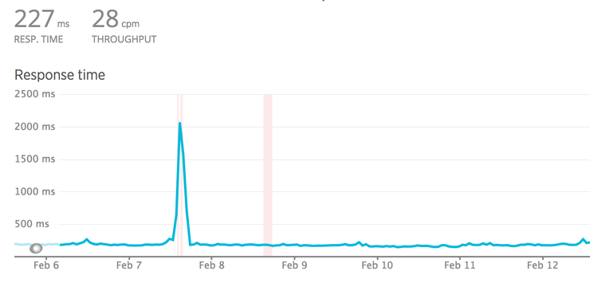
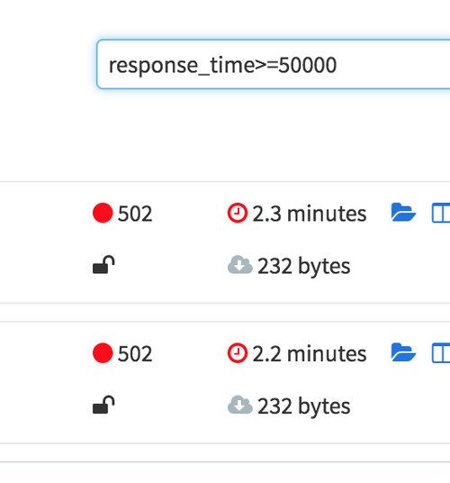
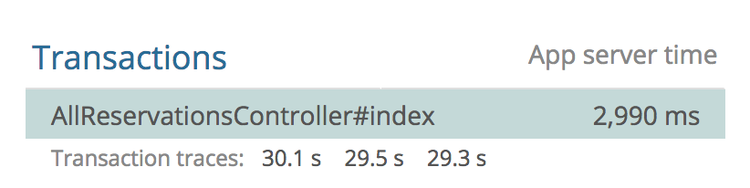
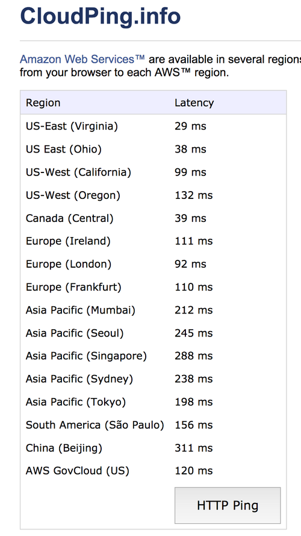
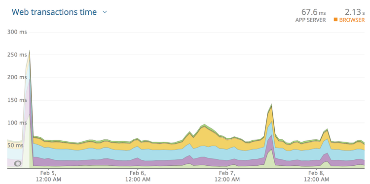
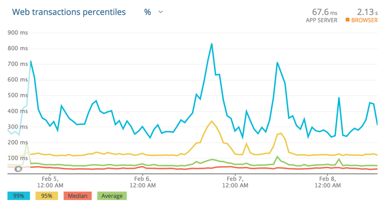

= Timeouts & Retries

As you're building an API client you are inherently exposed to the risk of that
APIs stability affecting the performance and reliability of your own
application. Talking to the API will hopefully be quick, but with all the
problems we've talked about here you might be starting to get the idea that you
never really know what's going to happen. Waiting for a slow API request could mean the user gets stuck looking at a blank page, with of progress for seconds, or maybe even minutes.

Slow applications can cost you a lot of money. A
https://blog.kissmetrics.com/loading-time/?wide=1[Kissmetrics survey] suggests
that for every additional second a page takes to load, 7% fewer conversions will
occur, so its important to keep as much of the user experience functioning as
well as possible, for as long as possible, even when upstream dependencies are
having a rough time.

// Don’t always want a timeout. 

// Question how to figure out if your internet is slow or if your server is struggling 

// If the server is struggling then don’t keep bothering it, but if the internet is slow maybe you should keep at it. Having a backup plan (offline mode) might mean it’s good to give up within a reasonable time so the user is not blocked, but if it’s a video upload for example then just keep on trucking despite the slowness, just make the UI not blocking. 

The most common interaction is simply trying to load primary data for a user
interface, at which point the browser is essentially doing the work for you, and
allowing the "progressive loading" approach to show what is loading so the user
is not confused.

Rather different to that is trying to send some data to an API, which could be a
simple POST request or trying to upload an image. On a good day and on a good
connection this may well go quickly, but if it goes slowly you want to avoid
this block the user interface for ages. When its backend to backend that could
freeze up an entire web thread, reducing how many usable threads there are for
handling your other traffic.

In an ideal world, slow (or potentially risky) interactions can be punted off to
a background worker, which can let the client application and its users know
when it's done. Then the user interface can get on with doing something else,
and if they do absolutely need to wait for that thing to happen then at least
the user interface can focus on assigning blame, like "Waiting for partner
data..." so that the user does not blame you for any slowness.

Whatever you're doing, the most important thing for your API client is to
continue working as best as it possibly can, doing as much as possible depending
on which services happen to be working at any particular moment. Other people's
problems cannot become your problems.

== Other People's Problems

You manage API A, and are making calls to API B. 

What happens when API B has a bad day, and instead of responding within the
usual ~350ms, it starts to take 10 seconds? Do you want to wait 10 seconds for
that response?

What about if API B is fine, but it's unbeknownst to you started depending on
API C which is taking 20s, and agghh that depends on API D which is taking 25s?

Are you happy to wait 45 seconds for the response from API B?

What about two minutes?! 😱

When a server is under load, it can do some pretty wild stuff, and not
all servers know to give up. Even fewer client applications know when to
give up waiting for the server, and those that do will take a while to
do it.

For example, if API B is on https://www.heroku.com/[Heroku], we can
be confident the request is not going to last for more than 30 seconds.
Heroku's router has a policy: applications get 30 seconds to send the
first byte, and if that doesn't happen then the request gets dropped.

Quite often in monitoring systems like NewRelic or DataDog, you will see
things like this:

This controller has an average response time of 2.9s, but the slow ones
are floating right around that 30s mark. The Heroku Chop saves the
caller from being stuck there indefinitely, but this behavior is not
widespread. Other web servers with different policies could hang for
longer, or forever.

For this reason, never presume any service is going to respond as fast as it
usually does. Even if that team's developers are super confident. Even if it
autoscales. Even if it's built in Scala. This thing could suddenly start being
very slow.

== Timeouts

So, how can we prevent slow requests from making our clients hang
indefinitely?

A client can simply say "If it ain't done in 2 seconds, I'm done. I got
other stuff to do." 

This concept is known as a "timeout".

=== Setting a Timeout in the HTTP Client

HTTP clients usually do not set a timeout by default, but most can be
configured to control various aspects of timeout settings.

For Ruby users, the HTTP client
https://github.com/lostisland/faraday/[Faraday] might look like this:

[source,ruby]
----
conn = Faraday.new('http://example.com'); 

conn.get do |req| 
  req.url '/search' 
  req.options.timeout = 5      # open/read timeout in seconds 
  req.options.open_timeout = 2   # connection open timeout in seconds 
end
----

For PHP,
http://docs.guzzlephp.org/en/stable/request-options.html?highlight=timeout#timeout[Guzzle]does
this:

[source,php]
----
$client->request('GET', '/delay/5', ['timeout' => 5]);
----

There are two types of timeout that a lot of HTTP clients use:

. Open (Connection) Timeout
. Read Timeout

An *open timeout* asks: how long do you want to wait around to see if
this server is actually accepting requests. That can mean many things
but often means a server is too busy to take a request (there are no
available workers processing the traffic). It also depends in part on
expected network latency. If you are making an HTTP call to another
service in the same data center, the latency is going to be a few
milliseconds, but going to another continent takes time.

The *read timeout* is how long you want to spend reading data from the
server once the connection is open. It's common for this to be set
higher, as waiting for a server to generate an answer (run queries,
fetch data, serialize it, etc.) should take longer than opening the
connection.

When you see the term "timeout" on its own (not an open timeout or a
read timeout) that usually means the total timeout.
https://github.com/lostisland/faraday/[Faraday] takes `timeout = 5` and
`open_timeout = 2` to mean "I demand the server marks the connection as
open within 2 seconds, then regardless of how long that took, it only
has 5 seconds to finish responding."

Setting an open timeout and read timeout in fetch is a little tricker, as its a low level library and you have to do a bit more heavy lifting to get it doing advanced things like that.

.Timeout example in fetch() from earlier in the book.
[,js]
----
include::code/ch06-connection-problems/04-timeout.js[]
----

Axios can make using a single timeout easier, but still does not handle open/read timeouts separately. If anyone knows a good way to do this in JavaScript please send me your code examples.

// TODO open/read timeouts in JavaScript

=== Some Must Die, So Others May Live

Timeouts are potentially a lot more important for server-side applications
talking to other APIs, than a browser-based application talking to an API.

For a server-side applications, any time spent waiting for a request that may
never come is time that could be spent doing something useful. There are limited
server-side resources, and the servers, workers, and threads available are
constrained by how much money you want to throw at it. Resources cost money, so
getting them working efficiently is key to a successful architecture, and
blowing all of your budget on resources that are sat there doing nothing whilst
_somebody else's API is mucking around_ is not going to work out well.

If the resource is answering web traffic, then that resource being stuck on an
upstream dependency means other web traffic is not going to be served. For
example, a API A has an endpoint `GET /external` which is making an HTTP calls
some API that is usually blazing fast and has been forever, until suddenly
squirrels chew threw some important cables, and now `GET /external` is slow. Not
only is this a problem for any end users trying to do anything that requires API
A's `GET /external`, but its a problem for _anyone trying to use API A_, because
its run out of resources with all its wheels being spun waiting on that upstream
API for minutes at a time.

If the resource is a background worker queue, there's background jobs not
getting processed, or may have to wait a long time before they can even try.
This might mean experiences that usually only take a few seconds or maybe a
minute are now increasing exponentially, with end users wondering what the hell
is going on, getting bored, and wandering off.

Let's put background workers aside for a minute (🥁) and focus entirely on how
one slow endpoint can take down a whole API.

=== Cascading Failures

Your application is still working for now, and as usual other endpoint
are still responding in 100ms. They will continue to respond so long as
there are threads available in the various workers... but if the
performance issues for the squirrel chewed API continue, every time a
user hits `GET /something`, another thread becomes unavailable for that
30s.

Let's do a bit of math. For each thread that gets stuck, given that
thread is stuck for 30s, and most requests go through in 100ms, *that's
3000 potential requests not being handled*. 3000 requests not being
handled because of a single endpoint. There will continue to be fewer
and fewer available workers, and given enough traffic to that payment
endpoint, there might be zero available workers left to work on any the
traffic to any other endpoints. Setting that timeout to 10s would result
in the processing of 2000 more successful requests.

Making timeouts happen early is much more important than getting a fast
failure. The most important benefit of failing fast is to give other
resources the chance to work, and it gives users update into what's
going on.

Frontend developer might not have to worry about freeing up server
resources, but they do have to worry about the UI freezing, or other
requests being blocked due to browsers HTTP/1.1 connection limits! The
concept is very similar for both frontend and backend, don't waste
resources waiting for responses which probably aren't going to come.

=== Picking Timeouts

If the server is a third party company, you might have a service-level
agreement stating: "Our API will always respond in 150ms". Great, set it
to 150ms (and retry on failure if the thing is important.)

If the service is in-house, then try to get access to NewRelic, CA APM
or whatever monitoring tool is being used. Looking at the response
times, you can get an idea of what should be acceptable. Be careful
though, *do not look only at the average*.

Looking at this graph may lead you to think 300ms is an appropriate
timeout. Seems fair right? The biggest spike there is 250ms and so round
it up a bit and let's go for 300ms?

Nope! These are averages, and averages are going to be far far lower
than the slowest transactions. Click the drop-down and find "Web
transaction percentiles."

That is a more honest representation. Most of the responses are 30-50ms,
and the average is usually sub 100ms. That said, under *high load* this
service starts to stutter, and these peaks can lead to responses coming
in around 850ms! Clicking around to show the slowest traces will show a
handful of requests over the last few weeks coming in at 2s, 3.4s, and
another at 5s!

Those are ridiculous, and looking at the error rate we can see that
those requests didn't even succeed. Whatever happens, setting the
timeout low enough to cut those off is something we want to do, so far
I'm thinking about 1s. If the transactions are failing anyway, there is
no point waiting.

Next: if the call is being made from a background worker, that 99
percentile of 850ms may well be acceptable. Background workers are
usually in less of a rush, so go with 1s and off you go. Keep an eye on
things and trim that down if your jobs continue to back up, but that's
probably good enough.

== Retrying Slow Requests

If it's a server-side web process... well, 2 seconds or more is certainly no
good, especially that means there is likely no user interface showing to the
user. Why wait for 2 seconds on white screen for something that might fail anyway. 

When skydiving we don't just take one parachute then stare at a a poorly
deployed canopy hoping it sorts itself out at some point. 

We hold out hope for a little bit of time, but then we cut it away, and deploy a
backup parachute.

In the world of HTTP clients, this is called "retries".

So we have this special web application that absolutely has to have this
web request to Service B in the thread. We know this endpoint generally
responds in 35-100ms and on a bad day it can take anywhere from 300-850.
We do not want to wait around for anything over 1s as its unlikely to
even respond, but we don't want this endpoint to take more than 1s...

Here's a plan: set the timeout to 400ms, add a retry after 50ms, then if
the first attempt is taking a while _boom_, it'll give up and try again!

[source,ruby]
----
conn = Faraday.new('http://example.com');
conn.post('/payment_attempts', { }) do |req|
 conn.options.timeout = 0.4
 conn.request :retry, max: 1, interval: 0.05
end
----

If the request is completed successfully on time, then all good, don't bother doing it a second time.

If the request takes too long, it'll get cut off, and we'll try again.

Here we've got (400 * 2) + 50 = 950, with another 50ms for whatever other random
junk is happening in the application, and that should mean the whole effort
comes in at under 1 second!

This is a good place to be. You have 2x the chance of success, and you're
setting tight controls to avoid service B messing your own application up.

You can experiment with number of retries, different timeout durations, and
different "intervals" and backoff settings until you've found something that
works for your scenario.

// TODO more on backoff

So that's fine. Everything is fine. Retries all around.

Right? 

I wish...

=== Race Conditions in Retries

Just because a client gives up waiting for a request, doesn't mean the API has
given up working on it. In fact, that server might just be getting over its hump
and finally doing the thing, right as the client gives up...

If that action was "sending a tweet" then so what, the interface will flash an
error saying "You already sent that tweet!" and I know I only did it once, but as
I know about retries I just chuckle to myself that a company the size of Twitter
hasn't bothered fixing that race condition and tell myself I'll make fun of them
in a book someday.

Unfortunately there could be far higher stakes than that, like sending somebody
$1,000. 

I don't want some server having a momentary lag but then getting there just a
little too slow for the client, resulting in me accidentally sending somebody an
extra $1,000, or a few extra $1,000's.

Race conditions like this are not uncommon, but there are solutions.

1. You can limit retries to idempotent requests.
2. If the API supports "Idempotency Keys" you can make all requests idempotent.

The former is the default behavior in the retry logic built into most HTTP
clients, and it will only make a retry if it things its sensible (worth
checking!). Some HTTP clients for example will be happy to make a request if its
spotted a `Retry-After` header, but some will limit retries to HTTP methods
which are idempotent in nature.

An idempotent request is one that can be repeated multiple times without any
further change of state happening from the later attempts. 

[quote,IETF: The Idempotency-Key HTTP Header Field,https://datatracker.ietf.org/doc/html/draft-ietf-httpapi-idempotency-key-header-02]
--
Idempotency is important in building a fault-tolerant HTTP API.  An
HTTP request method is considered "idempotent" if the intended effect
on the server of multiple identical requests with that method is the
same as the effect for a single such request.  According to
[RFC7231], HTTP methods "OPTIONS", "HEAD", "GET", "PUT" and "DELETE"
are idempotent while methods "POST" and "PATCH" are not.
--

Any GET request should absolutely idempotent, because you are just asking to see
some resource, and maybe a view counter goes up in the background but meh, it's
not sending emails or doing anything meaningful.

A PUT should be idempotent because you are providing the full resource, so doing
it twice just means it still knows what the whole resource looks like. 

A DELETE is idempotent because if you try to delete something a second time
then... well its deleted, well done, the intent is complete.

A PATCH is not because you are changing `"property": "foo"` to `"property":
"bar"`, but you cannot do that a second time because there is no `"property":
"foo"`, just `"property": "bar"`. This will likely give you a 409 Conflict on
the second attempt.

Similar issues for POST. God knows what a POST is doing, but it's mutating
something for sure. Creating a thing either cannot or should not happen twice,
so it's not Idempotent. 

So your client application can retry "OPTIONS", "HEAD", "GET", "PUT" and "DELETE"
requests all day, then maybe you don't get retries for "POST" and "PATCH". 

That's probably fine, but if the API documentation offers you an Idempotency Key, take it!

=== Idempotency Keys

Stripe were one of the first APIs I remember seeing this on. Maybe they invented it. Maybe I'm unobservant. Doesn't matter.

[quote,Idempotent Requests,Stripe API Documentation]
--
The API supports idempotency for safely retrying requests without accidentally performing the same operation twice. When creating or updating an object, use an idempotency key. Then, if a connection error occurs, you can safely repeat the request without risk of creating a second object or performing the update twice.

To perform an idempotent request, provide an additional Idempotency-Key: <key> header to the request.

Stripe's idempotency works by saving the resulting status code and body of the first request made for any given idempotency key, regardless of whether it succeeded or failed. Subsequent requests with the same key return the same result, including 500 errors.

An idempotency key is a unique value generated by the client which the server uses to recognize subsequent retries of the same request. How you create unique keys is up to you, but we suggest using V4 UUIDs, or another random string with enough entropy to avoid collisions. Idempotency keys can be up to 255 characters long.
--

Basically, an idempotency key can be anything. 

- `123456789`
- `bikesbikesbikes`
- `fiy74rlhdf09as9ufsdf13`
- `27fe8871-aea3-440b-a451-458621c07651`

The more unique it is the better. You'd hope the server implementation was smart enough to tie the uniqueness to a specific client, but to play it safe go for a https://www.uuidgenerator.net/version4[v4 UUID] as Stripe suggest. 

Here's how it looks in their SDK, which makes it incredibly easy for you. Make a random string. Bung it it.

[,js]
----
include::code/ch10-timeouts-retries/01-idempotency-sdk.js[]
----

Assuming there's no SDK, a high-level HTTP client will either have retry logic baked in, or can be extended with a package. In JavaScript, axios can handle timeouts easily and retry-axios will add the retry logic.

[,js]
----
include::code/ch10-timeouts-retries/02-idempotency-key.js[]
----

This code snippet shows that an idempotency key can be generated entirely randomly, and work before a bunch of request attempts are made. 

=== You don't always want a timeout

You want a timeout when something is meant to be quick, but for unexpected reasons could start going slow, and you don't want that instability effecting your application.

Sometimes a HTTP call is expected to be slow. 

Uploading photographs of trees from a hidden valley in rural Wales? Probably going to take a while. Keep on trucking until it's done please, or I'll be here forever with more and more retries getting nowhere, with the backoff periods getting longer and longer until the app is effectively bricked.

=== You can't retry forever

The beauty of a well executed quick retry is that it can turn a failure into a success without the user ever noticing, but if the mistakes keep on coming at some point you're going to have let the user know that the thing they're trying to do isn't working.

This can be bubbled up to the user as a "Thing is currently not possible, please try again later" in the worst case scenario. If you have offline syncing available in the application then perhaps just consider the application offline, or at least schedule those jobs to be done later. 

How exactly the interface handles it depends on what you're trying to do. If this is clicking a like button then _who cares_. Maybe you eventually make that like go through, maybe you don't, but the user probably doesn't care all that much either way. Definitely don't block the interface over it.

[comment]
--
== Circuit Breakers

Timeouts are a great way to avoid unexpected hangs from slowing a service down
too much, and retries are a great solution to having another when that
unexpected problem happens. These two concepts are both reactive, and as such
can be improved with the addition of a third proactive concept: circuit
breakers.

Circuit breakers are just a few lines of code, maybe using something
like Redis to maintain counters of failures and their timestamps. With
each failure to a service (or a particular endpoint on that service),
the client increments a failure counter and compares it to a certain
threshold. Maybe that threshold is 10 failures in 1 minute, or for
higher volume systems maybe 5 failures in a second.

So in our example, Service A might notice that service B is down after
the 10th error in 1 second, and at that point it opens the circuit
breaker, meaning it completely stops making calls to that system. This
will decrease the load on downstream services (B, C, and D), giving them
a chance to recover. This also avoids the "running out of threads" issue
we discussed previously. Even with service A giving up after 1s, that's
still 1s that thread could have spent handling other requests.

What to do when a circuit breaker is open? It depends on the feature the
circuit breaker is wrapping.

* Immediately respond with an error, letting the user know the required
system is down, and to try again later
* Have a secondary system kick in that handles things in a different way
* Divert traffic to a cluster of servers elsewhere
* Record information about the attempt and have customer services reach
out

That's only a quick intro to circuit breakers, so head over to see
https://martinfowler.com/bliki/CircuitBreaker.html[Martin Fowler explain
circuit breakers in depth]if you want more information on the topic.

"Service Meshes" like https://www.envoyproxy.io/[Envoy] or
http://conduit.io[Conduit.io] are also great solutions for this problem.
Instead of asking you to code it up yourself and the application level,
it can be handled with network-level tools which are able to be
controlled more centrally.

TODO: diagram for service mesh, and further reading links

TODO if you have offline sync maybe wait a reasonable time then offload to offline. If 
no offline, or no "alternative", then maybe you need to just keep on trying 
forever. Closer to the  user you are, and closer to what the 
user is specifically trying to do, the more you want to trust
they know what they are trying to do.
also maybe if you can differentiate between server struggling and network latency.
how do you find that out?

== When you actually have to do direct web requests 

There are other complex scenarios where an API following a
design pattern known as the
https://en.wikipedia.org/wiki/Broker_pattern[Broker Pattern]. This
pattern is useful when you're trying to build a new interface to
disguise complexity in the background, maybe temporarily while you help
two systems converge.

I have seen the proper pattern used at work after acquiring another
company, we made a new "membership system" and that API would talk to
the two different user/membership systems behind the scenes, converting
JSON into one unified interface for consumers. It was
not the most performant, but it let clients move over to the new system
while we worked on unifying the systems in the background. Eventually
when we were able to completely merge the systems (getting both sources
of data into the new membership system), we kept the response contracts
exactly the same, making it no longer a broker (and therefore a bunch
quicker!)

In an ideal world each service knows enough information to satisfy its
clients requests, but often there are unfortunate requirements (like the
one above) for data to be fetched, or actions to be confirmed, on the
fly. All of these things take time, and many developers make a mistake
in assuming that it will always be quick.

Frontend applications (desktop, web, iOS, Android, etc.) talk to
services, and services talk to other services. This chain of calls can
stack up, as service A calls service B, unaware that system is calling
service C and D... So long as A, B, C and D are functioning normally,
the frontend application can hope to get a response from service A
within a "reasonable time", but if B, C or D are having a bad time, it
can cause a domino effect that takes out a large chunk of your
architecture, and the ripple effects result in a slow experience for the
end users.

--
