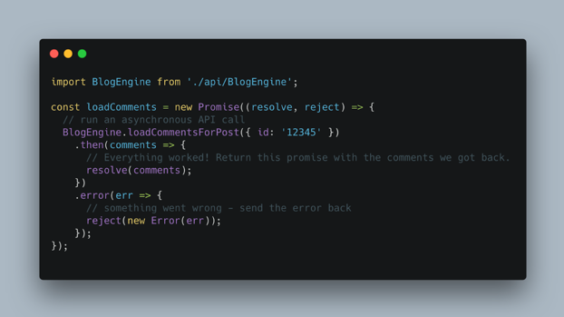
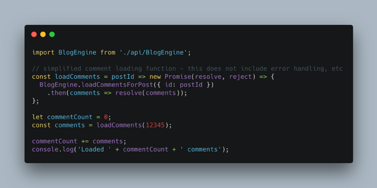
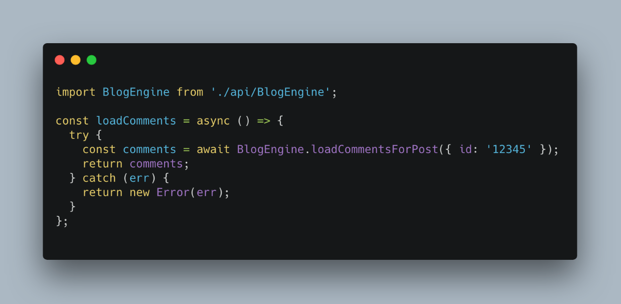

= Async

As it works out, I'm a YouTube addict.  I suspect many of you may be the same.  It started out years ago, when I came across some video that I found informative or funny or just entertaining.  A couple clicks and a few minutes, and I had watched a handful of videos from the same creator, and clicked the almighty `subscribe` button. Unfortunately, I don't have a clue which channel that was, but that's not the point here.

Fast forward to today.  I browse YouTube regularly, like much of the rest of the world, often turning to the _subscriptions_ page, to see what my favorite creators have put out into the world recently.  Subscriptions are great, because they're usually focused on things I'm interested in, rather than flat earther videos and anti-vaccination conspiracies.

As of writing, I am subscribed to somewhere around 450 creators on YouTube. I was pretty blown away by this, to be honest - I would have guessed around 100.  I'm not sure I would have ever noticed, either, if it weren't for a particularly painful failing of youtube.com's desktop web page.

By default, YouTube’s left-hand navigation drawer shows a shortlist of a few of the channels you’ve subscribed to.  Below that list is an option to `Show XXX more`, which will load and reveal a complete list of all the channels you’ve subscribed to.

.Clicking "Show 439 more" loads a list item for every chanel I've subscribed to.

My experience has been that when clicked, this button completely locks the browser until the next series of API requests come back.  This may not be a big deal if you’re subscribed to a few (or even a few dozen) channels - but in my case, with several hundred rows of data to load, this lockout lasts anywhere from 4-10 seconds.  That’s a long time - like, a ridiculously long time to be locked out.  This is a problem, and it’s one that could be solved by a better implementation of asynchronicity.

I’m not just being pedantic here.  In his 1993 book Usability Engineering, UX legend Jakob Nielsen wrote about the importance of speedy response times:

[quote, Nielsen Norman Group - Response Times: The 3 Important Limits, https://www.nngroup.com/articles/response-times-3-important-limits/]
____
- **0.1 second** is about the limit for having the user feel that the system is **reacting instantaneously**, meaning that no special feedback is necessary except to display the result.
- **1.0 second** is about the limit for the **user's flow of thought** to stay uninterrupted, even though the user will notice the delay. Normally, no special feedback is necessary during delays of more than 0.1 but less than 1.0 second, but the user does lose the feeling of operating directly on the data.
- **10 seconds** is about the limit for **keeping the user's attention** focused on the dialogue. For longer delays, users will want to perform other tasks while waiting for the computer to finish, so they should be given feedback indicating when the computer expects to be done. Feedback during the delay is especially important if the response time is likely to be highly variable, since users will then not know what to expect.
____

Put simply, this means that if getting a response from an API takes more than about a second, you should absolutely take steps to make sure your interface is still responsive.  This generally means you’ll want to show an animated loading indicator, and maybe a bit of copy explaining that you’re waiting.  During this time, your interface should avoid locking the UI at all costs.  That means that pages should still scroll, hover elements should still work, and so on.   If there are actions that your user shouldn’t be able to take while waiting for a response (like navigating away from the page), disable the interface elements that make those actions available.

== Long Polling is hurting us all
- Long polling hurts battery life

== Async requests across the web 
- Connection speed has significant impact on async experience
- Gigantic queries and long wait periods that lock up pages really suck

== Async challenges for mobile apps
- Suspending too slowly or locking display threads will cause apps to crash / lose state
- Another case for empathy: testing your app on a brand new Galaxy Note XXIX and a recently released iPhone is a lot different than the median cell phone, which is somewhere between 1 and 2 years old 

// TODO would love to find data/resources for this) - begging tweet here https://twitter.com/irreverentmike/status/1102557815934205952 

== Multi-threading in Javascript
Just kidding.  There’s unfortunately no such thing as multi-threading in JavaScript, at least given the current state of browsers.  This is a hard limitation that is a result of early browser implementations - basically, the easiest way to think of it is that each tab in your browser is limited to a single thread of processing.  Having just one thread is actually a pretty challenging limitation, but lucky for you, hordes of smart developers have already trodden this path, and given us some pretty useful workarounds for making applications feel like they’re multithreaded.

So in short, there’s no way for you to execute code for one application on two different execution threads using JavaScript.  Bummer. However, there are many libraries available which will allow you to write and execute code as if it was abstracted natively.  One such library is async, which offers a great set of helper functions which you can use for a wide array of 

== You’ll like async/await, I Promise
While JavaScript has no multithreading, there are ways for you to defer of execution of code.  In JavaScript parlance, this is called a Promise.  Promise syntax may look complex at first blush, but will quickly become familiar as you use it.  Let’s take a look at a quick example:

.Basic Promise execution helps defer execution of your code until an asynchronous request completes.

A `new Promise` is created and fed a single argument: an anonymous `function` which has two parameters, `resolve` and `reject` (which you may sometimes see as `res` and `rej`).  These two functions are called to indicate that the asynchronous code being executed inside this promise has either completed successfully (`resolve()`) or failed for some reason (`reject()`).

There’s one important thing to look out for when you’re implementing logic using Promises.  They are asynchronous, funny enough.  Let’s use a simplified example to illustrate the challenge:

.The asynchronous nature of promises can cause difficult-to-spot trouble

.Example from earlier, re-implemented with async/await

Discuss async / await syntax and parity with promise syntax
Be careful! https://twitter.com/dan_abramov/status/1099634166642196481 

Enter websockets
Firebase is great! ...but also there’s loads of challenges, so
GraphQL websocket implementations - https://hackernoon.com/real-time-react-app-with-graphql-websocket-fe64f42e97bc
Incoming Webhooks as triggers
push notifications

Cautionary tale: GraphQL is not a cure-all 
This thread https://twitter.com/tomdale/status/786952448799825921?s=12 

Making async feel like magic
How to use Localstorage to persist state between loads
Strategies for keeping track of everything loading (redux, useReducer)
State driven UI, and why it’s great - UI as turning machine
How to design for multiple possible loading states (loading posts, loading content, loading images, etc etc)
When to use Promise.all, and some pitfalls with its use (try/catch trap)
Just because you can, doesn’t mean you need to await execution

