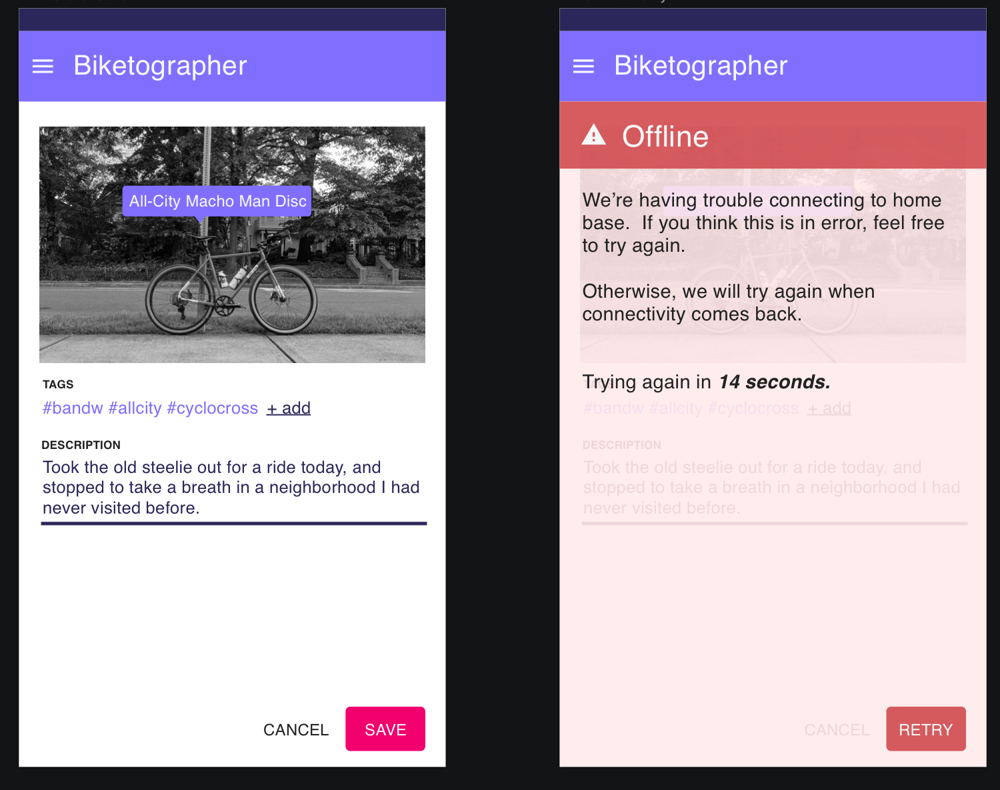

= Async

.https://twitter.com/jayzalowitz/status/1133547754989342722[A tweet from @ jayzalowitz] sums up async pretty well.


== An overview
Before we dive into the intricacies of implementing asynchronous API calls, let's cover some vocabulary.  There's a fair bit of lingo here, and it can be easy to get confused.

[glossary]
**Sync or Synchronous**::
  This is code which is executed in order, from top to bottom, while waiting for any blocking calls to complete.  In our case, this most often means synchronous code execution (your function executes predictably from top to bottom, line by line), or sync API calls (before doing anything else, we wait for the Auth API to tell us whether or not someone is currently logged in).

**Async or Asynchronous**::
  **Async** code allows us to execute a call and _not_ block everything else while we wait for it to complete. This happens regularly in web applications - for example, your web-based mail client will regularly send off requests to refresh the mail in your inbox asynchronously.  When new email activity is detected, your inbox is updated on the fly.  Neat!

**Serial**:: 
  When we refer to **Serial** execution, it means we have several things to do, and we want to execute them in a specific order (1, then 2, then 3, etc). 

**Parallel**:: 
  Similarly, **parallel** execution means we have several things to do, and we don't care what order they're done in.  Each is executed independently of the rest, and we're notified when each job is done.

**Blocking**::
  When we say something is **blocking**, this refers to code that holds up any other work being done.  Javascript is notoriously prone to blocking - while running a long loop, for example nothing else can be done.  If you're not careful, this can result in a screen that is blank or unresponsive while we wait for blocking code to complete execution.

**Non-blocking**::
  On the other hand, **non-blocking** work is just like it sounds.  This allows other work to be done while waiting for a response.  This is how “workers” are designed, and callbacks, and in UI its letting you do other things.

As a front-end developer, there are many different patterns that may be made available to you to read and write data asynchronously.  Like anything else, each has its benefits and challenges.  Your goal should be to make asynchronous interfaces feel like magic.  If implemented correctly, the people using your application won't feel burdened by waiting for data to come or go. They should feel confident that changes they're making are saved accurately.  When things go wrong, it should be easy for them to understand what broke, and what action they can take to remedy it (i.e. "Wait a moment and try again", or "You entered a title that is too long.").

Historically, there have been a variety of different ways to pull data from APIs asynchronously.  Included here are some of the more popular patterns that are in use today.

== Short Polling

In this scenario, you're asking a server for some information when something is ready.  That something can be anything - for the sake of example, let's imagine you're waiting to see if a credit card payment has succeeded.

In short polling, the client application asks the server for the information it's after at regular intervals, until that information comes back one way or another:

> Client: has this payment succeeded?
>
> Server: Not sure yet
>
> Client: has this payment succeeded?
> 
> Server: Not sure yet
>
> Client: has this payment succeeded?
> 
> Server: Not sure yet
>
> Client: has this payment succeeded?
> 
> Server: It did!

From an implementation standpoint, this usually looks like an indefinite loop of some sort, which is completed when we get the answer we want:

```javascript
const response = false;

const stopPolling = setInterval(pollServer, 500);

const pollServer = async () => {
  const results = fetch('https://some.api/cardpayment', options);
  if (results) stopPolling();
}

```

This is a very simple pattern, from the halcyon days of ajax requests.  While it does work, short polling is generally not a great approach for interface design for a few reasons: 

- It's a greedy strategy.  Sending lots of requests for one piece of data can use up battery life on mobile devices.

- It takes up precious thread space on your server. All API services have limits to how many requests they can process at once.  Crucially, short polling may work for one device at a time, but it doesn't scale well.

- Fallback and failure strategy is unclear. In other words, if the server _never_ changes its response from "Not sure yet", how do we know when to stop asking? What happens if your API client uses a different approach than another one, or if the server's response rules change?  

Right, so we don't like short polling too much.  What about...

== Long Polling

As you can imagine, this is similar to short polling, with one crucial difference: rather than asking over and over for the same information, the connection is left open until a response comes back from the server.  

> Client: Has this payment succeeded?
> 
> [some time later]
> 
> Server: Sure has!

This is a clear improvement on short-polling in the sense that the conversation is more succinct.  Your application doesn't need to fire off requests to the server every _X milliseconds_ until you get the information you're after.

So, what's the down side? Well - it's actually similar to the problem that short polling creates.  While a long polling approach doesn't send dozens of requests to the server throughout its lifecycle, it does fully occupy an API server thread until its request is complete.  If the server response is anything slower than _pretty much instant_, this approach runs into scaling problems very quickly, too.

From a UI design standpoint, it's particularly weak to connectivity problems.  If your LTE connection drops out while you're waiting for a response from a long-poll connection, it can be difficult to detect and properly recover from.

Long polling can also be catastrophically bad for user experience if you're asking for lots of information at once.  App developers who don't know better might send one single long poll request to their API for all the data needed for a given page.  Often this means that the entire interface is blank and showing as loading while heaps of information come back from the server. As we discussed in the UX pitfalls chapter, a better approach would be to split your API queries according to the logical hierarchy on screen, so you can get API data back in order of importance for that interface.

Generally speaking, it's best to stay away from long polling unless you're asking for a tiny bit of information which you know won't take a ton of processing power to return.

== Websockets

It turns out the answer to at least some of our problems comes in the form of websockets.  Under the hood, websockets are a protocol that is _parallel_ to `http`.  Websocket connections are established from client -> server via TCP.  That connection is then used as a direct line of communication between your client and the server for (effectively) as long as it's needed.  This gets around many of the problems already discussed in this chapter.

Websocket connections are flexible, and designed provide features that many  modern-day web applications use. 

In fact, there are plenty of websocket-enabled client/server tools and adaptations which you may already use at some level.  Some examples of this are RxJS, Firebase's Realtime Database and Firestore, and ReactiveMongo (and surely loads more).

Using websockets, we can avoid many of the problems seen in Long and Short Polling.  In particular, with websockets, you can send multiple requests to your API.  This will allow you to prioritize the information you're asking for - rather than have _one giant API call_ for everything on a screen, you can send a handful of smaller requests, and get back data in hieracrhical order of importance.  This will allow you to render bits of the page as they come back. Finally! 

It may sound like loading pages in order of importance won't be that different from just loading everything at once, but there's a handful of benefits here:
1. Users with _extremely_ slow connections will be able to use your software much more quickly.  With every passing millisecond of a page load, you're losing human attention.  You may as well give your product the best chance possible.  Want to feel the difference? Use your browser's devtools to set your connection speed to 3G or slower, and load up your favorite website.
1. This approach allows for more generic API calls to be used, which puts less strain on your API dev team.  Think of it this way: if you had to task your API developers with a _single query_ for all of the data on every screen of your app, they would need to be in lock-step with your front-end team for everything.  With a more granular approach, you'll fire off API calls for content in ways that aren't hyper-specific to the page they're on.  It's the difference between `API.loadToDos().filterByMonth('march')` and `API.loadCalendarScreenForUser({ month: 'march', user: 12345, view: 'monthly'})`.  The former is much easier to write, test, and maintain. 

An auxiliary benefit of websockets is that many websocket-enabled frameworks allow you to _subscribe_ to a particular query or bit of data.  This effectively means that your interface can reflect near real-time updates from your API without much extra effort for your front-end team.  It eliminates the need for your team to craft and adhere to strategies for repeatedly checking the API for data updates.  Many of these same frameworks come with supported (and often built-in) strategies for recovering lost connections, as well as PWA features for offline use of your site.

== Don't block the UI thread

When building web applications that use asynchronous API calls, developers often run into issues with blocking the UI thread.  As we defined at the beginning of this chapter, blocking the thread means that whatever work is being done prevents the browser from doing _anything else_.  You've probably encountered this from time-to-time - it can be extremely frustrating.  If you've ever clicked on an action in a web app that has caused the entire page to freeze while something loads, you've seen this in action.

On the web, blocked UI threads are most often the result of improperly using JavaScript to query APIs. For better or worse, at the moment JavaScript is strictly single-threaded.  This means that no matter _how hard you try_, your JavaScript code will only ever execute one instruction at a time.  That's right - when you make API calls in your web applications using JavaScript, your GET requests can block the _entire UI_ from doing anything: no re-rendering, no scrolling, no navigating, no nothing.  It can get really nasty unless handled properly.

So, how do we do that? Well, there's been a number of different approaches to this as web software has gotten more mature.  In the early days, web developers would have to roll their own workaround, using a pattern called Asynchronous Javascript and XML (AJAX). It was a remarkably simple solution to what was a vexing problem.  The gist of AJAX is this: while JavaScript is only able to execute one instruction at a time, your browser is smarter.  It can make many HTTP requests at any given time in parallel.  So, developers would fire off an HTTP request through the browser API, and include a _callback function_ -- a bit of JavaScript to invoke when the browser got back a response to the API request from the web.  Basic AJAX calls look something like this:

```javascript

function getZooAnimals() {
  var xhttp = new XMLHttpRequest();
  xhttp.onreadystatechange = function() {
    if (this.readyState === 4 && this.status === 200) {
      // the browser returned us something from our HTTP call
      // typically stored in this.responseText. 
      // do something with it!
      alert('here are the zoo animals!' + this.responseText);
    }
  }

  xhttp.open('GET', 'https://example.com/zooAnimals/list', true);
  xhttp.send();
}

```

If that looks unfamiliar to you, don't sweat it. In short, we tell the browser to invoke an HTTP request, and when it comes back, a JavaScript function is called to deal with what's there.  It's a relatively simple work-around for thread-blocking.  

As ajax grew in popularity, web applications started to feel more like native applications. The pattern works well - but the long syntax wrapped around each API call is long-winded and leaves lots of room for typoes and easy mistakes. Thankfully, as developers often do, we got tired of writing out all of the nonsense about `readyState` and `status`, and JavaScript Callback syntax was born.  You've probably come across this type of syntax if you've ever used something like jQuery: 

```javascript
  $.get("https://example.com/zooAnimals/list", function(data) {
    alert('here are the zoo animals!' + data);
  });
```

Look at that! It's much tidier, and serves the same purpose. The `function(data)` bit seen above is called a _callback function_, and is executed when the browser's HTTP request is completed, just like in the first example where we create and pass a function to `xhttp.onreadystatechange`.

Callback functions are easy to understand, and easy to read, and quickly became a common pattern in building UIs for the web. They also allow developers to easily _chain_ callbacks together - which allows us to build applications that execute pseudo-asynchronous code in a reasonably redable manner:

```javascript
  $.get("https://example.com/zooAnimals/list", function(data) {
    alert('here are the zoo animals!' + data);
  }).then(function() {
    // now that our zoo animals are loaded, we can fetch the list of zookeepers
    $.get("https://example.com/zooKeepers/list", function(data) {
      alert('we found zookeepers!' + data);
    })
  }); 
```

This got even better with the advent of `async` syntax for JavaScript, which allows us to write the above code even more succinctly:

```javascript
  const zooAnimals = await fetch('https://example.com/zooAnimals/list');
  alert('here are the zoo animals!' + zooAnimals);

  const zooKeepers = await fetch('https://example.com/zooKeepers/list');
  alert('here are the zookeepers!' + zooKeepers);
```

== Plan for things to go wrong

Setting up an interface to pull data from an API asynchronously is a clear upgrade over the alternative; we're now able to update the content on a given page without reloading all of the markup and assets (images, css, etc) on the page. For better or worse, your asynchronous upgrades will also introduce some potential for things to go wrong for the people using your app.  Once again, this is an opportunity to anticipate the things which might go wrong, and build fallbacks for when they do.

=== Dealing with dropped connectivity

Even if you've used a hyper-modern, robust websocket-enabled API-calling technology, at some point or another, the folks using your app _will_ lose their internet connectivity.  This isn't just the canonical example of someone on a train going through a tunnel, either.  Often times connectivity will go down briefly for mobile users when they switch from a cellular connection to wifi, or when they go between wifi networks, or when they lose wifi and go back to cellular.  

You should test your software to make sure it will continue to work in these cases.  It turns out this can be pretty easy to simulate, too - if you're on a phone, turn airplane mode on, wait a moment, and then switch it off again. On a laptop or desktop developer environment, you can switch wifi off, or disable your LAN connection.  Even better, if you're using Chrome devtools, you can use their responsive tools to shut off connectivity on a single tab:

.Chrome DevTools has a simple switch to shut off connectivity


Once you're able to simulate this kind of trouble, you can build out fallbacks for when things go wrong.  A typical approach to this is to keep track of the result of your API call locally.  If a drop in connectivity is detected, you should let the user know that it looks like they're offline.  From there, you can give them the opportunity to retry the API call, and automatically retry your call when you can tell things are working correctly again.

.Recovering from a dropped connection during an async save operation


Certain technologies will do the bulk of this work for you.  For example, if a connectivity drop is detected, Firebase will save any API operations to a queue in the client browser's local storage, and will execute offline changes as soon as connectivity comes back. Even still, as when creating interfaces which take advantage of features like this, you should let your users know when they're offline.  It's best to fully communicate what will happen when the connection comes back, too - in clear, human-friendly language.

.Explain clearly what will happen when the connection comes back


Note that in this case, we have the opportunity to create an interface which is a whole lot less shouty than in the last example. There's no need for the offline notice to be put in a modal window which takes up the whole screen.  Colors are dialed back a bit, too - yellow is used in the example, which is much less anxiety-inducing than _the-sky-is-falling-red_.

As a follow-up to this, when the connection comes back, it's good practice to fire off a notification when the offline requests are completed successfully.

=== Dealing with changing APIs

At some point, the APIs you're calling will change. In an ideal world, these sorts of changes are well-documented, and deprecation notices are made available months in advance of permanent changes which will break your application. It is part of your team's job to keep an eye on any services you use for breaking changes coming your way.  This can be as simple as assigning a task every sprint to check for API and dependency updates. 

This is a perfectly functional approach to watching out for version changes -- until it isn't.  For larger applications, you may find that as you build more features which depend on a growing number of external services and dependencies, this task becomes an untenable time sink. Luckily, in many cases, there are ways to automate the process.  One such tool is called Dependabot, which is owned by the folks at GitHub.

.Dependabot can be found at https://dependabot.com[dependabot.com]


Dependabot (and services like it) will keep an eye on dependency lists in your project (like `package.json` in Node projects, and `Gemfile` in Ruby projects).  Once initialized, it will regularly check your dependency lists against the published versions of each library.  When new versions are published, it'll open a simple pull request for each updated library, which you can review, test, and merge when ready.

.Lots of small pull requests - one for each library which has been updated!


Generally speaking, this makes the task of keeping dependencies up to date much simpler.  The majority of the work can now be done by your test suites via CI - and changes can be verified by reading changelogs for each updated package.

As this becomes more common, maintainers of various libraries are getting better at posting easy-to-understand changelogs, which reduces the chances that you'll merge a catastrophic change into your project. These kinds of proactive measures should help you sleep more soundly at night. 

Even still, sometimes things go wrong for one reason or another.

Maybe you merged and released a dependency update which has a breaking change to a mission critical API.  Maybe one of your web page uses an API with a version set to `@latest` (!), and you wake up one day to find hundreds of help tickets from people who used to love your application.  If you had been keeping an eye on server logs for your application, you may have noticed that overnight you received a spike in `4xx` or `5xx` errors from API calls.  Be honest with yourself - how often do you proactively check server logs for errors? Don't fault yourself if the answer is less than _often_ - most of us never check.

Once again, this is a place where automation can save the day. There is no shortage of tooling available to help you detect problems _reactively_ just as they start, and with a nimble enough release strategy, you can minimize application downtime.

=== Use error reporting to turn reactive situations into proactive messaging

Imagine this: you're in charge of an application which uses an external service to check the weather for [whatever purpose].  You've got thousands of happy users who regularly use your app to check the weather before going about their day.  One day, without warning, the weather API begins sending back data in a _completely_ different format than you'd expect - a change big enough to render your app useless.

In the old world, you wouldn't find out about this problem until help tickets and angry tweets started rolling in. At that point, it's past too-late - your beloved customers are upset, and you're the fireman who showed up after the roof collapses on your house.

We can do better than that.

There are a plethora of services available which will detect and report application crashes to you the instant they happen, so your support team can spring into action at a moment's notice.  Some of these services include https://raygun.com/platform/crash-reporting[Raygun], https://sentry.io/[Sentry], https://logrocket.com[LogRocket], https://rollbar.com/[Rollbar], and https://www.datadoghq.com/[Data Dog].  With a few lines of code, these will plug into your app, and keep an eye on network requests.  When a page crashes, they'll fire off all manner of notifications - SMS, email, webhooks, Slack messages, you name it.  

If you can't afford to use one of these services, or otherwise prefer not to, you can scrap together a simple one yourself.  This generally looks like a wrapper function which you can use to call APIs.  It should contain the logic to detect failures, and fire off whatever calls are necessary to alert your team to the problem.  For teams with a small budget, the easiest approach may be using Slack's incoming webhooks feature to send a message to a channel dedicated to an application crash:

```javascript

const callApi = async ({url, options}) => {
  try {
    // send off the API call
    const response = fetch(url, options);
    return response;
  } catch (e) {

    //something went wrong, let's notify the team!

    /* helper function to gather as much information as possible about this session, possibly including:
      - user name and contact information
      - URL or page they were visiting
      - which action caused this error
      - browser metadata ("IE7" or "Firefox 58", etc)
      - anything else that might help your support team send a thoughtful, personal response!
    */ 
    const metadata = getUserMetadata();

    // just what it sounds like - send a message to your team's slack channel via incoming webhook
    sendSlackWebhook({
      error: e,
      metadata: metadata
    });

    // send the response back to the interface so you can let the user know something went wrong
    return e;
  }
}

```

These can greatly decrease your effective response time.  If you're able to detect these problems and set your dev team off on a solution _before_ users start complaining, the people using your app will feel loved. Think about how rare it is to use software and feel like the people who are making it care about you directly! If you're a small, scrappy start-up, this can really help you hang on to early customers.  If you're a larger company, it means lower attrition rates, and better support ratings.

Error reporting can also help you detect crashes with user-by-user granularity.  You may see crash reports coming in from a single user over and over.  Reaching out to that individual to see how you can help them _before_ they message you can honestly feel like magic. I've even had users _thank me_ for dropping them a line and telling them I see that they're having trouble, and that I'm on the case.  It's a great feeling - particularly when the alternative is a red-hot support email or a scathing tweet.

=== Build a global status indicator... _before_ you need it!

In all of the projects I work on, it's become common practice to include a global status indicator into the fundamental roots of the application.  In its simplest form, this amounts to a content container that lives somewhere near the very top of every page off the application.  The vast majority of the time, it sits invisible and dormant. On page load, and once every few minutes it checks our CMS for content - if something goes wrong, we use that field in our CMS to alert users to the issue, and update it regularly with easily understandable messages about resolution of the issue.

If you don't use a CMS, never fear - you can use something like GitHub Pages to host a json file which you can use for these kinds of warnings.  Have your interface check the public URL of your GitHub Pages site, and if there's anything more than a blank file or object, that content can be parsed and displayed in your status indicator.
