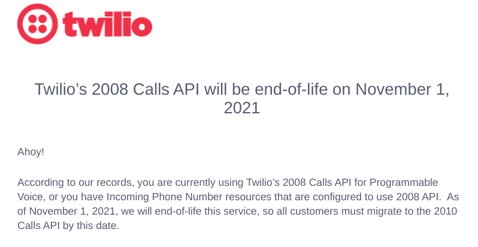
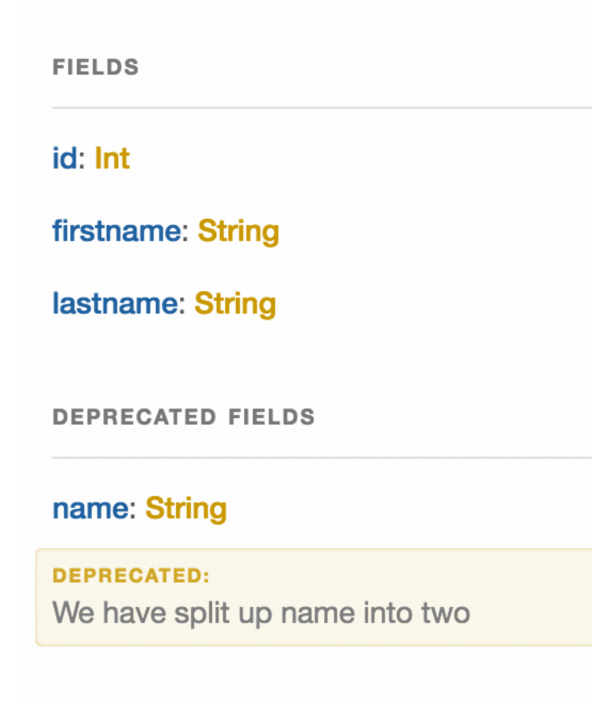

= Change Management

Change Management in relation to APIs, is a collective term for making
improvements over time. Hopefully the change is handled in a
non-breaking fashion, giving you ample time to make necessary changes.

There are a two main approaches to change.

*Versioning* - Shoving a version number (v1, v2, v3) next to things, or
in some odd cases the version is a date. The version might apply to the
entire API (global versioning), or a single resource (resource
versioning).

*Evolution* - Instead of versioning the whole API, or specific
resources/endpoints, some APIs will instead chose to carefully evolve
their interface over time.

== Versioning can differ by API paradigm

Let's go more in depth into these concepts, and how they come into
effect in various API paradigms.

=== REST & "Endpoint-based" APIs

==== Global URL Versioning

API endpoints are grouped (essentially "namespaced") under a
version number, e.g.
https://hostname/v1/companies[`https://hostname/v1/companies`], to make
it clear that a `/v1/companies` has no relation whatsoever to a
`/v2/companies`.

This might feel a bit like updating an software package, where major versions
can be very different, and in some ways it is. Most APIs will not bother with
minor or patch versions, because minor and patch changes are backwards
compatible. Adding new fields to responses, new optional fields to requests or
new resources will not break implementations, so that can be done without
needing a major version. Changing validation rules, removing fields, or drastic
changes to relationships, are things that may require a new major version be
created.

A global version change can be terrifying for clients. New endpoints are fine -
they can probably be ignored - but losing an endpoint that you rely on could be
a little change, it could mean a fundamental rewrite. Endpoints can also be
changed entirely. Many will be carbon copies, working exactly how they worked in
the previous version, but some will be subtly different, which means a lot of
extra testing.

This work will be dumped on your plate unceremoniously, pushing aside all
feature work your team had planned, whilst you race to try and align your client
with this essentially new and different API.

Usually old versions will be maintained for a reasonable timeframe, but
what's considered reasonable is completely up to the API maintainers. It
could be one month, a year, or anything in between.

Twiio famously supported a deprecated version of an API for _thirteen years_ before asking people to upgrade to at least the 11 year old version... 🤯

Do not expect the same from everyone. You might only get a month, or they might have been emailing a defunct email from a previous teammate and you find out when the API calls start failing.

==== Evolution

API evolution generally means skipping the concept of "versions" entirely, and
having one living API that "evolves" over time. 

This approach focuses on striving to maintain the "I" in API, the interface,
which is made up of the request/response body, query parameters, general
functionality, etc. Focusing on only adding new "backwards compatible" changes,
and doing a whole hell of a lot of work in the background to avoid changing the
interface, meaning the API developers do a lot of work but all the API clients
don't all have to do loads more work.

Change is inevitable, so using evolution if something absolutely must change,
then the smallest possible change is made, and that change is paired with
sensible warnings to clients, and an easy migration path is defined.

No version numbers exist in the URL, headers, or query string, and no two
versions of the same resource will exist at any given time. There is only the
"current version".

Just like in global versioning, backwards compatible changes like adding
new methods to existing resources, new fields to responses, new optional
fields to requests, new resources, etc. These can happen any time,
without clients needing to change anything. For example, splitting
"name" into "first_name" and "last_name". The "name" field would still
appear in responses along with the new first_name and last_name fields,
and could still be sent. This is a perfect evolution, because nothing
broke for the client, and the server supports the new functionality -
allowing folks to be specific about their first and last names instead
of the server guessing by splitting on space or something silly.

Where evolution differs from global versioning, is that instead of
creating a whole new namespace (forcing clients that don't even use the
specific changing resources to update/test code at great time and
expense), a single new resource is made to replace the existing resource
when adding new fields is not going to cover the use-case.

For example, a carpooling company that has "matches" as a relationship
between "drivers" and "passengers", suggesting folks who could ride
together, containing properties like "passenger_id" and "driver_id".
They realized they need to support carpools with multiple drivers (i.e.
Frank and Sally both take it in turns to drive), so this whole matches
concept is garbage.

At a lot of startups, this sort of conceptual change is common. No
number of new properties is going to help out here, as the whole "one
record = one match = one driver + one passenger" concept is foiled.

Deprecating the whole concept of "matches", a new concept of "riders" is
created. This resource tracks folks far beyond just being "matched",
through the whole lifecycle of the carpool, thanks to a `status`
property containing pending, active, inactive, blocked, etc.

By creating the `/riders` endpoint, this resource can have a brand new
representation. The API maintainers may well be converting matches to
riders - or riders to matches - in the background, but clients don't
need to care about that. Clients can then use either one, allowing them
the change to upgrade at their own pace.

== GraphQL

GraphQL also uses the evolution approach, and this works the same as the
REST / "Endpoint-based" API evolution approach. GraphQL APIs following
evolution carefully will try to avoid breaking changes, sticking to
backwards compatible changes like adding optional fields to mutations
and queries, new arguments on fields, new relationships, etc.

When these backwards compatible changes are not going to be enough to
provide the new functionality required, new mutations and new types
might be created: just like the matches and riders example above. In
another system, maybe a "Company" becomes an "Account" if that is more
appropriate to the constantly changing business language, but maybe
Company2 is created if not. This should only be done when the existing
type is utterly unable to bend to the new rules of the context, and
simply suggesting new fields cannot satisfy requirements.

Global versioning is not possible in GraphQL. When raised with Facebook
the topic was closed with a WONTFIX, so you will not have to worry about
that.

// == gRPC
// TODO who do we know who can write about versioning in gRPC

== Deprecations

Regardless of the type of API you are interacting with, and which
approach it takes to change management, deprecation is going to be an
important part of keeping up with the change. Any time a change is not
just additive, deprecation will be used to communicate a breaking
change.

Deprecation is the art of telling people to stop using a thing, because
that thing is probably going away at some point. Even if there are no
solid plans to delete the thing entirely, the thing might be deprecated
just because it sucks to work with, but usually it's because it has been
replaced with a better idea.

Sadly there are no promises the team in charge will deprecate things
cautiously. Some API providers act like jerks and just arbitrarily
change things, remove things, and break stuff. Closing APIs down with no
warning (or poor warning) is utterly disgraceful behavior, but it does
happen. Facebook especially like to pull the rug out on their API users.
Sometimes breaking changes are introduced accidentally.

Usually a more reasonable approach is taken, and API providers will
communicate change in a variety of ways. There are a few common methods
to keeping up with the changing happening to an API integrated into your
codebase.

=== Low-Tech Deprecations

As ludicrous as it might sound, the entire extent of some API providers
attempts to communicate upcoming change is "write a blog about it and
hope you notice."

These blog articles explain things like "Hey we're closing off the free
access to this API", or "We are replacing this Foo API with a Bar API,
and you have 3 months to stop using the Foo API before we shut it down".
Fingers crossed you see it!

This low-tech approach has no real solutions I can think of, other
than... subscribe to the api providers engineering blog on RSS, and - so
long as the RSS reader you're using doesn't get shut down - you might
notice the article. If they have a newsletter then subscribe to that,
maybe with a "devs@" email address or team-specific email address, to
improve the bus factor on this. You don't want the announcement going to
a member of the team who's quit, then the API breaks just because the
rest of the team didn't know about the change.

APIs requiring authentication will usually ask for an email address in
return for the authentication credentials (API keys, access tokens,
etc.) This gives API providers one more way to get in touch about
change, and again, make sure it's not the email of a manager or team
lead, but a distribution email address for the team.

== Deprecations in REST

If an API is using global versioning, then they might deprecate all the
endpoints under `/v1/` at the same time, and suggest you use all the `/v2/`
endpoints. 

If they're using evolution they might suggest that `/companies` is going away,
and you should start to work with `/accounts` instead. The suggestions here may
come in the form of low-tech announcements, but they can also be communicated
"in-band" (the response explains itself, without having to get a human to go and
google something in a browser to figure it out).

=== Deprecated Endpoints

A HTTP standard was created to solve this:
https://tools.ietf.org/html/rfc8594[RFC 8594: Sunset Header].

APIs can add a simple header to the HTTP response, let clients know that the
endpoint is nearing the end of its life, with a specific date and time.

Clients wanting to keep an eye out for deprecations can generically add a
client-side middleware to sniff for the `Sunset` header. The format is likely to
be a https://www.rfc-editor.org/rfc/rfc9110#name-date-time-formats[HTTP date]
which looks a little like this:

....
Sunset: Sat, 31 Dec 2018 23:59:59 GMT
....

The standard also allows responses to contain a HTTP `link` header, with
`rel=sunset`. The link can be a link to anything, the endpoint replacing it, a
link to some human readable documentation, a blog post, whatever.

Keep an eye out for sunset headers and their accompanying links coming
back in responses your code is getting, and log, or alert, or pass to a
dashboard accordingly. If you are using Ruby or PHP there are already
easy to use middleware for the most popular HTTP clients:

- *PHP:*
https://github.com/hskrasek/guzzle-sunset[guzzle-sunset]
- *Ruby:*
https://github.com/wework/faraday-sunset[faraday-sunset]
- *JavaScript:* https://github.com/johnnynotsolucky/sunset-header-interceptor[sunset-header-interceptor]

I'm particularly happy with the faraday-sunset one, because I made it when I was
working at WeWork. Everyone was too scared to ever deprecate anything because
nobody knew what it would effect, so the API surface area was scattered across
12 different API versions, and that kept all the API developers so busy the API
clients could never get any meaningful improvements made.

WeWork had a Faraday wrapper called We::Call, and it was basically Faraday with
some middlewares bolted on by default. I snuck the sunset middleware
into the stack, and sent pull requests to 50 APIs to make sure everyone had it. Then we started draining the swamp of all the old API versions, with errors popping up in our centralized logging service.

It's super configurable and there's loads of ways you can get notified about problems.

[source,ruby]
----
connection = Faraday.new(url: '...') do |conn|
  conn.response :sunset, active_support: true
  # or
  conn.response :sunset, logger: Rails.logger
  # or
  conn.response :sunset, rollbar: true
  # or combine:
  conn.response :sunset, rollbar: :auto, active_support: true, logger: Rails.logger
end
----

When you get these notifications, check the errors for what to do next. Either
go to the API documentation to figure it out, or shout at their customer support
for not making it clear what you're meant to be doing next, and hopefully
they'll do a better job next time.

=== Deprecated Properties

Other than the entire endpoint going away, specific properties _may_ over time
be deprecated. This is less common in global versioning as they would just
remove those in the next global version. It is not a regular occurrence in
evolution as they too would just wait until the creation of a new resource for
the concept, but it can happen if a property absolutely has to go away.

JSON is the main content type in use these days, which does not have a type
system built in. There is no way to mark a JSON field as deprecated in just
JSON, but those using OpenAPI v3 or JSON Schema have a `deprecated: true`
keyword.

Clients can check against the spec programmatically, or the API developer teams
can bake warnings into their SDKs; if a client application hits a property the
SDK knows is deprecated, it can fire off deprecation warnings into the logs, or
other reporting systems. Keeping up to date is important, so make sure something
like https://dependabot.io/[Dependabot] or https://greenkeeper.io/[Greenkeeper]
is implemented to keep tabs on dependencies.

== GraphQL

GraphQL pushes hard for evolution in its marketing and most advice in the
ecosystem, which is awesome. They do not have a huge amount of documentation
covering deprecations, and much of it comes from third-parties like Apollo, but
it's certainly possible.

=== Deprecating Types

Instead of endpoints, GraphQL has types. There is no first class support for
deprecating types in GraphQL at the time of writing, so an API developer is
unable to evolve the concept through adding new properties, a new type will pop
up somewhere. A low-tech solution like a blog or email announcement may be used
to communicate this new type, and the deprecation of the old type, as there is
no formal way to do it.

One possible solution is to deprecate all the properties in the type, and mark
in the reason that the whole type is going away.

=== Deprecating Properties

The API provider will add the `@deprecated` keyword to the type:

----
type User {
  name: String @deprecated(reason: "Property 'name' was split into 'firstname' and 'lastname'")
  firstname: String
  lastname: String
}
----

When looking at a GraphQL API through GraphiQL, the documentation that
it autogenerates will show deprecated fields, visually separated from
the other fields (smart!)

This image is from https://medium.com/@kevinsimper/[Kevin Simper]'s awesome
article:
https://medium.com/@kevinsimper/how-to-deprecate-fields-in-graphql-52fbd03fb9d7[_How
to deprecate fields in GraphQL_].

== SDK Deprecations

If an SDK is available, it might be handling deprecations for you so you don't need to sniff for sunset headers or whatever. By keeping your API SDK dependencies up-to-date using something like Dependabot or Green Keeper, there are a few ways you can avoid letting updates sneak past you.

Firstly, if a major version of the SDK is released, you'll get an email about the dependency changing, even if you've missed the emails about the API changing. You might even get the email letting you know about the new SDK for "API v2" before you get the email saying "API v1 is going away soon", giving you extra valuable time to look into the migration path.

Secondly, you might get language level deprecations. If you get a new version of the package and the `sdk.createThing()`
method is deprecated, they will probably explain in the changelog that means the `POST /things` endpoint behind it is also
deprecated.

// TODO Worth noting that in the case of using something like stripe’s npm package,
// change management is essentially handled by paying attention to package
// versions. (Bearing in mind that occasionally an old API version will be
// deprecated, etc).

// TODO Introduce and talk about SemVer here - this is something that
// many front end peeps will only have a foggy idea about From a
// people-reality-management standpoint, this might be a good place to talk about
// interacting with API maintainers on github, etc. I’ve had to ask for better
// documentation of API changes on several occasions, particularly as we go through
// the process of updating NPM package versions regularly.
