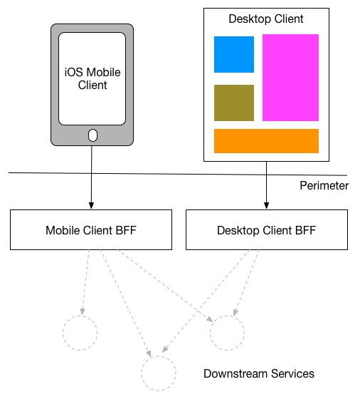
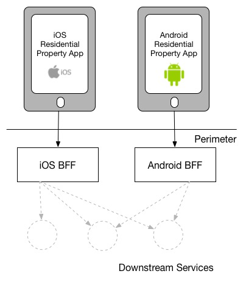
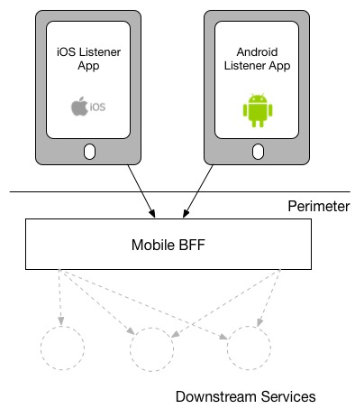

= Architecture

Frontend application developers might not worry themselves with architecture, but this chapter applies to you as much as any backend developers out there. All client application developers need to consider how their application is going to interact with its dependencies, either directly, via a service mesh, via a BFF (Backend for Frontend), or some sort of combination.

The architecture you implement will effect the stability and overall success of your application and the ecosystem around it. As with everything there are pros and cons of all the approaches, and use cases where one would make sense over another. 

== Direct Dependencies

The first thing that comes to mind when trying to interact with a dependency is just interact with that dependency directly. 

Some folks hard-code `api.example.com` into code (don't do this), some folks use configuration managers and environment variables to store the IP/hostname, and some folks use service discovery to automatically update the IP/hostname when it changes for various reasons (like the primary crashing and a secondary kicking in, A/B deployments, etc.)

However a client application is getting the IP/hostname for a dependency, if calls are being made directly to the dependency there are fewer moving parts, but a lot of things that can go wrong. 

_Chapter 9: Timeouts, Retries and Circuit Breakers_ covered a lot of the initial concerns with what can go wrong here. Mainly around remember to set timeouts in all client-side calls. Service mesh helps a lot with handling that stuff at the platform level, without needing to write language-specific code, so if you can funnel your outgoing requests through a service mesh you will get can get a lot of protection against instability, and a lot of insight when things go wrong. 

A more lightweight debugging/tracing proxy like https://httptoolkit.tech/[HTTP Toolkit] if you need more insight into what is going on if a service mesh is out of reach, but relying on logs alone is probably not going to provide the information you need when a direct dependency is acting up.

=== Change

Hopefully the API is using a reasonable approach to change management: they communicate upcoming change a long way ahead of time, offer alternative solutions to anything being deprecated, and chase applications still using the old approach. 

This is not always the case. Google Maps ditched their free mapping offering, Facebook regularly just turn off various APIs for whatever reason, and Meetup decided to ditch their API for any customers who were not Pro. 

Stuff can just vanish, especially if its a third-party API. If you are coupling your client application with a direct dependency on an API, the impact of that API vanishing can be devastating. 

In the past I've worked at companies who used alternative mapping solutions which got bought out by some bigger company and immediately sunset. We had to pull a rush job to switch all mobile apps, web apps, and backend services over to Google Maps, and deploy them all. When we did we made a generic "mapping service" which would proxy requests to Google Maps in the background, meaning we could switch mapping providers more easily, and it end-users on mobile/desktop apps were not stuck with a broken experience until they upgraded.

=== Consistency

Most clients will talk to more than one API. In 2010-15 most organizations getting into API-based architectures might have 1 API, but that started ballooning into double and triple digits with the onset of the microservice trend. 

If your client needs to talk to more than a few APIs, you will probably almost immediately notice inconsistencies between the APIs. Maybe some are internal to your organization and some are external, and that alone means you are interacting with a mixture of GraphQL, REST, gRPC or SOAP.

Maybe you are only talking to internal APIs but they were all built before anyone had a chance to think of a style guide, or your organization just does not care about creating consistent experiences and lets everyone create totally different HTTP authentication approaches, REST hypermedia formats, GraphQL errors are all completely different, and everyone has invented special snowflakes, instead of leveraging API gateways for consistent functionality and https://stoplight.io/open-source/spectral/[enforcing style-guides] with automated tools.

Whatever is going on, talking to multiple APIs probably means dealing with a lot of inconsistency, and without good SDKs that can be a real pain. 

For this, some people use the BFF pattern.

== Backends for Frontends (BFF)

A BFF is an API built for the specific needs of a client. This sounds counterintuitive at first because many of us were taught that APIs must be so generic they can be used by multiple clients, even if those clients require rather different content.

Trying to make an API so generic that it is useable for every client usually means it is not optimized for any clients. That might be fine depending on how many clients there are, or what they are doing, or how much traffic is coming through the ecosystem, but eventually generic APIs become a source of frustration for the developers who want to build more optimized workflows or data models. 

The worse the design of the remote models the more this starts to become ideal. If you are talking to one of those HTTP/1.1-based RESTish APIs which has jammed 25 resources into a single payload for some reason, but your iPhone application only needs 3 of those resources, making all that extra data go over the wire rather quickly becomes annoying. 

A BFF is a chance for your team to optimize payloads, by grabbing these larger chunks of data and returning only what thinks you probably need. 

BFFs also let you solve authentication inconsistencies between the various APIs a client needs to talk to, by letting the end user authenticate with your BFF, then it creates various JWTs, bearer tokens, cookies, and heck knows what else, all stored internally in the BFF API so the client doesn't have to juggle all that nonsense. 

Mainly a BFF is about providing consistency for the client, even when change happens. If an external provider says they're closing down, your BFF team can update the BFF to proxy off to an alternative service, or even in a pinch make their own replacement service, all of which can reuse the same interface for seamless transitions for the end user. No application updates or down-time required. 

BFFs sound like a lot of work, and they are. They require time, and money, as you will need extra developers to manage them. These developers might even need to be new hires if your whole team is more frontend than backend, so that alone can be a barrier to using them.

The canonical example of BFFs is Netflix, who used to make one API for their iPhone client app, another for web app, another their XBox client app, etc. Your company may not have pockets as deep as Netflix, and honestly your clients might not be that different from each other. 

[quote,Sam Newman,https://samnewman.io/patterns/architectural/bff/]
____
When it comes to delivering the same (or similar) user experience on different platforms, I have seen two different approaches. The model I prefer is to strictly have a single BFF for each different type of client - this is a model I saw used at REA:

____

Your iOS and Android application might be basically identical, so maybe they could share a BFF. Then maybe there is an internal dashboard which is more about CRUD and statistics, this could just be an "Admin API", which powers a web dashboard and an iOS admin/management app. Dogmatic BFFs can be unrealistic and too extreme for many, so consider a reasonable variation: backends for groups of frontends. 

[quote,Sam Newman,https://samnewman.io/patterns/architectural/bff/]
____
The other model, which I have seen in use at SoundCloud, uses one BFF per type of user interface. So both the Android and iOS versions of the listener native application use the same BFF:

My main concern with the second model is just that the more types of clients you have using a single BFF, the more temptation there may be for it to become bloated by handling multiple concerns. The key thing to understand here though is that even when sharing a BFF, it is for the same class of user interface - so while SoundCloud's listener Native applications for both iOS and Android use the same BFF, other native applications would use different BFFs (for example the new Creator application Pulse uses a different BFF). 

I'm also more relaxed about using this model if the same team owns both the Android and iOS applications and own the BFF too - if these applications are maintained by different teams, I'm more inclined to recommend the more strict model. So you can see your organisation structure as being one of the main drivers to which model makes the most sense (Conway's Law wins again). It's worth noting that the SoundCloud engineers I spoke to suggested that having one BFF for both Android and iOS listener applications was something they might reconsider if making the decision again today.
____

Creating a BFF means you need to figure out the appropriate API paradigm. The two main contenders in this space are GraphQL and REST.

== GraphQL BFFs

A practice talked about a lot over the last few years is GraphQL as a BFF. Seeing as GraphQL has one message format, one type system, etc. then theoretically it is more likely to be consistent with other GraphQL APIs. If you are building a GraphQL BFF and have one external GraphQL API to talk to, then yes, there will likely be more consistency than two random HTTP APIs made by different teams.

This approach was popularized by Apollo platform, offering their own concept called Schema Stitching. This approach basically helped you hook up multiple microservices and easily put a single interface on top. This approach was deprecated and replaced with "Federation", which is a similar concept.

Basically, if everything everywhere is GraphQL then glueing them all together is rather easy, and if there are some bad HTTP APIs involved then this gives folks a nice chance to put a nice layer on top of that badly designed API. 

Generally speaking the GraphQL BFF pattern seems like an odd choice for any clients that want to leverage HTTP appropriately. GraphQL adds a nice consistent type system, but the lack of endpoints means HTTP-based caching is no longer viable, HTTP/2 is out the window, hypermedia (using HTTP as a state machine for complex workflows) is gone, and the whole "ask for only what you need" approach to picking fields should not be necessary when talking to an API which is designed specifically to power a specific client. 

GraphQL as a BFF can be useful for creating backends for groups of frontends, because there might be certain properties which are added for one of the client applications in this group of incredibly similar applications. 

This is extra applicable if those frontends are dealing with real-time information and have no interest in caching, and instead of using HTTP/2 for grabbing related data they can subscribe to WebSockets for streams of data, which GraphQL integrates rather well. 

This is also applicable if the apps are mostly handling CRUD and do not have "workflows", which REST is a lot better at handling.

== REST BFFs

A lot of the reasoning for "GraphQL as a BFF" are just as applicable to "REST as a BFF". Basically old badly designed RESTish APIs can be wrapped with a well designed REST API, 
which is using JSON Schema for a type system, or it can wrap gRPC, SOAP, and all sorts of other dependencies, all with one consistent interface.

A REST API operating over HTTP also has the chance to leverage all of HTTP instead of just a subset, providing solid HTTP caching conventions, full HTTP/2 support, and hypermedia controls. 

In my experience the "REST API for Frontend Groups" argument would have solved some rather frustrating problems. An iOS and a Web version of the same internal application was consistently receiving bug reports, where the same employee could see a button on the web app, but could not on the iOS app, even though it should have been the same. 

This was due to some complex if statements checking 5 different things, and one of the apps forgot to check a 6th thing, so the state was out of whack. Hoisting these states up into the REST API mean that one API can interpret arbitrary data from all over the ecosystem. This data could be from hypermedia controls on other REST APIs, or random flags and settings elsewhere, or GraphQL APIs, or a gRPC API, or a local Redis DB, or based on OAtuh scopes, or any combination of the above. 

Whatever conclusions the BFF comes to about the state as it pertains to this client group, the whole group of clients get that same conclusion instead of everyone in the group all trying to figure it out independently.

== Summary

Direct dependencies are not terrible, despite having potential downsides. Depending on the size of your team, and what sort of phase the organization is in, they may be an unideal reality. Consider it a necessary shortcut for prototypes, MVPs, and early stage startups, etc. 

If you are counting the runway of your company in months, direct dependencies are probably fine, because getting the job done, proving the concept, beating your competition, surviving to raise more, etc. is probably more important than making your client resilient to potential change which may not come for a year or two. 

That said don't blame me if you build your entire startup around a single API which vanishes next week. It's impossible to predict the future, but you should consider what sort of priorities you have, before committing limited resources to building out loads of BFFs which might really not be all that important just yet.

== Further Reading

Other authors have written more extensively on BFFs:

- _https://samnewman.io/patterns/architectural/bff/[Pattern: Backends For Frontends]_ by Sam Newman
- _https://martinfowler.com/articles/micro-frontends.html[Micro Frontends]_ by Cam Jackson

Seeing as building a BFF is creating an API, the most logical suggestion would be to take a look at other content on _APIs You Won't Hate_.

// TODO Update when 2nd edition is complete
- _https://leanpub.com/build-apis-2/[Build APIs You Won't Hate: Second Edition]_ (in progress)
- _https://apisyouwonthate.com/books/build-apis-you-wont-hate[Build APIs You Won't Hate]_
- https://apisyouwonthate.com/videos[Videos and Talks]