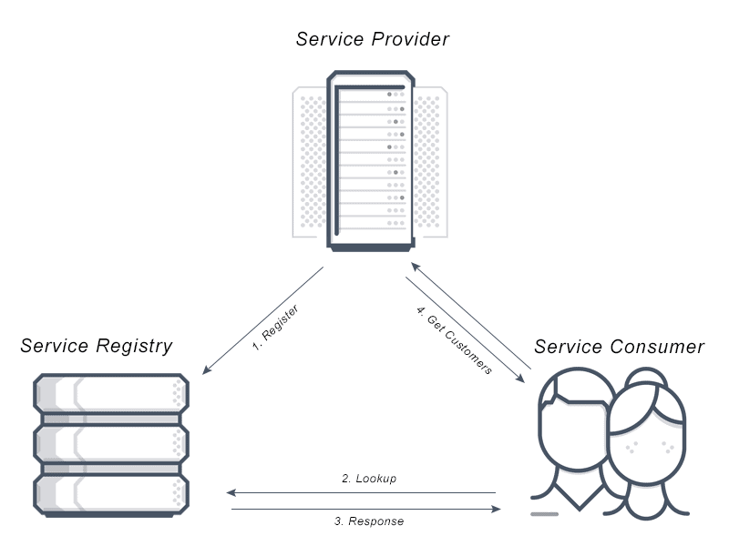
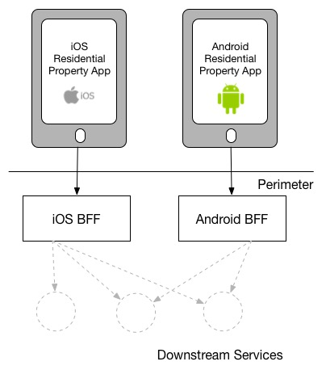
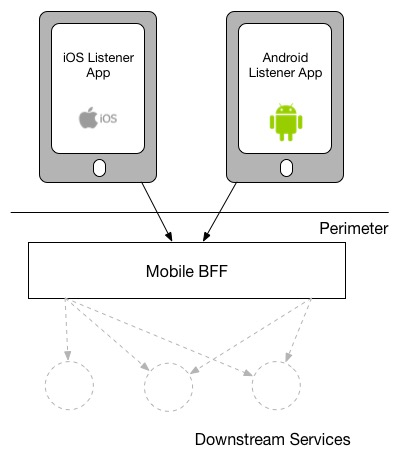
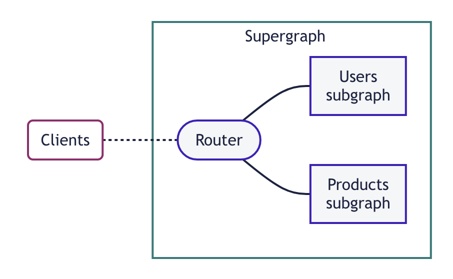
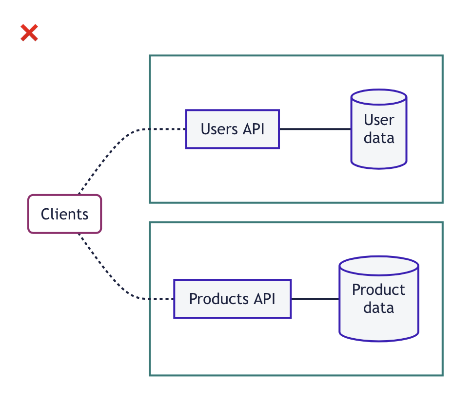
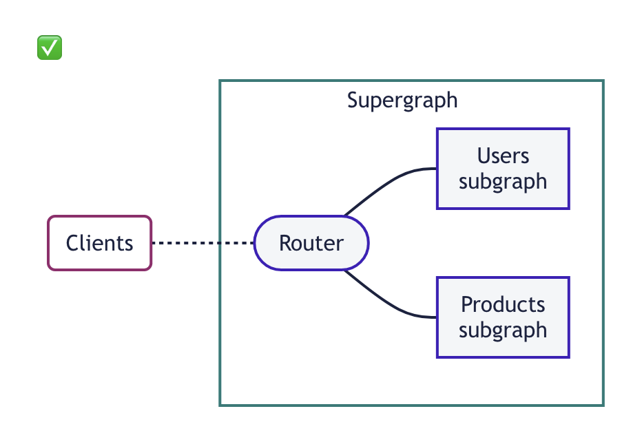

= Systems Architecture

Systems Architecture is how the ecosystem of various clients and APIs talk to
each other, and its a huge and horrendously complicated topic which has multiple
books dedicated to various aspects of it. 

Traditionally this topic might be aimed more at backend developers than frontend
developers, but I'd like to talk to the frontend here folks too. Maybe your team
is a "full-stack team", maybe your being asked to contribute feedback to an
architectural conversation, maybe you're being frozen out of an architectural
conversation and want your feedback to be heard.

Everyone should be part of the conversation about how upstream and downstream
dependencies are expected to talk to each other. How events are being published,
when, and who is meant to subscribe to them, and what they're meant to do. More
specifically for client developers, how are you going to interact with your
upstream dependencies? Directly, or indirectly via a service mesh, via a BFF
(Backend for Frontend), or some sort of combination? This is all systems
architecture and it needs agreement across all stakeholders and teams. 

The architecture you implement (or work within) will effect the stability and
overall success of your application and the ecosystem around it. As with
everything, there are pros and cons of all the approaches and use-cases where
one would make sense over another. 

== Direct Dependencies

The first thing that comes to mind when trying to interact with a dependency is
to just interact with that dependency directly. 

A direct dependency is one that your application talks to without going through
any form of abstraction via an API, proxy, or gateway. There's no background
workers that could fail and retry later once a job has been fixed or tweaked.
It's just going straight at that thing, and if it fails it fails. If it's down
you're down, and there's no sort of backup plan or automated failover to another
system. 

There's a chance the dependency you're talking to has a load balancer, and if
one of its servers crashes you will seamlessly be switched over to another
server without having a clue. Cracking. 

That may not be the case, so if you have a direct dependency on a dodgy API what
can you do?

xref:_authentication[Chapter 4: Authentication] covered how bad it can be to
leave API credentials in the codebase, but leaving API hostnames baked into the
codebase can make it hard to do anything clever with a dodgy dependency.

The most basic first step is to pop your hostnames into environment variables.

.An `.env` file with the pokeapi.co host defined.
[source]
----
POKE_API_HOST: https://pokeapi.co/api/
----

[,js]
----
include::code/ch14-architecture/01-env-host.js[]
----

Instead of hardcoding `pokeapi.co` into our codebase all over the place, we've
moved that to an environment variable. 

Not only does this allow us to avoid sending off real requests to the production
API in testing (🙊!) it makes it nice and eas for us to switch to a backup API
if things are going poorly.

When things start going horribly wrong we'll see lots of Rollbar critical errors
coming through, and we can do _something_. Perhaps the DNS has broken for
whatever reason, and trying to change the host involves the whole process of
doing a code-change, getting a peer review from X number of people, then the
re-deploy leads to a whole bunch of downtime as that build chugs its way through
whatever deployment process is employed... Changing an environment variable can
be a whole lot easier than that.

The change could require fairly trivial, like changing the host because the API
maintainers moved it to/from a subdomain/directory they forgot it used to be
available on.

[source]
----
POKE_API_HOST: https://pokeapi.co/api/
# becomes
POKE_API_HOST: https://api.pokeapi.co/
----

That can speed up a few scenarios, but you're still pretty tied to that one API,
or any other API which just so happens to be entirely compatible. This is not
massively common, but is a thing, e.g. there are various storage drive APIs with
an API entirely compatible with the industry-leader Amazon S3. 

When there's no a magically identical API knocking around what other options do you have?

For fetch data you might build a read-only clone which is statically generated off the most up-to-date data you had before the API went down.

For write data you might consider building a fake API that'll save submitted data in a worker
queue and try submitting it all when/if that API comes back.

[quote,Bruce Feirstein]
The distance between insanity and genius is measured only by success.

... and this has been very successful for me, in admittedly quite weird scenarios. 😅

=== Automatic Failover

If you're got some sort of backup API you need a way to kick it in. I've worked
at huge corporations that would send the developers an automated email if an API
went down, then they'd have to very quickly update the environment variables and
re-deploy the application. Erm, you can, but maybe a good next step is to make
robots do that for you. 

Some applications have configuration managers and environment variables to store
the IP/hostname, which mean there is a config option setting the host name. If
one service goes down you can automatically start using another, which means you
don't have to keep one eye on rollbar and automatically change an environment
variable. Let the robots do that for you.

This is known as "service discovery", and usually comes in the form of a special
service in charge of knowing where everything is. This is more likely to be used
internally when there is a backup service which might be waiting to take over
from the primary service if it goes down. 

.Diagram from AVI Networks, a cloud services platform.

Consider the situation where `https://api.example.com` is down and
`https://api-secondary.example.com` is ready to go. All those hardcoded
applications would be busted, and the environment variable users will be quickly
updating their config and restarting the app. Those using service discovery
won't have to do anything because api-secondary has already told the service
catalog it is ready to accept traffic. 

Service discovery is probably not an option when calling external APIs. You just
have to hope whatever hostname is correct and unchanging.  If it is randomly
going to change (re-branding, acquisition, etc)... then hopefully the change is
advertised appropriately.

This all assumes the same sort of API is available somewhere, and focuses on how
you can update a client to talk to that API that's definitely up somewhere. 

Ok, but what about when that API just loves going down a lot?

Or changes a lot? 

Or is so inconsistent to other APIs in the ecosystem that it's incredibly
confusing for various clients to talk to these various APIs?

=== Change

Hopefully, the APIs you're talking to are using a reasonable approach to change
management: it communicates an upcoming change a long way ahead of time, offer
alternative solutions to anything being deprecated, and chase applications still
using the old approach.

Unfortunately, this is not always the case. Google Maps ditched their free
mapping offering, Facebook regularly just turns off various APIs for whatever
reason, and Meetup decided to ditch their API for any customers who were not
Pro. Twitter API starting charging people bonkers money just to send a single
tweet, and every geocoding service I've ever loved has gone. Farewell Yahoo
Placefinder API, Algolia Places Search, SimpleGeo...

Stuff can just vanish, especially if it's a third-party API. If you are coupling
your client application with a direct dependency on an API, the impact of that
API vanishing can be devastating. 

In the past, I've worked for companies tied directly to those mapping solutions
which got bought out by some bigger company, then immediately sunset. We had to
pull a rush job to switch all mobile apps, web apps, and backend services over
to Mapbox, test the heck out of it, and deploy them all at the same time. 

=== Abstractions

Thankfully when those APIs were rug pulled we had enough time to make sure the
same problem didn't happen again, and instead of making it a direct dependency
we abstracted it.

Instead of having the frontend teams hitting the new mapping service directly,
we build an internal geocoding API that did all the same stuff. We didn't have
to rebuild a mapping system ourselves, we just provided a generic enough
interface that would then proxy off to whichever other system in the background,
like using a different "driver".

This meant we could switch mapping providers more easily and its end-users on
mobile/desktop apps at the first sign of one of these drivers being deprecated,
and it meant that users with an older version of our app would continue to have
a successful experience without needing to update the app, because its hitting
the same API, with the same JSON being returned from the abstraction layer.

We could even use multiple drivers at once, allowing us to trial new systems for
X% of our end users before entirely committing to it.

Abstractions are amazing, but are of course one more API to maintain, another
cost to worry about, and a few more miliseconds before the client gets the response.

That said, sometimes the APIs you're abstracting are doing a pretty poor job
with network caching, so it's possible that you can speed up the experience not
just slow it down by repeatedly proxying the same requests over and over again.

=== Consistency

If your client needs to talk to more than a few APIs, you will probably almost
immediately notice inconsistencies between the APIs. Maybe some are internal to
your organization and some are external, and that alone means you are
interacting with a mixture of GraphQL, REST, gRPC and SOAP. Even if they're all
the same paradigm, they might be using wildly different standards, naming
conventions, authentication, versioning, etc.

When these inconsistencies are happening at your organization, it might make
sense to talk to somebody fairly high up about implementing an https://apisyouwonthate.com/blog/automated-style-guides-for-rest-graphql-grpc/[API Style Guide],
which helps organizations decide on a naming conventions, authentication,
versioning, and everything else, and whatever the API Style Guide doesn't cover
can probably be standized with an API Gateway. 

Basically a good ecosystem probably shouldn't all be using wildly different
stuff, because that makes it almost impossible to share generic code components,
and makes every new integration a mystery that starts at square pone, but
sometimes that's the world you're in.

If the wildly inconsistent APIs are all external, or they're internal and the
organization doesn't feel like changing, some client developers turn to the BFF
pattern.

== Backends for Frontends (BFF)

A "Backend for Frontend" API is an API built specifically for the needs of a
particular client. This sounds counterintuitive at first because many of us API
developers were taught from day one that APIs must be so generic they can be
used by multiple clients, even if those clients have entirely different
requirements to handle entirely different use-cases. We were taught that the
more generic an API is, the more useful it is. BFFs are entirely opposite to
that.

image::images/ch14-architecture/arch-bff.jpg[A mobile app and a desktop app both have their own
BFF, which each talk to a bunch of downstream services]

Trying to make an API so generic that it is useable by any client inherently
means that it is not optimized for any client. That might be fine depending on
how many clients there are, or what they are doing, or how much traffic is
coming through the ecosystem, but eventually generic APIs become a source of
frustration for the developers who want to build more optimized workflows or
data models. 

For example, for Protect Earth I am building a statistics API, which help us
compile information for release, like top 20 species of tree we've planted each
year, and how many acres we've rewilded (broken down by woodland creation,
woodland restoration, wildflower meadows, peatbog restoration, etc.)

I could easily tell the web client to go off an hit the /trees endpoint and loop
through 60,000 trees, count it up, etc. but not only does that suck for the
client, that's an expensive operation with a lot of noise being thrown on the
API, that takes up server resources, costs money, and ironically produces
unnecessary carbon dioxide emissions.

Instead of forcing all clients to use the most generic API with the most generic
API data models, I am building a more targeted API with a data model that makes
sense to that context. The worse the design of the remote models the more this
starts to become ideal. If you are talking to one of those HTTP/1.1-based
RESTish APIs which has jammed 25 resources into a single payload for some
reason, but your iPhone application only needs 3 of those resources, making all
that extra data go over the wire rather quickly becomes annoying. 

If the API developers have provided you with irrelevant APIs, a BFF is a chance
for your team to optimize payloads, by grabbing these larger chunks of data and
returning only what you need.

// TODO Diagram of JSON getting thrown out

BFFs also let you solve authentication inconsistencies between the various APIs
a client needs to talk to, by letting the end user authenticate with your BFF,
then it creates various JWTs, bearer tokens, cookies, and heck knows what else,
all stored internally in the BFF API so the client doesn't have to juggle all
that nonsense. 

Mainly a BFF is about providing consistency for the client, even when change
happens. Again if an API you depend on says they're closing down, this is where
you can do your abstraction and switch the driver to use an alternative service,
which can reuse the same interface for seamless transitions for the end user. No
application updates or down-time required. 

BFFs sound like a lot of work, and they are. You are essentially abstracting
everything you ever do, just in case it changes, or ejust to sprinkle your own
opinions on top. The extra development means extra time is spent on this and not
on features. You may also need to hire extra developers with different skillsets
if the whole team is more frontend than backend (and don't just throw a few frontend developers at making the BFF because "I know JavaScript, how hard can it be!")

The canonical example of BFFs is Netflix, who used to make one API for their
iPhone client app, another for web app, another their XBox client app, etc. Your
company may not have pockets as deep as Netflix, and honestly your clients might
not be that different from each other. 

[quote,Sam Newman,https://samnewman.io/patterns/architectural/bff/]
--
When it comes to delivering the same (or similar) user experience on different platforms, I have seen two different approaches. The model I prefer is to strictly have a single BFF for each different type of client - this is a model I saw used at REA:

Your iOS and Android application might be basically identical, so maybe they
could share a BFF. Then maybe there is an internal dashboard which is more about
CRUD and statistics, this could just be an "Admin API", which powers a web
dashboard and an iOS admin/management app. Dogmatic BFFs can be unrealistic and
too extreme for many, so consider a reasonable variation: backends for groups of
frontends. 

The other model, which I have seen in use at SoundCloud, uses one BFF per type
of user interface. So both the Android and iOS versions of the listener native
application use the same BFF:

My main concern with the second model is just that the more types of clients you
have using a single BFF, the more temptation there may be for it to become
bloated by handling multiple concerns. The key thing to understand here though
is that even when sharing a BFF, it is for the same class of user interface - so
while SoundCloud's listener Native applications for both iOS and Android use the
same BFF, other native applications would use different BFFs (for example the
new Creator application Pulse uses a different BFF). 

I'm also more relaxed about using this model if the same team owns both the
Android and iOS applications and own the BFF too - if these applications are
maintained by different teams, I'm more inclined to recommend the more strict
model. So you can see your organisation structure as being one of the main
drivers to which model makes the most sense (Conway's Law wins again). It's
worth noting that the SoundCloud engineers I spoke to suggested that having one
BFF for both Android and iOS listener applications was something they might
reconsider if making the decision again today.

One guideline that I really like from Stewart Gleadow (who in turn credited Phil
Calçado and Mustafa Sezgin) was 'one experience, one BFF'. So if the iOS and
Android experiences are very similar, then it is easier to justify having a
single BFF. If however they diverge greatly, then having separate BFFs makes
more sense.
--

Creating a BFF means you need to figure out the appropriate API paradigm. The
two main contenders in this space are GraphQL and REST.

== GraphQL BFFs

Using GraphQL as a single "nice" interface over "your old smelly REST APIs" is a
stance that's become popular, using "Federated Schemas". A popular implementation of federation for GraphQL is Apollo.

.A diagram showing the idea of federation, from "Introduction to Apollo Federation".

Let's hand over to Apollo to explain this idea.

[quote,Apollo,"Introduction to Apollo Federation"]
--
The idea is that you can build a single GraphQL API that allows a single client ot make a single request and get all sorts of data from various APIs in a unified interface.

But with an architecture like this, a client might need to communicate with multiple APIs to fetch all of the data it needs. This diminishes a powerful advantage of GraphQL over REST.

Instead, your organization should expose a unified supergraph that lets clients fetch all of the data that they need from a single endpoint:

By unifying your supergraph with Apollo Federation, teams can continue to own and develop their subgraphs independently, and clients can fetch data from all of those subgraphs with a single query.
--

This means you can use GraphQL to interact with multiple other APIs that are all in whatever other paradigm, format, with any old naming convention, then let your GraphQL tidy it all up.

[source,javascript]
----
import { RESTDataSource } from '@apollo/datasource-rest';

class MoviesAPI extends RESTDataSource {

  override baseURL = 'https://movies-api.example.com/';

  async getMovie(id: string): Promise<Movie> {
    return this.get<Movie>(`movies/${encodeURIComponent(id)}`);
  }

  async getMostViewedMovies(limit = '10'): Promise<Movie[]> {
    const data = await this.get('movies', {
      params: {
        per_page: limit,
        order_by: 'most_viewed',
      },
    });
    return data.results;
  }
}
----

Mapping these RPCish endpoint-grabs to a "data source" means clients using a
GraphQL BFF can query one or more REST APIs in a single request, which hopefully
internally is using timeouts to avoid one slow data source letting the main
query hang.

To me, GraphQL as a facade over REST has generally been advertised by some as a way to "move away from bad REST and start using lovely GraphQL", which always felt like an odd sales pitch.

As I've mentioned, the idea that multiple client application teams are running
around building these GraphQL BFFs because the internal APIs are so
inconsistent, suggests a huge smell at the company. If your client team is
building this BFF maybe another team is building another similar BFF and we're
all just wasting massive amounts of time sweeping the same bad decisions under
various rugs all over the company purley down to poor API governance. Instead
the company should get better at API governance... that's not always something
you can control as a client.

More generally speaking, the GraphQL BFF pattern seems like an odd choice for
any clients that want to leverage HTTP appropriately. GraphQL adds a nice
consistent type system, but the lack of endpoints means HTTP-based caching is no
longer viable, HTTP/2 is unable to kick in its multiplexing because you're mostly waiting for one mega-query to come back instead of making multiplexing multiple requests and responses through at the same time. Hypermedia is gone, so no using HTTP as a state
machine for complex workflows. The whole "ask for only what you
need" approach to picking fields should not be necessary when talking to an API
which is designed specifically to power a specific client. 

GraphQL can be good for creating a BFF for a group of clients, as there might be
certain properties which are added for one of the client applications in this
group of incredibly similar applications, and only that one client will bother asking for it. If any of those properties are being computed on-the-fly then having other clients not have it forced on them by default is going to save wasting unnecessary resources.

Also if those frontends are dealing with real-time information and have no
interest in caching, then who cares that a lot of the HTTP network caching
mechanisms and HATEOAS has been stripped away, just subscribe to WebSockets for
streams of data and shove all that into the interface. GraphQL can let you do this quite nicely with the `subscribe` query.

== REST BFFs

A lot of the reasoning for "GraphQL as a BFF" are just as applicable to "REST as
a BFF". Basically old badly designed RESTish APIs can be wrapped with a well
designed REST API, which is using JSON Schema for a type system, or it can wrap
gRPC, SOAP, and all sorts of other dependencies, all with one consistent
interface.

A REST API operating over HTTP also has the chance to leverage all of HTTP
instead of just a subset, providing solid HTTP caching conventions, full HTTP/2
support, and hypermedia controls. 

In my experience the "REST API for Frontend Groups" argument would have solved
some rather frustrating problems. An iOS and a Web version of the same internal
application was consistently receiving bug reports, where the same employee
could see a button on the web app, but could not on the iOS app, even though it
should have been the same. 

This was due to some complex if statements checking 5 different things. One of
the apps forgot to check a 6th thing, so the state was out of whack. Hoisting
these states up into the REST API mean that one API can interpret arbitrary data
from all over the ecosystem. This data could be from hypermedia controls on
other REST APIs, or random flags and settings elsewhere, or GraphQL APIs, or a
gRPC API, or a local Redis DB, or based on OAtuh scopes, or any combination of
the above. 

Whatever conclusions the BFF comes to about the state as it pertains to this
client group, the whole group of clients get that same conclusion instead of
everyone in the group all trying to figure it out independently.

== Summary

Direct dependencies are not terrible, it depends on how reliable the performance
is, and how much you trust the maintainers. Depending on the size of your team,
and what sort of phase the organization is in, they may be an unideal reality.
Consider it a necessary shortcut for prototypes, minimum viable products, and
early stage startups.

If you are counting the runway of your company in months, direct dependencies
are probably fine. Getting the job done, proving the concept, beating your
competition, surviving to raise more, etc. is probably more important than
making your client resilient to potential change which may not come for a year
or two. 

That said don't be surprised if you build your entire startup around a single
API, and that API vanishes in a puff of smoke. It's impossible to predict the
future, but you should consider what sort of priorities you have, before
committing limited resources to building out loads of BFFs which might really
not be all that important just yet.

== Further Reading

Other authors have written more extensively on BFFs:

- _https://samnewman.io/patterns/architectural/bff/[Pattern: Backends For Frontends]_ by Sam Newman
- _https://martinfowler.com/articles/micro-frontends.html[Micro Frontends]_ by Cam Jackson

Seeing as building a BFF is creating an API, the most logical suggestion would be to take a look at other content on _APIs You Won't Hate_.

// Whatever means the client application is using to get the IP/hostname for a
// dependency, if calls are being made directly to the dependency, there are fewer
// moving parts but a lot of things that can still go wrong. 

// xref:_authentication[Chapter 10: Timeouts and Retries] talked about this a lot,
// but an application having a direct dependency on an application can lead to all
// sorts of headaches. Generally implementing a service mesh can help to control
// some of the timeout and retry logic at the infrastructure level instead of
// forcing all the clients to figure it out, but you'll still need to know how to
// deal with it. 

// TODO talk about circuit breakers more, either new chapter or squeeze it in here, or there, but somewhere.

// with circuit breakers is going to help to prevent a lot of potential performance
// issues, but this does not help with with the scariest of all things in
// dependencies: Change!

// TODO Good GraphQL BFF thoughts for quoting
// https://philcalcado.com/2019/07/12/some_thoughts_graphql_bff.html
