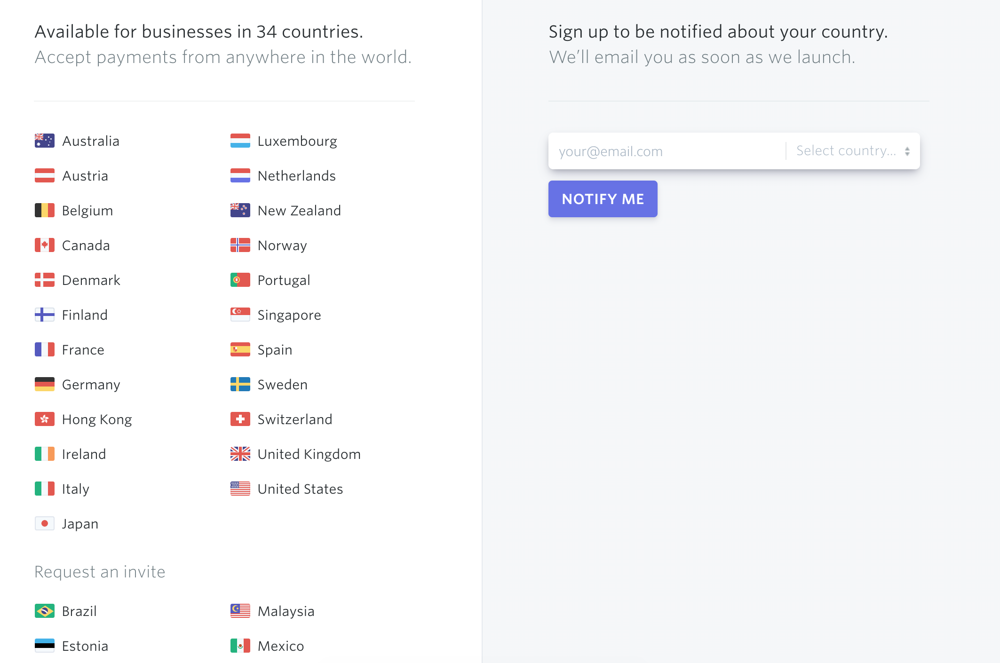

= Form Generation

Imagine you're building a shiny new web app which requires users to register an account with a profile that includes their mailing address.  You're using https://stripe.com[Stripe] for payments, and because of that, you're forced to limit registrations to the https://stripe.com/global[countries supported by Stripe].  Looking at their list on launch day, you see that they support _34 Countries_:

.Stripe's list of supported countries on day 1 of your product launch

Taking note of that list, you build out your HTML form with a `<select>` box that has an entry for each country:

[source,html]
----
<select>
  <option value="australia">Australia</option>
  <option value="austria">Austria</option>
  <option value="belgium">Belgium</option>
  <option value="canada">Canada</option>
  <!-- etc -->
</select>
----

Having done that, you let the product out into the world.  Maybe you make a mental note to check back on Stripe's list of supported countries in 6 months - or you do one better and log a ticket in your project tracking system so that it doesn't get forgotten forever.  Even with the best of intentions, if Stripe updates their supported country list down the line, you may miss it for some length of time.  At best, that represents a lost opportunity to gain paying customers in a new geography. But what happens if Stripe _removes_ a country from their list? Suddenly you've got a potentially very broken experience on your hands.  Crap.

In a better world, this is exactly where form generation would start to save your butt. After some googling, you find that Stripe actually has https://stripe.com/docs/api/country_specs/object[an API endpoint] which you can use to grab a list of countries which they support.  It contains all of the metadata you'll need to make decisions about which countries to include in your dropdown list!  Suddenly you've got a solution on your hands which is much more maintainable:

----
// note: this is a simplified example, done with react, for illustration purposes

const countries = await fetch('https://api.stripe.com/v1/country_specs');

const countrySelect = (
  <select>
    {countries.forEach(country => <option value={country.id}> {country.displayName}</option>)}
  </select>
);

// render a select box with a list of countries
return countrySelect;
----

notes / future janx: 
https://github.com/json-schema-form/json-schema-form-core
http://schemaform.io/
https://mozilla-services.github.io/react-jsonschema-form/

== JSON Schema

In the chapter on Validation, we discussed how JSON Schema can be used to keep form validation in tune with your API's validation rules. From a usability standpoint, using JSON Schema for validation alone can represent a massive leap in progress compared to old-world application development.  As JSON Schema can _also_ be used to generate your app's forms.  In this chapter, we present some strategies for building forms dynamically from your API.
