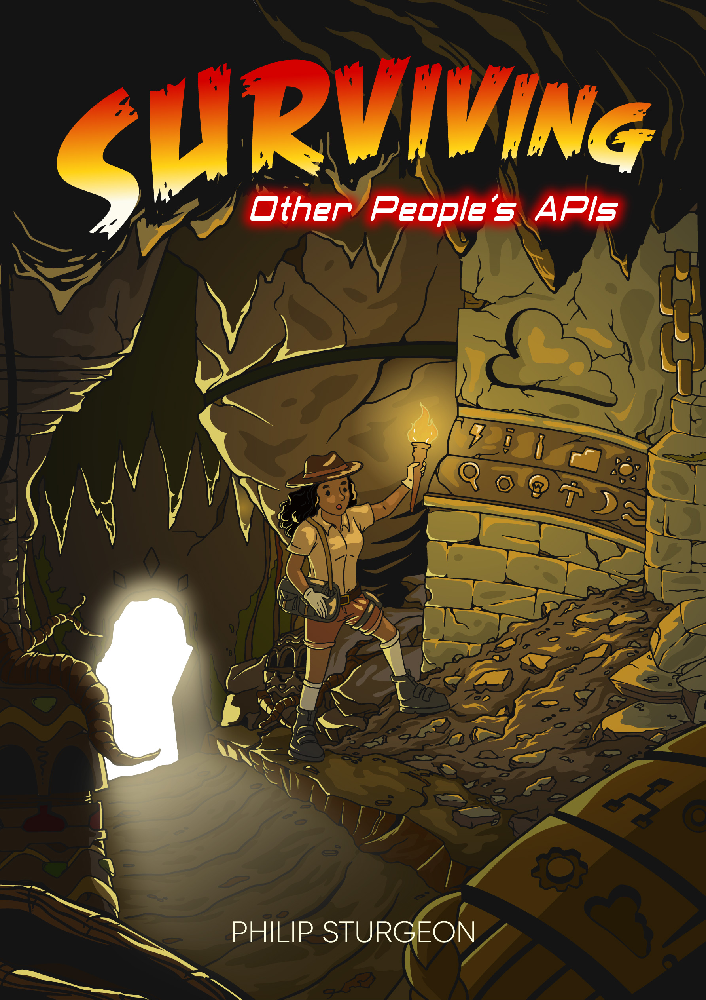

= Surviving Other Peoples Web APIs
Phil Sturgeon <phil@apisyouwonthate.com>; Mike Bifulco <mike@apisyouwonthate.com>
:doctype: book
:creator: Phil Sturgeon & Mike Bifulco
:front-cover-image: 
:keywords: API, architecture, REST, gRPC, RPC, HTTP, GraphQL, microservices, API Design
:source-highlighter: coderay
:toc:
:leveloffset: 1

// include::author.adoc[]

include::00-introduction.adoc[]

:sectnums:

include::01-transportation.adoc[]

include::02-sdks.adoc[]

include::03-paradigms.adoc[]

include::04-authentication.adoc[]

include::05-error-handling.adoc[]

include::06-connection-problems.adoc[]

include::07-ux-pitfalls.adoc[]

include::08-caching.adoc[]

include::09-validation.adoc[]

include::10-timeouts-retries.adoc[]

include::11-change-management.adoc[]

include::12-async.adoc[]

include::13-testing.adoc[]

include::14-architecture.adoc[]

include::99-outro.adoc[]
