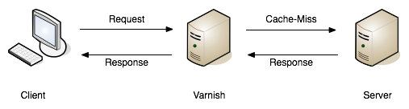
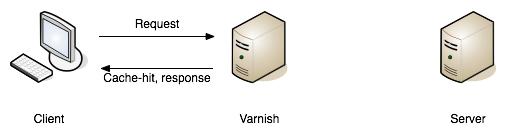

= Caching

Caching is a huge topic, and there's a lot of different types of caching
which makes discussing it tricky. The most basic definition of caching
is: avoid wasting time computing the answer to the same questions over
and over again.

A backend program will often cache the response to database calls to
avoid making them multiple times. It could then also cache the
serialized output to avoid needing to convert the model into JSON
multiple times, and other stuff can be cached too. In the world of APIs,
caching can do a lot more. HTTP calls can be skipped by clients, or
memorized by servers to skip the application server having to do get
involved to answer a similar request. All of this could happen in the
life-cycle of a single request.

For backend applications data stores like https://redis.io/[Redis] and
https://www.memcached.org/[Memcached] are the most common caching
solutions, but anything can be a cache. The file system (not the most
performant) or plain-old SQL can be used to cache data. Frontend
applications running in a web browser often use
https://developer.mozilla.org/en-US/docs/Web/API/Storage/LocalStorage[LocalStorage].

== Caching and Performance

Often caching is misused by inexperienced developers to try and make
slow code look like fast code. This leads other folks to consider
caching a crutch that should be avoided whenever possible.

The goal of caching on the client side is not "to make our application
faster", but to avoid asking questions if we have an acceptable level of
confidence that we already know the answers. Making unnecessary
requests, even if they are fast, is of course going to be slower than
just not making those requests. This is what caching is about.

== Caching in relation to APIs

For the rest of this chapter we're going to skip talking about caching
in a general way, and talk about caching as it relates to API requests
and responses. As such there are three terms we're going to use.

*Application Caching:* Software like Memcache, Redis, etc. can be
implemented in your application, to cache whatever you want, for however
long you want, in whatever data store you want.

*Network Caching:* Tools like https://www.varnish-cache.org/[Varnish] or
http://www.squid-cache.org/[Squid] (known as "cache proxies") intercept
requests that look the same, then return a response early straight out
of memory instead of hitting the application server. Doing this allows
the application server to spend more time handling other traffic, and
can reduce network latency for clients.

*Client Caching:* The client, browser, app, another service, etc. can
treat an API response just like any other CSS, Javascript or Image file.
If that resource had an expire time, ETags, or one of a few other cache
related headers, the last request could be directly reused, or a
conditional request might be triggered to see if the data has changed,
instead of grabbing the whole resource every time.

*HTTP Caching:* A set of conventions written into the HTTP
specification, which is a way to collectively refer to both network and
client caching when it relates to HTTP. GraphQL for example has it's own
set of conventions for supplying network caching, but HTTP caching at
its core should theoretically work for any programming language,
framework, or paradigm, that respects the specification and doesn't
build in its own contradicting conventions on top.

=== Application Caching

So you're writing a client application, and you like the idea of
skipping duplicate requests for a few reasons. Maybe you want to avoid
going over the API rate limit, draining the battery of the mobile
device, or avoid going over the wire if you don't have to. All good
reasons to look into caching responses.

At first you might consider application caching. In Rails, using
application caching to wrap an API request usually looks a bit like
this:

....
Rails.cache.fetch("users/#{uuid}") do
  UserAPI.find_user(uuid)
end
....

If there is nothing in the cache with the key `user/foo` then it will
run the code contained in the "`do"` block, which calls a method on the
SDK and goes over the wire to fetch the thing. That is handy and all,
but how long does that cache entry last? The answer is forever! Infinity
is a long time, so we have to provide a reasonable expire period.

....
Rails.cache.fetch("users/#{uuid}", expires_in: 12.hours.from_now) do
  UserAPI.find_user(uuid)
end
....

That is great and all, but the you - the client - providing "12" is
possibly not something you should be doing, as you do not own the data.
If this is an RPC API and you are part of the same team as the folks who
made it, you might know enough about the data source to be confident in
making this call, but if you do not own the data then picking an
arbitrary number is a bad idea.

Even if 12 is an appropriate number at the time, cache duration could
change for a number of reasons. In the most simple case, this leads to
"My email address is showing up differently in multiple places", but
beyond that there may be all sorts of business logic potentially
involved with how long data should be cached.

I've experienced odd situations where a race condition was causing a
resource to fetched immediately after it was created, which would cause
it to be cached for 5 hours. An important update would happen a few
minutes after creation letting us know what sort of membership the user
had. That update was not noticed by the system doing this hard
time-based caching for that whole 5 hours. Some folks would set up
complex invalidation rules, or say "well that data cannot be cached!"
but in reality the data could easily be cached after that initial state.
We switched from time-based application caching, to using HTTP caching.
This allowed the API to define how long the data should be cached for,
and the client just does what it's told.

....
expiry_time = model.present? ? 15.minutes : 5.hours
expires_in(expiry_time, public: true)
render_json_response :ok, user_memberships if stale?(model)
....

Having the flexibility to let the API tell clients how long to cache
things for is really handy, but sounds a lot like magic. Let's take a
look at HTTP caching to see how it all works.

=== HTTP Caching

HTTP caching is one of the best parts of the HTTP specification. At it
most simple it's just telling various actors (like an API client) how
long to keep data before they chuck it out, and at its most complex it
solves the issue of cache invalidation - one of the toughest problems in
programming.

Any "endpoint-based" API can use HTTP caching, so potentially you could
run into it quite often, but it's also ignored by a lot of API
developers who just do not know it exists.

Basically there are a whole bunch of conventions outlines in
http://Speeding[RFC 7234: HTTP/1.1 Caching], the most commonly used of
which is the
https://developer.mozilla.org/en-US/docs/Web/HTTP/Headers/Cache-Control[Cache-Control
HTTP header], which resources can use to define its cacheability. The
idea of defining cacheability is one of the main requirements for a REST
API, and it refers to a standard way to "control" who can cache the
response, what they can do with it, under which conditions, and for how
long. If a GET request has a `Cache-Control` header, the client knows it
can keep it around for a while.

....
Cache-Control: max-age=120
....

Here the API is telling clients they should keep that information for
two minutes, but it can do a whole lot more than that. There is
conditional validation, which allow for requests asking "only respond
with data if it has changed since my last request", and you can create
all sorts of complex instructions.

The main idea is to avoid repeating the same GET requests, because no
matter how well optimized the API is at responding, not making a request
is quicker than making a request. Storing a local copy of a response
allows you to skip network latency entirely, which not only saves the
end user from waiting, but can also save money too. Respecting cache
control headers provided by an API will make your end users experience
feel quicker, cheaper, reduce power usage (important for mobile
devices). If the API is leveraging network caching too, then when your
client does make requests, there is a chance the responses will be
served from the cache server, which is usually quicker than the
application server. It is also often sitting "at the edge" if it's a CDN
("Content Delivery Network") style network cache.

There is a lot to learn about HTTP caching, and some of the words used
do not mean what you would expect them to mean anything first glance.
Google have
https://developers.google.com/web/fundamentals/performance/optimizing-content-efficiency/http-caching[an
amazing guide] which is designed at understanding the concepts in
general, and the hosting company https://www.fortrabbit.com/[Fortrabbit]
have written a brilliant
https://blog.fortrabbit.com///blog.fortrabbit.com/mastering-http-caching[article
on HTTP caching for applications in general]. To leverage some of their
writing, here is an overview of the Cache-Control header from
fortrabbit:

____
The Cache-Control header controls not just the request and response, but
holds instructions for potentially two cache locations: The "local
cache" (aka "private cache") and the "shared cache".

The local cache, is a cache on the local disk of the machine running the
browser. Your laptop, if you will. Be aware that you don't have "exact
control" over that cache. Ultimately, the browser decides whether to
follow your "suggestions" or not, which means: don't rely on it. The
user might clear all caches whenever the browser is closed and you would
not know about it, aside from increased traffic cause those caches
invalidate faster then you anticipate.

The shared cache ... between the web server and the client. The CDN, in
this case. You have full control over the shared cache and should
leverage it to the fullest.

OK, let's dive in with some code examples. I'll explain in detail below:
____

....
Cache-Control: public max-age=3600
Cache-Control: private immutable
Cache-Control: no-cache
Cache-Control: public max-age=3600 s-maxage=7200
Cache-Control: public max-age=3600 proxy-revalidate
....

____
That might look a bit confusing, but don't worry, it's not that hard.
First you should now that Cache-Control takes three "kinds" of
directives: Cachability, expiration and revalidation.

First cachability, which takes care of the cache location, which in
includes whether it should be cached at all. The most important
directives are:
____

* *private:* Means it shall only be cached in the local (private) cache.
On your laptop.
* *public:* Means it shall be cached in the shared cache. In the CDN. It
can also be cached on the local cache, though.
* *no-cache:* Interestingly this means caching is allowed - just
everybody (local cache, shared cache) must revalidate before using the
cached value
* *no-store:* Means it shall not be cached. Nowhere. Not ever.

[quote,Ulrich Kautz,Fortrabbit.com]
____
Next up is expiration, which takes care of how long things are cached.
The most important directives are: * *max-age=<seconds>:* Sets the cache
validity time. How many seconds shall the cache location keep it? Goes
for local and shared cache. * *s-maxage=<seconds>:* Overrides max-age
just for the shared cache. No effect on local cache.

Lastly there is revalidation, which is, more or less, fine control. The
most important directives are: * *immutable:* Means that the document
won't change. Ever. Can be cached until the heat death of the universe.
* *must-revalidate:* Means the client (browser) must still check with
the proxy (CDN), even while it's cached! * *proxy-revalidate:* Means
that the shared cache (CDN) must check the origin, even while it's
cached!

And to put it all together, here is how to read the above code examples
in plain English: 1. Cache it both on CDN and laptop for an hour. 2.
Don't store in CDN, only on laptop. Once cached (on laptop), no need to
ever refresh it. 3. Don't cache it - or do. Just make sure to revalidate
always! 4. Cache it for an hour on laptop, but for two hours on the CDN
5. Cache it both on CDN and laptop for an hour. BUT: if a request hits
the CDN, although it's cached here for an hour, it still must check with
the origin whether the document is still unchanged.
____

Couldn't have put that any better myself! We've spoken a bit here about
client caching and network caching, so let's look into both of those
concepts in more detail.

=== Client Caching

Client caching when leveraging the HTTP standard is no different from
how caching works for Javascript, images, etc. There are some headers
telling the client how long to keep this data around, and after that you
can chuck it out entirely, or check to see if it is still valid.

This is how browsers interact with websites: the browser assumes the
website is the one in charge of certain things like how long to cache
data. Whenever you go to pretty much any website, the server defines
various cache-related headers and the browser respects them (unless told
to override them via something like a hard refresh).

When we build systems that call other systems, we often skip out this
step, and performance can suffer. Hopefully the API you are integrating
with has `Cache-Control` headers, if not, you are on your own and have
to use the application caching approach we discussed before.

== Implementing HTTP Client Caching

At work we built an upstream "Permissions" API, which would talk to a
lot of other systems to see if a user should be allowed to complete the
action they were attempting to make. One request from the end-user could
end up making 5 more HTTP requests to other services which were not
always the quickest.

We threw a few `Cache-Control` headers on the different services the
Permissions API was calling, like on user profiles, membership
information, etc., then enabled HTTP client caching using a middleware
for our Ruby HTTP client:
https://github.com/plataformatec/faraday-http-cache[faraday-http-cache].
This thing took an instance of a Redis client, and no more work was
required.

Benchmarking with https://www.joedog.org/siege-home/[siege]:

....
siege -c 5 --time=5m --content-type "application/json" 'https://permissions.example.com/check POST { ...not relevant... }
....

All of a sudden the Permissions API went from this:

....
Transactions:            443 hits
Response time:           3.35 secs
Transaction rate:        1.48 trans/sec
Successful transactions: 443
Failed transactions:     0
Longest transaction:     5.95
Shortest transaction:    0.80
....

... to this:

....
Transactions:            5904 hits
Response time:           0.25 secs
Transaction rate:        19.75 trans/sec
Successful transactions: 5904
Failed transactions:     0
Longest transaction:     1.75
Shortest transaction:    0.12
....

This benchmark is of course somewhat artificial due to requesting the
same handfuls of users and their related membership data thousands of
times, but repeat requests are down to ~250ms from 3.5s. This is
substantial however you spin it.

_We also later switched from making these calls synchronously, to
asynchronously, which of course saved a buuuuunch of time._

This was done with standard `max-age` based caching, which is often
incredibly useful all by itself. These days a lot of people act like
their APIs are "big data" and everything must be completely real-time,
but in most cases having data be a few minutes out-of-date is fine.
Basic profile data for a company could absolutely take a few minutes to
update, as they're probably not changing their Opening Hours or name
very often. Featured items on an e-commerce store is also not likely to
change on the regular. I used to work for a financial company which
build stocks and shares monitoring systems, and they'd cache most

An API developer could set an hour long max-age for these things, then
clients would only need to make the call to the API once an hour.

For information that is more subject to change, a max-age might still be
appropriate, it would just be much shorter. This has a few benefits,
like making sure browser-based application users can hit the Back button
without replicating every single request again, or improving the speed
of a backend-based data import script which has a HTTP request written
into a loop. Respecting a 10 second cache is still going to cut down
load on the server, and speed things up for the client in many cases.

== Conditional Validation

Caching based entirely on time is not always the most helpful, but that
does not mean client caching should be thrown out. Basic time-based
caching will help a client skip making requests entirely, but
conditional requests can be made which are much quicker than standard
requests.

A conditional request is one which attaches a HTTP header with some sort
of information that basically asks the server: has data changed since
this previous request? If the data is the same, you can skip downloading
it all Armani, which reduces load on the server, reduces data going over
the wire, saves battery use on mobiles, and reduces data transfer.

Using HTTP caching there are two headers that enable this functionality:
If-Modified-Since, and If-Match-None. The first accepts a timestamp, and
basically the client is letting the server know then time it last got a
response, so it only cares about new data. The second is a bit more
involved. Maybe you've heard of the concept of Etags, but are not really
sure what they are?

Etags are usually some unique hash, which in web frameworks like Rails
are a md5 checksum of the type of model, a unique ID, and an updated at
timestamp.

....
etag = md5(author/123/2018-12-01)
....

This etag is then returned in a response to a GET request, which the
client can save, and reuse on a subsequent request. In the request it
goes into the If-Match-None header, and if the API is paying attention
if it will rerun the checksum. If the checksum matches it will return a
304 Not Modified with no body, and if there is a mismatch it will shove
the normal JSON response into the HTTP body

*No Need to Roll Your Own*

Writing all the code to handle this on the client side would be a big
job. Luckily, there are solutions built in pretty much every single
language.

=== Ruby

....
client = Faraday.new do |builder|
  builder.use :http_cache, store: Rails.cache
  ...
end
....

https://github.com/plataformatec/faraday-http-cache[plataformatec/faraday-http-cache]
- a Faraday middleware that respects HTTP cache

=== PHP

....
use GuzzleHttp\Client;
use GuzzleHttp\HandlerStack;
use Kevinrob\GuzzleCache\CacheMiddleware;

// Create default HandlerStack
$stack = HandlerStack::create();

// Add this middleware to the top with `push`
$stack->push(new CacheMiddleware(), 'cache');

// Initialize the client with the handler option
$client = new Client(['handler' => $stack]);
....

https://github.com/Kevinrob/guzzle-cache-middleware[Kevinrob/guzzle-cache-middleware]
- A HTTP Cache middleware for Guzzle 6

=== Python

....
import requests
import requests_cache

requests_cache.install_cache('demo_cache')
....

https://pypi.python.org/pypi/requests-cache[requests-cache] - Persistent
cache for requests library

=== JavaScript (Browser)

....
// Download a resource with cache busting, to bypass the cache
// completely.
fetch("some.json", {cache: "no-store"})
  .then(function(response) { /* consume the response */ });

// Download a resource with cache busting, but update the HTTP
// cache with the downloaded resource.
fetch("some.json", {cache: "reload"})
  .then(function(response) { /* consume the response */ });
....

https://developer.mozilla.org/en-US/docs/Web/API/Fetch_API[Fetch API] -
Replacement for XMLHttpRequest build into most modern browsers

=== JavaScript (Node)

....
const http = require('http');
const CacheableRequest = require('cacheable-request');
const cacheableRequest = new CacheableRequest(http.request);
const cacheReq = cacheableRequest('http://example.com', cb);
cacheReq.on('request', req => req.end());
....

http://www.npmjs.com/package/cacheable-request[cacheable-request] - Wrap
native HTTP requests with RFC compliant cache support

_*Note:* Despite_ _NodeJS having a_
https://www.npmjs.com/package/whatwg-fetch[_Fetch API polyfill_]__, it__
https://github.com/github/fetch/issues/438[_does not support cache
mode_]__, and therefore alternatives must be used.__

=== Go

....
proxy := &httputil.ReverseProxy{
    Director: func(r *http.Request) {
    },
}

handler := httpcache.NewHandler(httpcache.NewMemoryCache(), proxy)
handler.Shared = true

log.Printf("proxy listening on http://%s", listen)
log.Fatal(http.ListenAndServe(listen, handler))
....

https://github.com/lox/httpcache[lox/httpcache] - An RFC7234 compliant
golang http.Handler for caching HTTP responses

*Real World Considerations*

Not every HTTP GET request is one you want to cache. The middleware will
generally do the correct thing so long as the server has declared their
intentions well, but regardless of how well the server declares its
cacheability, you may way to store things for longer, shorter, or not at
all.

*Maybe Stale is Better Than Nothing*

Disrespecting the max age of a response can have similar effects to
ignoring the use-by date on a carton of milk, but if you're aware of
what you're doing then sometimes ignoring the intentions of the server
to persist longer makes sense.

*Admin Panels*

There will be times when you want to make sure things are as fresh as
possible, and don't mind waiting a little longer to get it. If you are
calling the same API for both typical frontend functionality for a
user-facing web/mobile app, and also using it to populate data for an
"admin panel", then you might want to skip cached responses for the
admin panel. Sure you can use cached results on many of the admin panel
"list" or "overview" pages, but when it gets to the "edit form" you
would be better off waiting a little longer to get the latest
information.

*Hard Refresh in your App*

Writing your own application caching logic for requests to other site
can lead to unexpected caching in front end applications. End users of
web applications expect the refresh button to work, and if you have
cached data in a way that won't work with the refresh button 5t can
cause trouble. End users of mobile devices generally expect to "pull
down to refresh" on feeds or similar interfaces, which can be
problematic if its not there. Following the rules of HTTP caching makes
it pretty easy to implement this functionality locally in your front end
application. Again, you can simply throw a Cache-Control: no-cache on
there.

=== Sometimes HTTP Caching is Inefficient

If you are making multiple calls to APIs with large responses to create
one composite resource (one local thing made out of multiple remote
things) you might not want to cache the calls.

If the client is only using a few fields from each response, caching all
of the responses is going to swamp the cache server. File-based cache
stores might be slower than making the HTTP call, and Redis or Memcache
caches may well run out of space.

Besides, restitching the data from those multiple requests to make the
composite resource locally may be too costly on the CPU. In that case
absolutely stick to application-level caching the composite resource
instead of using the low level HTTP cache. You can use your own rules
and logic on expiry, etc. because the composite item is yours.

One final example: if you have data that changes based on the
authenticated user, you'll need to use `Vary: Authentication`, which
basically segments the caches by `Authentication` header. Two requests
that are identical in all ways other than the `Authentication` header
will result in two different cache results.

This can lower cache hit ratios so much it might not be worth worrying
about. Depends. Give it a try.

*GRPC*

Seeing as gRPC is not an "endpoint-based" API implementation, there is
no way for HTTP caching to work. That said, if they have implemented the
"REST Bridge" then they might have applied Cache-Control headers, so
maybe you can hook onto that. The REST Bridge really just means RESTish
(they have endpoints instead of firing methods and arguments at it), so
same rules apply.

If you want to cache gRPC data and they do not have the REST bridge,
then you need to roll your own application caching. Pick an arbitrary
number that seems appropriate, and cache away.

*GraphQL*

The recommendation from the GraphQL documentation suggests the
responsibility of caching falls on clients to implement their own
application caching:

____
In an endpoint-based API, clients can use HTTP caching to easily avoid
refetching resources, and for identifying when two resources are the
same. The URL in these APIs is a globally unique identifier that the
client can leverage to build a cache. In GraphQL, though, there's no
URL-like primitive that provides this globally unique identifier for a
given object. It's hence a best practice for the API to expose such an
identifier for clients to use. --- *Source:*
http://graphql.org/learn/caching/[*graphql.org*]
____

This is advertised like a feature, but as we discussed already having a
client decide arbitrary cache lifetimes is often rather questionable.
Due to the way GraphQL is implemented on a single endpoint (and usually
as a POST(, trying to use any existing client caching middleware would
not work.

There are some third-party extensions showing up that place extra
metadata into the response, and that metadata looks a lot like some of
the keywords found in the HTTP caching standard. If you spot these
keywords on an API you are working with, check the API documentation to
see if there is mention of which of these various extensions it is, so
you know how to work with it.

=== Network Caching

The same conventions that govern HTTP client caching caching also govern
HTTP network caching; in that the majority of it is operated through the
same HTTP headers like Cache-Control and Etag.

Network caching is a really powerful but often overlooked component in a
robust API-centric architecture. Whilst client caching focuses on local
caches on each device that is making calls, network caching focuses on
sharing responses to requests that pass through the network, which could
be potentially made by different clients.

This has the benefit of taking traffic off of application servers,
meaning some traffic spikes can be smoothed out whe n clients are
request similar data. It also provides similar benefits to caching
CSS/JS/images on "the edge".

CDNs cache assets on servers physically spread around the world, meaning
the assets spend less time traveling over the wire, and that means
quicker downloads times for the end users requesting them. API responses
can be cached in exactly the same way.

Network caching and client caching can be used together in combination,
following the same set of rules, which helps to avoid complex
invalidation logic. Thanks to client caching you can skip making request
sometimes, then other times you grab data from somewhere physically
closer to you than the application server may be. On top of the geo
benefit that network cache response is coming straight from memory,
instead of waiting for some poorly optimised API written in a dynamic
language hastily put together by developers focusing on business goals
and maybe not writing the very most performant code possible.

The basic idea looks a little like this:

A request being returned early by a cache
server. --- book.varnish-software.com

A request failing to find a match (a.k.a cache miss), and being passed
on to the API server to fulfill. ---  book.varnish-software.com

Varnish and Squid are two common tools, and Fastly is a hosted version
of Varnish. Hopefully the API developers will mention they use a network
cache in their documentation somewhere, but if they do not there are
common signs to look out for. Most systems will add some headers, like
X-Cache, X-Cache-Hit, and there is also X-Served-By which in the case of
Fastly will let you know the names of some cache nodes that served it
up.

The HTTP-based cache tools can leverage HTTP headers like Etag, Vary,
Cache-Control to handle cache validation, and know all the rules of
HTTP, meaning this application caching can essentially be thrown in and
function with very little effort from the API developers. Clients will
get a speed boost without even having to implement their own client
caching, even though they still could, and still should, as requesting
data over the wire from the cache server is still slower than not
requesting data.

An interesting thing about these HTTP conventions is that they were
designed to work in a lot of situations that you probably never
considered. I was blown away to hear of a use case, where HTTP cache
proxies were installed in towns around Africa, to provide cached
responses for websites that either didn't already network cache their
responses, or did but didn't have any cache servers anywhere near that
town. It meant that everyone saves a bunch of money on their data plans
and the internet still works as expected.

The same logic that applies to websites also applies to data. If you are
talking to a third-party API which has cache control headers but they
didn't bother setting up network caching, you can set that up for them
with these tools.

*Max-Age Network Caching*

The easiest type of network caching to understand is max age based
stuff. If the API shoved a max-age=60 in there, the cache server will
simply return that value if the request is within 60 seconds of a
previous matching request. Theoretically the data cloud have changed,
but the API is declaring that using 60 second old data is good enough.

A common misconception abut network caches is that they'll always
returned cached data and clients have no say in the matter. In the
client caching section we talked about choosing when to skip the local
cache --- for things like hard refresh, or for whatever other reason the
freshest data is required - and its exactly the same with network
caching. The Cache-Control header can be used to bypass the cached
version, and hit the application server to fetch the freshest data.

Something I find to be very cool, and exceptionally handy, is that API
developers can set specific instructions for a network cache on top of
the usual rules. If a API developer sets Cache-Control: max-age=30 then
sure, clients and the network will both keep that thing around for 30
seconds, but if they set Cache-Control: max-age=30,s-maxage=86400 then
its going to keep that thing around on the cache server for a whole day,
but the client cache will only last for 30 seconds. This allows the
developers to set up their own edge cache purging process, updating the
cache server proactively if things change, and it still keeps the client
applicatiton performant by skipping repeat requests in a 30 second
window. Then when the thing is past thirty seconds its off to the
network cache, which is hopefully physically closer!

*Conditional Validation In Network Caching*

Ok so time based network caching might make enough sense, but what about
conditional validation with things like Etag?

When you make a conditional request to a cache server, you are always
going to hit the application server. This confused me so much when I
first started digging into this. What on earth is the point of that?

Assuming there was a max age on there, the response was considered
"fresh" for some time, then the client cache had to validate to see if
anything has changed. The conditional check will pass straight through
the network cache, and the same conditional check is made to the
application server. If the etag does not match, then it is considered
"stale", and the full response will be returned by the API: a 200 OK
with a whole bunch of JSON to give the network cache, and the client
cache, a full new response to hold onto. If things changed, the 304 Not
Modified is returned by the application and passed through the network
cache to let the client cache know its got the latest thing.

Network caching is not wildly useful for conditional validation, it is
mainly there for max age based stuff, but if the API developers are
leveraging both then it still has value.

*GraphQL*

Due to the way GraphQL generally operates POSTing against a single
endpoint, HTTP is demoted to the role of a dumb tunnel, making network
caching tools like Varnish, Squid, Fastly, etc. almost entirely useless.
If the API developers were kind enough to also allow queries to be made
over GET then you can switch to using that, and technically network
caching will work at a very basic level, but the chance of a cache hit
is minimal, as the entire query has to match perfectly (asking for foo
and bar, not bar and foo). It's not even guaranteed that GET is
supported for a given API.

With standard HTTP-based network caching essentially removed from the
equation, some third-party solutions have started popping up. One of
these is FastQL, a name inspired by Fast.ly but built specifically for
GraphQL. It might not be easily to tell if the API developers have that
enabled.

If they have not enabled a network cache you are out of option. Unlik
HTTP-based caching solutions, client developers are not be able to run
their own network cache that the API development team is unaware of, as
it relies on purge requests being made to it to remove outdated
information and replace it with newer information. Basically that means
if you set up your own network cache, you would have to find some way to
subscribe to data changes on their end, and repopulate the data on the
cache server maybe using some sort of scheduled job, all of which sounds
like quite the faff.

=== The Plan!

Ok that was admittedly a lot of information thrown around, so let us
take a step back, and figure out how you can get some caching on your
API interactions right now: what you can do yourself, and what you might
need a little help on.

== Which Paradigm is in use?

If gRPC or any other type of RPC API, there will not have any caching
metadata to hook onto for automated client caching. Don't even worry
about trying to figure it out.

If using GraphQL there might some client side data, but you need to
figure out which extension is being used and find a matching client side
tool or middleware.

If REST or RESTish, the API developers may well have implemented
caching, but it is still not guaranteed. To find out...

== Look for Cache-Control and Etag

If the API you are talking to does not have a Cache-Control header,
maybe politely ask the API developers to consider it. They might think
the data is uncacheable, but they can probably put a 10-30 second cache
on it at the very least.

Even if they think their data is so very precious that it could not
possibly have any sort of cache time, Etags can be used to speed up
requests when data has no changed, by skipping rendering and downloading
JSON. Let them know that supporting conditional requests will lighten
the load on their servers and make their API quicker with basically no
work, and you'll almost certainly get that feature implemented.

== Add Client Caching Middleware

Find a middleware for your HTTP client of choice, and if that client
does not support middleware you should switch out for one that does.
Every programming language has a lot of HTTP clients of varying quality,
and the best always support middleware.

If there is no HTTP caching middleware for any HTTP client in the
language you are using, it might be time to put on your open-source hat
and build one.

You will need a data store for this caching middleware, and that will
depend on the language and ecosystem you are building for. If it is a
backend application then you'll probably be setting up Redis or
Memcache, and if it is front end then check out Local Storage.

== Identify no-cache Requests

Figure out which parts - if any - of your application require the
freshest possible data, and add Cache-Control: no-cache on there to
force revalidation on that request.

== Check for Network Caching

Look for hints in the documentation that network caching has been setup,
and if there is nothing there scout around the responses for X-Cache
headers - or something similar.

If there is no network caching, it might be because the API developers
have done such a fantastic job of replicating their servers to data
centers all over the world that they didn't see the need, but this is
both highly unlikely, and not entirely true even if they have put API
servers in Mumbai, Helsinki, Sydney, Peru...

Network caching can often help smooth out traffic spikes, and fulfill a
reasonable percentage of traffic when the API server has gone down. Even
when API servers are spread all over the world, well load balanced,
auto-scaled and finely tuned, having a network cache on there is just
going to help speed up requests for max-age based stuff, and there is
basically no overhead.

== Don't Let APIs Be Slow

If the API is offering cached responses of ~50ms but the uncached
responses are taking 500ms, you should have a chat with their
development team about how they're using caching to _simulate_ good
performance, and explain that hiding a performance issue behind caching
is an unacceptable poor practice.

Remember, going over the wire is inherently slow and fraught with danger
and potential issues. Caching helps clients do that less often by
identifying which questions they already have answers to, but that does
not mean API developers can stop worrying about performance.
