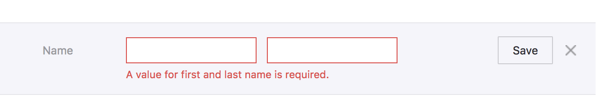
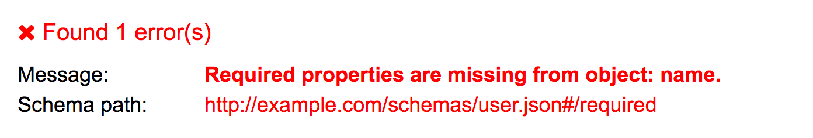
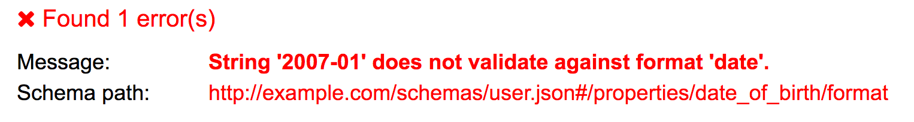

= Validation

Whenever an API client attempts an operation (creating a REST resource,
triggering an RPC procedure, etc.) there are usually some validation
rules to consider. For example, the `name` field is required and and
cannot be longer than 20 characters long, `email` must be a valid email
address, the `date` field should be a valid ISO 8601 date, and either
the home phone _or_ mobile phone field must be entered to send a text
message, etc.

There are two locations in which these rules can live, the server and
the client.

Client-side validation is incredibly important, as it provides immediate
visual feedback to the user. Depending on the UI/UX of the client
application, this might come in the form of making invalid boxes red,
scrolling the user to the problem, showing basic alert boxes, or
disabling the submit button until the local data looks good.

To create this functionality, a common approach is to reproduce
server-side validation in the client-side. This should be avoided at all
costs.

It is awfully common for client developers to read the API
documentation, take note of prominent validation rules, then write a
bunch of code to handle those rules on their own end. If their code
considers the data valid, it will pass it all onto the server on some
event (probably on submit) and hopefully the server will agree.

This seems to make sense at first, as frontend applications want
immediate feedback on input without having to ask the server about
validity. Unfortunately this approach does not scale particularly well,
and cannot handle even the smallest evolution of functionality. Rules
can be added, removed or changed for the API as the business
requirements change, and clients struggle to keep up to date. Arguably
the API development team should not be randomly changing things, but
change always happens in some form. The varying versioning strategies
for APIs will be discussed later, but even extremely cautious API
developers can introduce unexpectedly breaking change when it comes to
validation.

The most simple example would be the above mentioned name field, with a
max length of 20 characters. Months later, requirements come in from the
business to increase the max length to 40, and the API rolls out that
change. The API developers have a chat, and decide that making
validation rules more lenient cannot be considered breaking, as all
previous requests will still function. So they deploy the change with a
max length of 40 characters, and one client-app deploys an update to
match, increasing the validation to 40. Despite various client
applications still having the hardcoded max length at 20 characters,
everyone feels pretty happy about this.

One user jumps on this chance for a long name, going well over the 20
character limit. Later on the iOS application, they try to edit another
field on the same form, but notice their name has been truncated to 20
characters as the input field will not take any more than that.
Confused, they grab their friends phone and try it out there. The
Android application does something a little different: the full 40
characters are populated into the form, but client-side validation is
showing an error when the form is submitted. The user profile cannot be
updated at all on this application without the user truncating their
name...

This is certainly not the only potential issue. The API creating a new
allowed value to an "enum" field will cause the same sort of problem.

Depending on the API you are attempting to integrate with, you may be
doomed to suffer this sort of fate, but there are ways to mitigate this
problem. Depending on the type of API, you can probably find a way to
synchronize validation between client and server.

== Client-Validation via Contracts

Well built APIs generally offer a copy of their contracts in a
programmatically accessible format. The idea is that validation rules
should be written down somewhere, and not just inside the backend
server. If the validation rules can be seen by API clients, clients are
going to be far more robust, and not break on tiny validation changes.

These contracts can be called many things. Some refer to them as "data
models" or "schemas", and there are many different implementations with
different pros and cons. Here are some of the good ones.

* http://json-schema.org/[JSON Schema]
* http://openapis.org/[OpenAPI]
* http://graphql.org/[GraphQL Types]
* https://developers.google.com/protocol-buffers/[Protocol Buffers]
* https://www.w3.org/TR/json-ld/[JSON-LD]
* https://www.w3.org/standards/techs/xmlschema[XML Schema]

These contracts provide a wide array of functionality to API developers.
Some API developers generate human-readable documentation from them,
some even generate SDKs from them. Some will use them for validating
incoming payloads to save writing up the same validation rules
themselves. Client-side validation is yet another feature some of these
systems are able to provide, saving a trip over the wire, and hopefully
avoiding validation hell.

== JSON Schema

JSON Schema is a layer of metadata for JSON, that is written in JSON.
Unlike some formats which are knocked out by one particularly large
company, JSON Schema is a web standard being worked on by smart
developers from all sorts of companies like Cloudflare, Microsoft, and
they even let me stick my oar in a bit.

The idea is to point our which fields might exist, which are required or
optional, what data format they use, and other validation rules can be
added on top of that basic premise. The metadata lives in .json files,
which might look a bit like this:

....
{
  "$id": "http://example.com/schemas/user.json",
  "type": "object",
  "definitions": {},
  "$schema": "http://json-schema.org/draft-07/schema#",
  "properties": {
    "name": {
      "title": "Name",
      "type": "string",
      "description": "Users full name supporting unicode but no emojis.",
      "maxLength": 20
    },
    "email": {
      "title": "Email",
      "description": "Like a postal address but for computers.",
      "type": "string",
      "format": "email"
    },
    "date_of_birth": {
      "title": "Date Of Birth",
      "type": "string",
      "description": "Date of uses birth in the one and only date standard: ISO 8601.",
      "format": "date",
      "example": "1990-12-28"
    }
  },
  "required": ["name"]
}
....

There is quite a lot of stuff here, but most of it should make sense to
the human eye without too much guesswork. We are listing "properties" by
name, giving them a data type, setting up maxLength for the name
according to the example earlier, and putting human-readable
descriptions in there too. Also some examples have been thrown in for
giggles.

The one bit that probably needs more explaining is the $schema key,
which is pointing to the draft version of JSON Schema in use. Knowing
which draft you are validating against is important, as a JSON Schema
file written for Draft 07 cannot be validated with a Draft 06 validator,
or lower. Luckily most JSON Schema tools keep up fairly well, and JSON
Schema is not madly changing crap at random.

Anyway, back to it: An example of a valid instance for that .json schema
file might look like this.

....
{
 "name": "Lucrezia Nethersole",
 "email":"l.nethersole@hotmail.com",
 "date_of_birth": "2007-01-23"
}
....

To try playing around with this, head over to
http://jsonschemavalidator.net[jsonschemavalidator.net] and paste those
in. Removing the name field triggers an error as we have `"required":
["name"]` in there.

Another validation rule could be triggered if you enter date of birth in
an incorrect format.

Conceptually that probably makes enough sense, but how to actually
programmatically get this done? The JSON Schema .json files are usually
made available somewhere in a HTTP Link header
http://json-schema.org/latest/json-schema-core.html[with a rel of
describedby].

....
Link: <http://example.com/schemas/user.json#>; rel="describedby"
....

This might look a bit off to those not used to Link headers, but this is
how a lot of links are handled these days. The one difficulty here is
parsing the value, which can be done with some extremely awful regex, or
with a https://tools.ietf.org/html/rfc5988[RFC5988] compliant link
parser - like
https://github.com/thlorenz/parse-link-headerhttps://github.com/thlorenz/parse-link-header[parse-link-header]
for JavaScript.

Another approach that some APIs use (like the
https://docs.api.getpostman.com/[Postman Pro API]) is to shove a URL in
the HTTP body instead. A GET request on `/collections/\{id}` will return
all the JSON, and a schema field somewhere in the payload.

....
{
    "collection": {
        "info": {
            "name": "[Turtles.com](http://Turtles.com)",
            "description": "Postman Collection for Turtles.com",
            "schema": "https://schema.getpostman.com/json/collection/v2.0.0/collection.json"
        },
....

Either way, once a API client has the schema URL they can download the
file. This involves simply making a GET request to the URL provided.
Fear not about performance, these are usually stored on CDNs, like S3
with CloudFlare in front of it. They are also very likely to have cache
headers set, so a HTTP client with caching middleware will keep that
locally, or you can manually cache it by inspecting the cache headers.
More on that later.

Triggering validation rules on a random website is one thing, but
learning how to do that with code is going to be far more useful. For
JavaScript a module called https://github.com/korzio/ajv[ajv] is fairly
popular, so install that with a simple `yarn add ajv@6`, then shove it
in a JavaScript file. This code is available on the GitHub Repository
http://github.com/apisyouwonthate/talking-to-other-peoples-apis-code/blob/master/json-schema-validation/1-simple.jshttps://github.com/apisyouwonthate/talking-to-other-peoples-apis-code/blob/master/json-schema-validation/1-simple.js[apisyouwonthate/talking-to-other-peoples-apis-code].

....
const Ajv = require('ajv');
const ajv = new Ajv();

// Fetch the JSON content, pretending it was downloaded from a URL
const userSchema = require('./cached-schema.json')

// Make a little helper for validating
function validate(schema, data) {
  var valid = ajv.validate(schema, data);
  if (!valid) {
    return ajv.errors;
  }
  return true;
}

// Pretend we've submitted a form
const input = {
 name: "Lucrezia Nethersole",
 email: "l.nethersole@hotmail.com",
 date_of_birth: "2007-01-23"
}

// Should be valid
console.log('valid', validate(userSchema, input))

// Ok screw up validation...
input['email'] = 123
console.log('fail', validate(userSchema, input))
....

For the sake of keeping the example short, the actual JSON Schema has
been "downloaded" from http://example.com/schemas/user.json and put into
a local file. This is not quite how you would normally do things, and it
will become clear why in a moment.

A `validation()` function is created to wrap the validation logic in a
simple helper, then we move on to pretending we have some input. The
input would realistically probably be pulled from a form or another
dynamic source, so use your imagination there. Finally onto the meat,
calling the validation, and triggering errors.

Calling this script should show the first validation to succeed, and the
second should fail with an array of errors.

....
node ./1-simple.js
true
[ { keyword: 'type',
    dataPath: '.email',
    schemaPath: '#/properties/email/type',
    params: { type: 'string' },
    message: 'should be string' } ]
....

At first this may seem like a pile of unusable gibberish, but it is
actually incredibly useful. How? The dataPath by default uses JavaScript
property access notation, so you can easily write a bit of code that
figures out the input.email was the problem. That said, JSON Pointers
might be a better idea. A much larger example, again available on
Github, will show how JSON Pointers can be used to create dynamic
errors.

_Sadly a lot of this example is going to be specific to AJV, but the
concepts should translate to any JSON Schema validator out there._

....
const Ajv = require('ajv');
const ajv = new Ajv({ jsonPointers: true });
const pointer = require('json-pointer');
const userSchema = require('./cached-schema.json')

function validate(schema, data) {
  return ajv.validate(schema, data)
    ? [] : ajv.errors;
}

function buildHumanErrors(errors) {
  return errors.map(function(error) {
    if (error.params.missingProperty) {
      const property = pointer.get(userSchema, '/properties/' + error.params.missingProperty);
      return property.title + ' is a required field';
    }
    const property = pointer.get(userSchema, '/properties' + error.dataPath);
    if (error.keyword == 'format' && property.example) {
      return property.title + ' is in an invalid format, e.g: ' + property.example;
    }
    return property.title + ' ' + error.message;
  });
}
....

The important things to note in this example are the `new Ajv(\{
jsonPointers: true });` property, which makes dataPath return a JSON
Path instead of dot notation stuff. Then we use that pointer to look
into the schema objects (using the
mailto:https://www.npmjs.com/package/json-pointer[json-pointer] npm
package), and find the relevant property object. From there we now have
access to the human readable title, and we can build out some human
readable errors based off of the various properties returned. This code
might be a little odd looking, but we support a few types of error quite
nicely. Consider the following inputs.

....
[
  { },
  { name: "Lucrezia Nethersole", email: "not-an-email" },
  { name: "Lucrezia Nethersole", date_of_birth: 'n/a' },
  { name: "Lucrezia Nethersole Has Many Many Names" }
].forEach(function(input) {
  console.log(
    buildHumanErrors(validate(userSchema, input))
  );
});
....

These inputs give us a whole bunch of useful human errors back, that can
be placed into our UI to explain to users that stuff is no good.

....
node 2-useful-errors.js
[ 'Name is a required field' ]
[ 'Email should match format "email"' ]
[ 'Date Of Birth is in an invalid format, e.g: 1990-12-28' ]
[ 'Name should NOT be longer than 20 characters' ]
....

The errors we built from the JSON Schema using the properties that exist
can get really intelligent depending on how good the schema files are,
and how many edge cases you cover. Putting the examples in is a really
nice little touch, and makes a lot more sense to folks reading the
messages than just saying the rather vague statement "it should be a
date".

If you were to instead find a way to tie these back to the DOM, you
could update your forms with visual updates as discussed earlier: making
invalid boxes red, scroll the user to the problem, show basic alert
boxes, or disable the submit button until the local data looks good!

== What about Validation Hell?

Earlier validation hell was mentioned, and JSON Schema is supposed to
avoid it. But how? The API client now has this JSON Schema file locally,
and if the server changes... how does it know? This sample code storing
the schema in the repo along with the source code, which - generally
speaking - is a pretty bad idea, only done for simplicity of the
example.

Put very simply, if the API developers change the schema file to have a
maxLength of 40, any client should then get that change the next time
they request the schema file. That is a fluffy simplicity which has a
few details to explain...

....
Link: <http://example.com/schemas/user.json#>; rel="describedby"
....

This URL is not versioned, which suggests that it might change. This
is... possibly ok, as long as they have not set a long cache. If a
client application is respecting cache headers, and the schema file has
cache headers, then your application could suffer from validation hell
for the duration of the cache. If the cache is only set to something
short like 5 minutes, and the change is only a minor one, honestly might
not be too bad. The whole "multiple devices being used to try to make
profile changes and getting clobbered by a maxLength change" scenario we
have been discussing actually would not really be an issue if the cache
was reasonably short, but if it was set to days or longer you could be
in trouble. The link:#client-caching[Caching chapter] will help make
more sense of this.

Some APIs version their schema files, and as such new versions _should_
be published as a new URL.

....
Link: <http://example.com/schemas/v1.0.0/user.json#>; rel="describedby"
....

When a minor change is released like the maxLength one, API developers
may well release another version.

....
Link: <http://example.com/schemas/v1.0.1/user.json#>; rel="describedby"
....

So long as URLs are not hardcoded in your application, and the URL is
being read from the response (taken from wherever the API provides the
link: body or link header), then the change of URL will automatically
cause your application to fetch the new schema, allowing your
application to notice the new validation essentially immediately.

== Protobuff

If you are interacting with an API using Protobuf, setting up a payload
is as easy as writing code. Protobuf has types defined in `.proto`
files, which you will need access to. The example Google use is an
`addressbook.proto` , which looks a bit like this.

....
syntax = "proto2";
package tutorial;

message Person {
  required string name = 1;
  required int32 id = 2;
  optional string email = 3;

  enum PhoneType {
    MOBILE = 0;
    HOME = 1;
    WORK = 2;
  }

  message PhoneNumber {
    required string number = 1;
    optional PhoneType type = 2 [default = HOME];
  }

  repeated PhoneNumber phones = 4;
}

message AddressBook {
  repeated Person people = 1;
}
....

A fairly complex example to get started with (classic Google), but the
idea here is quite simple. By providing a bunch of information about
what fields are expected, which are optional/required, what possible
values are permitted for `PhoneType`, etc., it is possible to validate
data locally and ensure the server is not going to freak out when
information is sent up to it.

....
import addressbook_pb2
person = addressbook_pb2.Person()
person.id = 1234
person.name = "John Doe"
person.email = "jdoe@example.com"
phone = person.phones.add()
phone.number = "555-4321"
phone.type = addressbook_pb2.Person.HOME
....

Note that these assignments are not just adding arbitrary new fields to
a generic Python object. If you were to try to assign a field that isn't
defined in the .proto file, an AttributeError would be raised. If you
assign a field to a value of the wrong type, a TypeError will be raised.
Also, reading the value of a field before it has been set returns the
default value.

....
person.no_such_field = 1  # raises AttributeError
person.id = "1234"        # raises TypeError
....

Pretty much just the same as JSON Schema, you can turn those errors into
UI feedback if the client has a UI.
